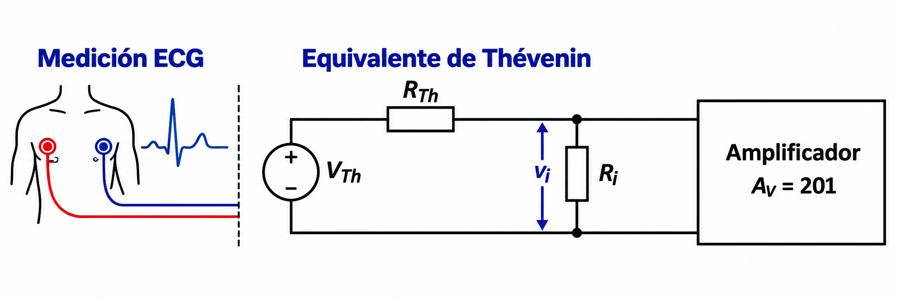

#  Trabajo 1 de Sistemas Electrónicos

#### Segundo Semestre de 2026

## Introducción

Durante este semestre, cada grupo diseñará y fabricará un prototipo de **amplificador de instrumentación de ganancia programable**. El circuito recibirá señales diferenciales de baja amplitud y permitirá seleccionar distintos factores de amplificación. En aplicaciones biomédicas, este tipo de circuito puede utilizarse para adquirir señales bioeléctricas como el electrocardiograma (ECG) y el electroencefalograma (EEG).

Cada prototipo estará compuesto por 3 placas:
- Placa 1: Amplificador de instrumentación con ganancia programable
- Placa 2: Visualizador de señal de salida de la placa 1
- Placa 3: Fuente de poder y configuración de la placa 1

El diseño del prototipo estará dividio de la siguiente forma en 7 trabajos:
- Trabajo 1: Amplificador 1 y 2 (model de Thevenin); Placa 1
- Trabajo 2: Amplificador 1 y 2 (implementación con amplificadores operacionales); Placa 1
- Trabajo 3: Visualizador de señales; Placa 2
- Trabajo 4: Hacer la solución programable; Placa 1 y 3
- Trabajo 5: Filtros; Placa 1
- Trabajo 6: Estabilidad, correcciones y hacer los filtros programables; Placa 1 y 3
- Trabajo 7: Fuente de poder; Placa 1 y 3

En este primer trabajo se estudiará cómo la amplitud y la resistencia de salida de una señal biomédica afectan el voltaje que recibe un amplificador.

El trabajo será un ensayo y deberá contener:

- Identificación del grupo (color).
- Identificación de los integrantes (nombres, apellidos y RUT).
- Desarrollo de las tres secciones siguientes.

## 1. Equivalentes de Thévenin de señales biomédicas (2,4 pt)

Una medición diferencial de una señal biomédica será representada mediante un voltaje de Thévenin $V_{Th}$ y una resistencia de Thévenin $R_{Th}$.

Figura 1: Ejemplo de una medición de ECG representada mediante su equivalente de Thévenin y conectada a la entrada del amplificador.

Determinen valores posibles de $V_{Th}$ y $R_{Th}$ para cada uno de los siguientes escenarios:

1. ECG a través de las extremidades (manos o pulsos) con electrodos secos.
2. ECG a través de las extremidades (manos o pulsos) con electrodos con gel.
3. ECG a través de electrodos en el tórax con electrodos secos.
4. ECG a través de electrodos en el tórax con electrodos con gel.
5. EEG con electrodos secos.
6. EEG con electrodos con gel.

Para facilitar la comparación entre los resultados, utilicen la impedancia reportada a **10 Hz** y aproxímenla mediante la resistencia $R_{Th}$. Si una referencia no entrega un valor exactamente a 10 Hz, pueden utilizar un valor cercano, siempre que indiquen claramente la frecuencia original y justifiquen brevemente la aproximación.

Presenten los resultados en una tabla que incluya, para cada escenario:

- $V_{Th}$ y su unidad.
- Tipo de amplitud utilizada para $V_{Th}$: amplitud de pico, pico a pico o valor eficaz (RMS).
- $R_{Th}$ y su unidad.
- Frecuencia a la que fue reportada la impedancia.
- Referencia y enlace de origen.
- Una breve justificación de los valores elegidos.

Algunas referencias informan la impedancia de **un solo contacto electrodo-piel**, mientras que otras informan la impedancia medida entre **un par de electrodos**. Indiquen cuál de estos casos corresponde a cada fuente. Si el valor está dado para un solo electrodo, consideren las dos interfaces presentes en la medición diferencial al determinar $R_{Th}$. No dupliquen un valor que ya corresponda al par completo.

No es necesario realizar una investigación exhaustiva. Para cada escenario basta encontrar valores posibles y razonables, respaldados por al menos una referencia técnica o académica. Una misma referencia puede respaldar más de un escenario.

## 2. Efecto de la impedancia de entrada (2,4 pt)

La primera etapa del sistema puede analizarse utilizando el modelo de amplificador estudiado en la clase 2. Su factor de amplificación sin carga es aproximadamente:

$$A_{V_{NL}}=201$$

La resistencia de entrada diferencial depende del tipo de señal:

- Para ECG: $R_i=200\,\text{M}\Omega$.
- Para EEG: $R_i=2\,\text{M}\Omega$.

Para cada uno de los seis escenarios de la sección 1:

1. Calculen el voltaje de salida real de la primera etapa.
4. Calculen el voltaje de salida ideal, definido para este trabajo como:

   $$V_{o,ideal}=201V_{Th}$$

5. Determinen cuánto se desvía el voltaje real del ideal, tanto en unidades de voltaje como en porcentaje respecto del valor ideal.
6. Comparen brevemente los resultados de ECG y EEG, y los obtenidos con electrodos secos y con gel.

Incluyan las ecuaciones utilizadas, el reemplazo de los valores y sus unidades. Presenten además los resultados finales en una tabla comparativa.

## 3. Selección de $R_8$ y $R_9$ (1,2 pt)

La segunda etapa del sistema posee dos resistores de diseño, $R_8$ y $R_9$. Para este bloque, el factor de amplificación está dado por:

$$A_{V2}=1+\frac{R_8}{R_9}$$

Elijan valores para $R_8$ y $R_9$ que cumplan simultáneamente las siguientes condiciones:

- Los valores elegidos tienen que ser valores disponibles en la tabla en el anexo
- El factor de amplificación $A_{V2}$ debe ser aproximadamente 15.
- La corriente a través de cada resistor no debe superar $0{,}5\,\text{mA}$.
- Para verificar la condición de corriente, consideren que el voltaje máximo que puede existir entre los terminales de cada resistor es $5\,\text{V}$.

Observación: a lo largo de los trabajos Ustedes eligirán valores para diversos componentes del sistema final. Mantengan una lista de los valores seleccionados en cada trabajo para facilitar su consulta en los talleres de fabricación.

## Plazo de entrega

**23:59 del 28 de septiembre de 2026, por correo electrónico.**

## Anexo

Valores de Resistencias disponibles:

|   |  |        |       |  |
|------|------|-----------|------------|-------|
| 10Ω  | 220Ω | 1kΩ       | 6.8kΩ      | 100kΩ |
| 22Ω  | 270Ω | 2kΩ       | 10kΩ       | 220kΩ |
| 47Ω  | 330Ω | 2.2kΩ     | 20kΩ       | 300kΩ |
| 100Ω | 470Ω | 3.3kΩ     | 47kΩ       | 470kΩ |
| 150Ω | 510Ω | 4.7kΩ     | 51kΩ       | 680kΩ |
| 200Ω | 680Ω | 5.1kΩ     | 68kΩ       | 1MΩ   |
