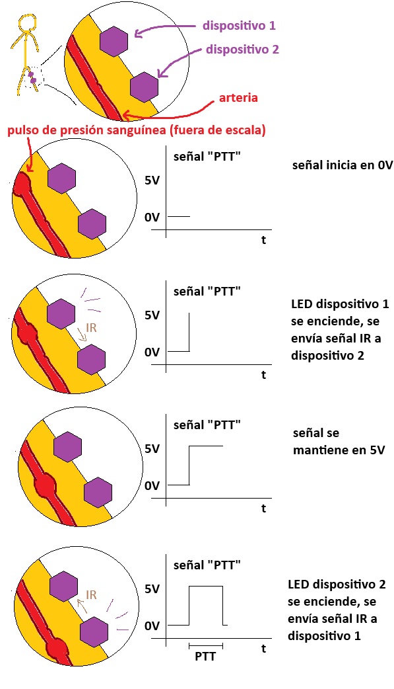

#  Trabajo 2 de Sistemas Electrónicos

#### Primer Semestre de 2025

## Introducción

Este semestre, su grupo es responsable de diseñar y fabricar un prototipo de fotopletismógrafo para aplicar los conocimientos y tecnicas relacionados a la asignatura de Sistemas Electrónicos.

A grandes rasgos, el prototipo debe tener las siguientes funcionalidades:

1. medir la frecuencia cardíaca (Heart Rate - HR)
1. emitir una señal de luz infrarroja cuando hay un pulso cardíaco
1. detectar la señal infraroja emitida por otro prototipo
1. medir el tiempo entre la detección de la señal infrarroja y el siguiente pulso cardíaco (Pulse Transit Time - PTT)
1. Permitir la visualización de los valores de HR y PTT medidos

El sistema que deben diseñar puede ser dividido en los siguientes bloques:

Figura 1: División del sistema del fotopletismógrafo en bloques

En el segundo trabajo, los objetivos son los siguientes:

1. diseñar el driver del LED que indica cuando hay un pulso.
1. diseñar el driver del emisor de señal infrarroja.
1. proyectar un circuito de Latch SR, que se usará para medir el PTT

El trabajo será un ensayo que debe contener la siguiente información:

- Identificación del grupo (color)
- Identificación de los integrantes del grupo (nombres, apellidos y RUT)
- La información que se pide en cada una de las siguientes sesiones de este documento

## 1. Driver del LED indicador de pulso

En el trabajo anterior se eligió el valor de la resistencia $R_{2}$ para que el LED se encienda cuando el siguiente circuito se alimenta con +5V:

Figura 2: Circuito de la indicación luminosa de pulso

En este trabajo, se introduce un transistor $Q_1$ para controlar cuando el LED se enciende y se apaga:

Figura 3: Driver del LED indicador de pulso

El objetivo es que el LED se encienda cuando $V_i=5\ V$, y se apague cuando $V_i=0\ V$.

1. Considerando que $V_{CE_{SAT}} = 0.3\ V$, $V_{BE_{SAT}} = 0.7\ V$ y $\beta=100$ para $Q_1$, elijan un valor de $R_4$ dentro de los valores disponibles en el anexo de tal forma que cuando $V_i=5\ V$, $Q_1$ está en modo saturado con $\beta_{forzado} \approx 10$. (1.5pt)

## 2. Driver del emisor de señal infrarroja

En el trabajo anterior se eligió el valor de la resistencia $R_{3}$ para que los LEDs infrarrojos se enciendan cuando el siguiente circuito se alimenta con +5V:

Figura 4: Circuito del emisor de señal infrarroja

En este trabajo, se introduce un transistor $Q_2$ para controlar cuando la señal infrarroja se enciende y se apaga:

Figura 5: Driver del emisor de señal infrarroja

El objetivo es que los LEDs se enciendan cuando $V_i=5\ V$, y se apaguen cuando $V_i=0\ V$.

2. Considerando que $V_{CE_{SAT}} = 0.3\ V$, $V_{BE_{SAT}} = 0.7\ V$ y $\beta=100$ para $Q_2$, elijan un valor de $R_5$ dentro de los valores disponibles en el anexo de tal forma que cuando $V_i=5\ V$, $Q_2$ está en modo saturado con $\beta_{forzado} \approx 10$. (1.5pt)

## 3. Latch SR

Al instalar en un paciente dos fotopletismografos con alguna distancia entre ellos, se observa que los pulsos cardiacos no se detectan exactamente al mismo tiempo. El atraso entre la detección de los pulsos se conoce como tiempo de tránsito del pulso (en inglés, Pulse transit time- PTT).

Para medir el PTT, primero es necesario generar una señal eléctrica que depende del PTT de alguna forma. La estrategia que adoptaremos es: cuando el primer dispositivo detecta un pulso cardiaco, el voltaje de la señal de PTT sube a 5V, y cuando el segundo dispositivo detecta el pulso, la señal baja a 0V. De esta forma generamos pulsos de voltaje cuya duración es igual al PTT, conforme se muestra en la imagen a continuación:

Figura 6: Estrategia para generar pulsos de voltaje con duración igual al PTT

Como se puede observar, en el dispositivo 1 la logica de la señal es que el voltaje cambie a 5V cuando se detecta un pulso cardiaco, y que baje 0V cuando recibe la señal infrarroja. Por otro lado, en el dispositivo 2, la logica es al revés: que el voltaje suba a 5V cuando recibe una señal infrarroja, y baje a 0V cuando detecte el pulso cardíaco. El prototipo contendrá un botón para seleccionar si debe actuar como dispositivo 1 o 2.

Tanto al tratarse del dispositivo 1 como 2, se necesita un circuito con dos posibles voltajes de salida (0V y 5V). Además, debe ser capaz de ajustar la salida a 5V cuando es gatillado por una señal, y mantenerla en 5V hasta que se gatille la otra señal. Un circuito que implementa dicha funcionalidad se conoce como Latch SR (SR son las iniciales de Set y Reset).

Para implementar el Latch SR, empezaremos con el siguiente circuito:

Figura 7: Inversor

Asumiendo que $V_{CE_{SAT}} = 0.3\ V$, $V_{BE_{SAT}} = 0.7\ V$ y $\beta=100$ para $Q_3$:

3. Elijan un valor disponible en el anexo para la resistencia $R_6$ de tal forma que $I_C \approx 1\ mA$ cuando $Q_3$ está saturado. (1pt)
4. Elijan un valor disponible en el anexo para la resistencia $R_9$ de tal forma que $\beta_{forzado} \approx 10$ cuando $V_i = 5\ V$. (1pt)

Al elegir los valores de $R_6$ y $R_9$ que cumplen con los criterios anteriores, y considerando solamente dos posibles valores para la entrada $V_i$ (0 y 5 V), la idea es que el circuito también tenga solamente dos posibles valores de salida $V_C$: 0 y 5V. Cuando la entrada es 0 V, $Q_3$ está apagado y el voltaje $V_C$ es, por lo tanto 5V. Por otro lado, cuando la entrada es 5V, $Q_3$ está saturado y la salida $V_C$ es aproximadamente 0 V. Es decir, el circuito de cierta forma "invierte" la entrada.

En el siguiente paso, conectamos una copia del circuito inversor a la salida del primero inversor ($R_7=R_6$, $R_8=R_9$):

Figura 8: Doble inversor

El resultado es que la entrada se "invierte" dos veces, lo que significa que ahora el voltaje $V_o$ sigue la entrada: si $V_i = 5\ V$, $V_C \approx 0\ V$ y $V_o = 5\ V$; por otro lado, si $V_i = 0\ V$, $V_C = 5\ V$ y $V_o \approx 0 V$. Además, notese que ambos transistores siempre están en estados opuestos: si $Q_3$ está saturado, $Q_4$ está apagado, y si $Q_3$ está apagado, $Q_4$ está saturado.

En el siguiente paso, conectamos la salida del circuito a su entrada, de tal forma que ya no se necesita $V_i$ para mantener el circuito en uno de sus dos estados. El circuito resultante se va a mantener o encendido ($Q_3$ saturado, $Q_4$ apagado, $V_o=5\ V$) o apagado ($Q_3$ apagado, $Q_4$ saturado, $V_o\approx 0\ V$) de forma permanente.

Figura 9: Latch

Finalmente, introducimos dos transistores que permiten seleccionar en cual estado queremos mantener el circuito. Tanto $Q_5$ como $Q_6$ se mantendrán apagados la mayor parte del tiempo, y activaremos apenas uno de ellos a la vez por un breve periodo de tiempo para configurar el circuito. Cuando activemos (saturemos) $Q_5$ ($RESET = 5\ V$), la base de $Q_3$ se conecta a tierra, lo que lo apaga y, por lo tanto, satura $Q_4$ ($V_{PTT} \approx 0\ V$). A partir de entonces, $Q_3$ se mantendrá apagado y $Q_4$ saturado incluso si apagamos $Q_5$. Por otro lado, cuando activemos $Q_6$ ($SET = 5\ V$), $Q_4$ se apaga ($V_{PTT} = 5\ V$), lo que satura $Q_3$. Luego, $Q_3$ se mantendrá saturado y $Q_4$ apagado incluso cuando apagamos $Q_6$. Así, se ha implementado un Latch SR.

Figura 10: Latch SR

5. Elijan un valor para la resistencia $R_{45}$, que esté disponible en el anexo, de tal forma que $Q_5$ se satura con $\beta_{forzado} \approx 10$ cuando la señan de RESET es igual a 5V. Utilizaremos el mismo valor elegido para $R_{46}$. (1pt)

## Plazo de entrega: 23:59, 31 de Marzo de 2025

## Anexo

Valores de Resistencias disponibles:

|   |  |        |       |  |
|------|------|-----------|------------|-------|
| 10Ω  | 220Ω | 1kΩ       | 6.8kΩ      | 100kΩ |
| 22Ω  | 270Ω | 2kΩ       | 10kΩ       | 220kΩ |
| 47Ω  | 330Ω | 2.2kΩ     | 20kΩ       | 300kΩ |
| 100Ω | 470Ω | 3.3kΩ     | 47kΩ       | 470kΩ |
| 150Ω | 510Ω | 4.7kΩ     | 51kΩ       | 680kΩ |
| 200Ω | 680Ω | 5.1kΩ     | 68kΩ       | 1MΩ   |
