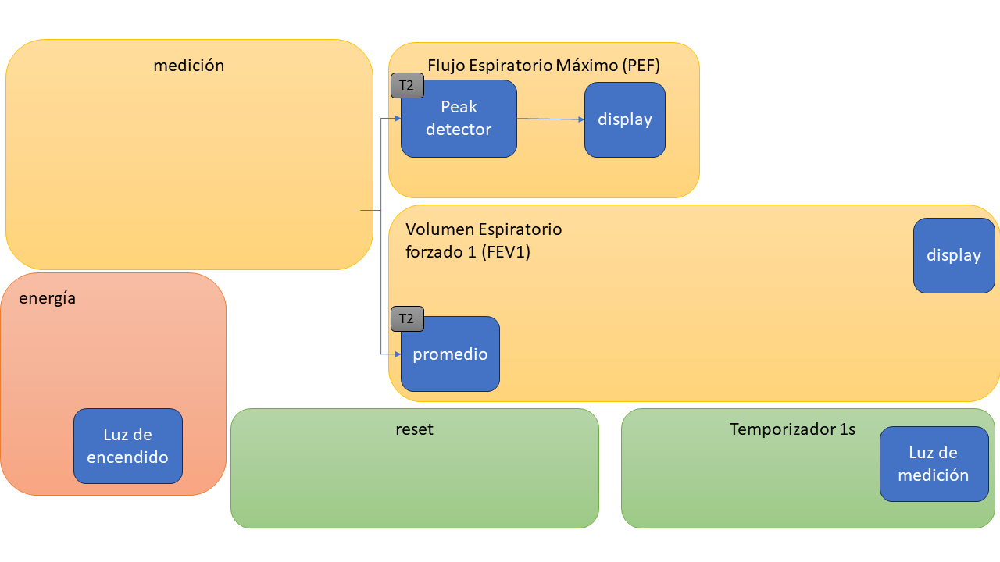

#  Trabajo 2 de Sistemas Electrónicos

#### Primer Semestre de 2024

## Introducción

Este semestre, su grupo es responsable de diseñar y fabricar un espirómetro electrónico para aplicar los conocimientos y tecnicas relacionados a la asignatura de Sistemas Electrónicos. 

En el Trabajo 2, a su grupo le ha sido asignada la tarea de diseñar los circuitos que generan dos importantes mediciones de la señal que representa el flujo espiratorio: el valor maximo y el promedio. El valor maximo representa el Flujo Espiratorio Maximo (PEF), y el promedio se medirá con respecto a un largo intervalo de tiempo y más adelante se utilizará como línea de base para calcular el Volumen Espiratorio forzado 1 (FEV1).

Figura 1: División del sistema del espirómetro electrónico en bloques y componentes del trabajo 2

El trabajo será un ensayo que debe contener la siguiente información:

1. Identificación del grupo (nombres, apellido y RUT)
1. La información que se pide en cada una de las siguientes sesiones de este documento

## Peak detector

El circuito capaz de detectar el valor maximo de una señal recibe el nombre de peak detector (en español, detector de pico). A grandes razgos, su función es implementar la siguiente lógica:

1. Si el voltaje de entrada es mayor al voltaje de salida, igualar el voltaje de salida al de entrada.
1. En caso contrario, mantener el voltaje de salida.

Una manera de implementar dicha lógica es utilizando un diodo para cumplir con el punto 1, y un capacitor para cumplir con el punto 2, de la siguiente forma:

Figura 2: Peak detector

Así, cuando $v_i$ es mayor a $v_o$, $D_3$ conduce, lo que hace con que el voltaje de salida se iguale al de entrada. Al mismo tiempo, el capacitor $C_1$ se carga con dicho voltaje. Cuando $v_i$ se vuelve menor a $v_o$, $D_3$ deja de conducir, y el voltaje $v_o$ se mantiene con el valor que fue cargado a $C_1$.

Para $D_3$, se utilizará un diodo del tipo Schottky, que es un tipo de diodo con bajo $V_F$, tipicamente 0.4 V. Para elegir el valor de $C_1$, consideren el circuito equivalente de Thevenin para el circuito que genera el voltaje $v_i$.

Figura 3: Peak detector con equivalente de thevenin para la fuente de $v_i$

1. Suponiendo que $V_F=0.4\ V$, determine el valor de $v_o$ en estado estacionario cuando $V_{th}$ es una entrada escalón de 10 V. (1pt)
1. Suponiendo que $R_{th} = 500\ \Omega$, y que la corriente de fuga del capacitor es $1\ \mu A$, elija un valor de capacitancia para $C_1$ de tal forma que (2pt):
   1. $v_o$ alcance 95% del valor en estado estacionario en menos de 20 ms.
   1. Cuando $D_3$ está cortado, el voltaje en $C_1$ se demore al menos 1 segundo en descargar 0.1 V por la corriente de fuga. 
   1. El valor de $C_1$ tiene que ser uno de los valores disponibles en el anexo.

## Promedio

Para obtener el valor promedio de una señal, se deben eliminar todas las componentes que son cambiantes en el tiempo de dicha señal. De ésta forma, apenas la componente constante (promedio) permanecerá. 

Una manera de implementar un circuito que calcula el promedio es utilizando un filtro pasa-baja, como el que se muestra a continuación.

Figura 4: Filtro pasa-baja pasivo (detector de promedio)

En el caso del espirometro, el objetivo de este circuito es proveer el valor de la señal cuando el paciente no está soplando (es decir, cuando el flujo es cero). En dicha condición, la salida del sensor no será exactamente cero, sino que algun voltaje constante. Más adelante, será necesario restar dicho voltaje constante de la señal para obtener un voltaje que sea cero cuando no hay flujo. Idealmente, cuando el paciente sopla por algunos segundos y la señal sube de valor, la salida del circuito no debería cambiar mucho.

Para cumplir con el objetivo, diseñen el filtro pasa-baja (es decir, elijan los valores de R y C), de tal forma que (3pt):

1. Si $V_{in}$ salta de cero a 10 V, la corriente maxima en R es menor o igual a 20 mA.
1. Para una entrada escalón, el valor de $V_{out}$ alcance un valor menor al 10% del valor en estado estacionario después de 1 segundo. Es decir, cuando hagamos una medición, que la salida del circuito no varie más que el 10% del valor medido.
1. Para una entrada escalón, el valor de $V_{out}$ alcanza el 95% de su valor en estado estacionario en menos de 30 segundos. Es decir, al encender el espirometro que no tengamos que esperar más de 30 segundos para que el circuito estabilice y por lo tanto podamos hacer una medición.
1. El valor de la resistencia y del capacitor tienen que ser uno de los valores disponibles en el anexo.

## Plazo de entrega: 23:59, 4 de Abril de 2024

## Anexos

Valores de Resistencias disponibles:

|   |  |        |       |  |
|------|------|-----------|------------|-------|
| 10Ω  | 220Ω | 1kΩ       | 6.8kΩ      | 100kΩ |
| 22Ω  | 270Ω | 2kΩ       | 10kΩ       | 220kΩ |
| 47Ω  | 330Ω | 2.2kΩ     | 20kΩ       | 300kΩ |
| 100Ω | 470Ω | 3.3kΩ     | 47kΩ       | 470kΩ |
| 150Ω | 510Ω | 4.7kΩ     | 51kΩ       | 680kΩ |
| 200Ω | 680Ω | 5.1kΩ     | 68kΩ       | 1M    |

Valores de Capacitores Electrolíticos disponibles:

|   |  |        |       |  |
|------|------|-----------|------------|-------|
| $2.2\ \mu F$  | $4.7\ \mu F$ | $10\ \mu F$  | $22\ \mu F$ | $33\ \mu F$ |
| $47\ \mu F$  | $68\ \mu F$ | $100\ \mu F$ | $220\ \mu F$ | $470\ \mu F$ |