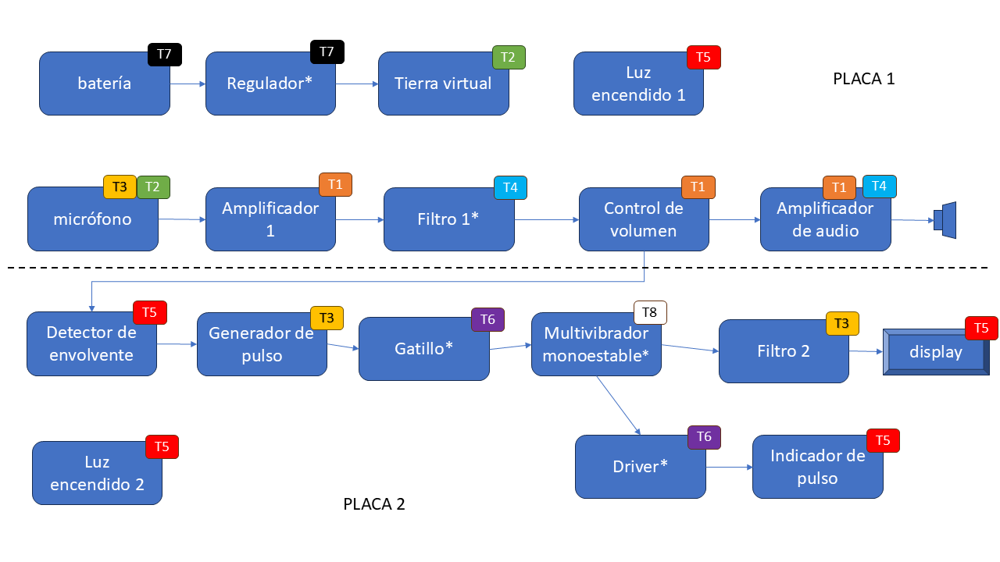
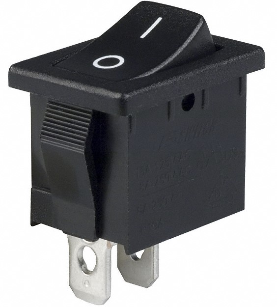

#  Trabajo 2 de Sistemas Electrónicos

#### Segundo Semestre de 2024

## Introducción

Este semestre, su grupo es responsable de diseñar y fabricar un prototipo de termometro médico electrónico para aplicar los conocimientos y tecnicas relacionados a la asignatura de Sistemas Electrónicos. 

A grandes rasgos, el prototipo debe tener las siguientes funcionalidades:

1. medir la temperatura en °C y mostrar su valor numérico con 1 casa decimal.
1. determinar cuando la medición de temperatura está estable e indicarlo con una señal sonora (bip).
1. encender una luz cuando la temperatura es muy alta o muy baja.
1. permitir el ajuste de los umbrales de temperatura alta y baja.
1. permitir el ajuste del criterio de estabilidad de la señal (más estricto o menos esctricto).
1. contener un sólo botón, que enciende el termometro cuando este está apagado, y lo apaga cuando este está encendido.
1. auto-apagado después de un tiempo ajustable de al menos aproximadamente 1 minuto.

Además, la fuente de energía debe ser una batería del tipo moneda/botón tamaño CR2032. Como esta fuente tiene pequeña capacidad energética, considerar bajo consumo de energía durante el desarrollo de todos los circuitos del termometro.

El sistema que deben diseñar puede ser dividido en los siguientes bloques:

Figura 1: División del sistema del termometro electrónico en bloques

En el segundo trabajo, los objetivos son los siguientes:

1. diseñar el driver de la señal luminosa que indica alta/baja temperatura.
1. estudiar el buzzer y diseñar su driver
1. diseñar una versión inicial del circuito que mantiene el dispotivito encendido cuando se apreta el botón

El trabajo será un ensayo que debe contener la siguiente información:

- Identificación del grupo (color)
- Identificación de los integrantes del grupo (nombres, apellidos y RUT)
- La información que se pide en cada una de las siguientes sesiones de este documento

## 1. Driver de la Indicación Luminosa de Alta/Baja Temperatura

En el trabajo anterior se eligió el valor de la resistencia $R_{12}$ para que el LED se encienda cuando el siguiente circuito se alimenta con +5V:

Figura 2: Circuito de la indicación luminosa de alta/baja temperatura

En un trabajo futuro (Trabajo 4) se diseñarán circuitos que producen voltajes $V_A$ y $V_B$, que permiten determinar cuando la temperatura está alta o baja, de acuerdo con las siguientes tablas.

### Grupo Verde

| temperatura | $V_A$ | $V_B$ | LED Verde |
| -- | -- | --| -- | 
| baja | 0 V | 0 V | apagado | 
| normal | 0 V | 5 V | encendido | 
| alta | 5 V | 5 V | apagado | 

### Grupo Blanco

| temperatura | $V_A$ | $V_B$ | LED Blanco |
| -- | -- | --| -- | 
| baja | 0 V | 5 V | apagado | 
| normal | 0 V | 0 V | encendido | 
| alta | 5 V | 0 V | apagado | 

### Grupo Rojo

| temperatura | $V_A$ | $V_B$ | LED Rojo |
| -- | -- | --| -- | 
| baja | 0 V | 5 V | encendido | 
| normal | 5 V | 5 V | apagado | 
| alta | 5 V | 0 V | encendido | 

### Grupo Amarillo

| temperatura | $V_A$ | $V_B$ | LED Amarillo |
| -- | -- | --| -- | 
| baja | 5 V | 5 V | encendido | 
| normal | 0 V | 5 V | apagado | 
| alta | 0 V | 0 V | encendido | 

### Grupo Azul

| temperatura | $V_A$ | $V_B$ | LED Azul |
| -- | -- | --| -- | 
| baja | 0 V | 0 V | encendido | 
| normal | 5 V | 0 V | apagado | 
| alta | 5 V | 5 V | encendido | 

En este trabajo, el objetivo es conectar los voltajes $V_A$ y $V_B$ al circuito del LED de forma que este se encienda de acuerdo a la última columna de cada tabla. Es decir, para los grupos Verde y Blanco el LED debe encenderse cuando la temperatura está dentro del rango normal, y para los grupos Rojo, Amarillo y Azul cuando la temperatura NO está dentro del rango normal.

Para cumplir con dicho objetivo, se seleccionaron las siguientes opciones de circuitos:

| Circuito A | Circuito B |
| -- | -- |
|  |  |

| Circuito C | Circuito D |
| -- | -- | 
|  |  |

| Circuito E | Circuito F |
| -- | -- | 
|  |  |

| Circuito G |
| -- |
| |

1. Asumiendo que $R_{13}$ y $R_{14}$ fueron seleccionadas para que los transistores $Q_1$ y $Q_2$ estén saturados cuando $Q_A$ y $Q_B$ están cortados, respectivamente, determinen cual de los circuitos implementa la logica deseada en la tabla de su grupo. (0.5pt)

2. Si el circuito elegido contiene $R_{13}$ y/o $R_{14}$, elijan sus valores de tal forma que $Q_1$ y $Q_2$ estén saturados cuando $Q_A$ y $Q_B$ están cortados, respectivamente. Elijan valores de resistencias disponibles en el anexo. Utilicen un valor de $\beta_{forzado}$ cercano a 10. Utilicen el valor de corriente en el circuito del LED que se determinó en el primer trabajo (10% de la corriente de prueba). Asuman los siguientes parametros para los transistores, extraidos de sus datasheets (1pt):

| transistor | $V_{CE_{SAT}}$ | $V_{BE_{SAT}}$ | $\beta$ |
| -- | -- | -- | -- |
| $Q_A$ | 300 mV | 700 mV | 100 |
| $Q_B$ | 300 mV | 700 mV | 100 |
| $Q_1$ | 100 mV | 800 mV | 100 |
| $Q_2$ | 100 mV | 800 mV | 100 |

3. Resuelvan el circuito seleccionado (encontrar todas las corrientes y voltajes) asumiendo que la temperatura medida está el el rango normal ($V_A$ y $V_B$ tienen los valores indicados en la tabla de su grupo en la línea de temperatura normal). (0.5pt)

Nota: Número de parte de $Q_1$ y $Q_2$ = MMBT3904

## 2. Driver del Buzzer

Un Buzzer (en español, zumbador) es un dispositivo electromecanico que convierte energía eléctrica en energía acústica, generando un sonido tipicamente de un solo tono. Actualmente las tecnologías más comunes que se utilizan en buzzers son los efectos electromagnetico y piezoeléctrico. 

Figura 3: Símbolo de un buzzer

En ambos casos, están disponibles buzzers de 2 tipos:

- del tipo transducer (en español, transductor), los cuales requieren un circuito externo para producir una señal AC con la frecuencia del sonido que se desea emitir;
- del tipo indicator (en español, indicador), los cuales no requieren un circuito externo, solo necesitan alimentación con un voltaje DC para producir un sonido.

Para indicar que la medición de la temperatura ha terminado, se utilizará un buzzer del tipo indicator con número de parte CPI-1375IC-80T. Es decir, un buzzer que sólo requiere de un voltaje DC para producir un zumbido.

En un trabajo futuro (Trabajo 8), se implementará el circuito que produce $V_U$, un pulso de 5 V durante 1 segundo cuando la temperatura se estabiliza. En este trabajo, el objetivo es conectar $V_U$ al Buzzer de forma a encenderlo cuando $V_U = 5\ V$. Para cumplir con el objetivo, se utilizará el siguiente circuito:

Figura 4: Circuito del driver del buzzer

4. Encuentren el datasheet del buzzer e identifiquen el consumo de corriente cuando se alimenta con 5 Vdc. (1pt)

5. Elijan el valor de $R_{21}$ de tal forma que el transistor $Q_3$ se sature con $\beta_{forzado} \approx 10$ cuando $V_U = 5\ V$. El valor elegido debe ser uno de los valores en la tabla en anexo. Asuman los siguientes parametros para $Q_3$, extraidos de su datasheet (1pt):

| transistor | $V_{CE_{SAT}}$ | $V_{BE_{SAT}}$ | $\beta$ |
| -- | -- | -- | -- |
| $Q_3$ | 100 mV | 800 mV | 100 |

Nota: Número de parte de $Q_3$ = MMBT3904

## 3. Botón de encendido/apagado (parte 1)

Al analizar los requerimentos del botón de encendido y apagado, se puede resumir su comportamiento de la siguiente forma:

- si el termometro está apagado, apretar el botón lo enciende
- si el termometro está encendido, apretar el botón lo apaga
- después del auto-apagado, el termometro está apagado y, por lo tanto, apretar el botón debe encenderlo

El último punto implica que no se puede utilizar un botón de dos estados como el de la siguiente figura. 

Figura 5: Interruptor del tipo "rocker"

Esto porque al encender el termometro el botón estaría en la posición de encendido. Sin embargo, después de un tiempo el auto-apagado apagaría el termometro, y apretar el botón lo cambiaria a la posición de apagado, y no a de encendido que es lo que se requiere. En vez de un botón de dos estados, se utilizará un pulsador como el de la siguiente figura.

Figura 6: Pulsador

Un pulsador es un botón que hace contacto entre sus terminales cuando se apreta, y luego los desconecta al soltar. Su simbolo se muestra a continuación (en este ejemplo, el pulsador conecta los terminales 1 y 2 cuando está presionado):

Figura 7: Símbolo de un pulsador

Como el pulsador produce siempre el mismo efecto al ser presionado, pero el requerimiento es que la consecuencia de presionarlo debe ser distinta dependiendo del estado del termometro, es necesario implementar un circuito que tiene "memoria". Es decir, un circuito que es capaz de "recordar" si está encendido o apagado, para generar efectos distintos al presionar el botón. En este trabajo, su objetivo es contruir un Latch, que es un tipo de circuito que puede ser "programado" para permanecer encendido, o permanecer apagado incluso cuando la señal de entrada ya no está presente.

La lógica del circuito es la siguiente: cuando se "enciende" un transistor NPN (es decir, cuando se polariza su unión base-emisor en directa), su salida se "apaga" (es decir, el voltaje Colector-Emisor se vuelve bajo). Por lo tanto, si conectamos la "salida" de un transistor a la "entrada" de un segundo transistor, ellos se mantendrán en estados opuestos. Cuando el primer transistor se enciende, el segundo se apaga, y cuando el primer transistor se apaga, el segundo se enciende. Finalmente, si conectamos la "salida" del segundo transistor a la "entrada" del primero, el segundo transistor mantendrá el primero en su estado actual incluso si no hay una señal externa. La siguiente figura muestra una implementación de dicha logica:

Figura 8: Circuito del latch RS

6. Elijan un valor de $R_{24}$ y $R_{25}$ de tal forma que la corriente de saturación de ambos transistores esté entre $50\ \mu A$ y $200\ \mu A$. El valor elegido debe ser uno de los valores disponibles en la tabla en anexo (1pt)

7. Elijan un valor de $R_{26}$ y $R_{27}$ de tal forma que cuando uno de los transistores está cortado, el otro está saturado con $\beta_{forzado} \approx 10$. El valor elegido debe ser uno de los valores disponibles en la tabla en anexo (1pt)

Obs: por ahora el circuito requiere dos pulsadores: uno para "encender" y uno para "apagar", pero en el siguiente trabajo se expandirá el circuito para poder funcionar con apenas un pulsador.

## Plazo de entrega: 23:59, 14 de Octubre de 2024

## Anexo

Valores de Resistencias disponibles:

|   |  |        |       |  |
|------|------|-----------|------------|-------|
| 10Ω  | 220Ω | 1kΩ       | 6.8kΩ      | 100kΩ |
| 22Ω  | 270Ω | 2kΩ       | 10kΩ       | 220kΩ |
| 47Ω  | 330Ω | 2.2kΩ     | 20kΩ       | 300kΩ |
| 100Ω | 470Ω | 3.3kΩ     | 47kΩ       | 470kΩ |
| 150Ω | 510Ω | 4.7kΩ     | 51kΩ       | 680kΩ |
| 200Ω | 680Ω | 5.1kΩ     | 68kΩ       | 1M    |
