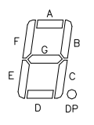
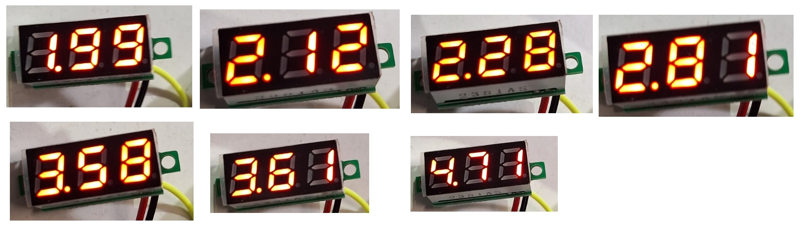

#  Trabajo 2 de Sistemas Electrónicos

#### Segundo Semestre de 2024

## Introducción

Este semestre, su grupo es responsable de diseñar y fabricar un prototipo de termometro médico electrónico para aplicar los conocimientos y tecnicas relacionados a la asignatura de Sistemas Electrónicos. 

A grandes rasgos, el prototipo debe tener las siguientes funcionalidades:

1. medir la temperatura en °C y mostrar su valor numérico con 1 casa decimal.
1. determinar cuando la medición de temperatura está estable e indicarlo con una señal sonora (bip).
1. encender una luz cuando la temperatura es muy alta o muy baja.
1. permitir el ajuste de los umbrales de temperatura alta y baja.
1. permitir el ajuste del criterio de estabilidad de la señal (más estricto o menos esctricto).
1. contener un sólo botón, que enciende el termometro cuando este está apagado, y lo apaga cuando este está encendido.
1. auto-apagado después de un tiempo ajustable de al menos aproximadamente 1 minuto.

Además, la fuente de energía debe ser una batería del tipo moneda/botón tamaño CR2032. Como esta fuente tiene pequeña capacidad energética, considerar bajo consumo de energía durante el desarrollo de todos los circuitos del termometro.

El sistema que deben diseñar puede ser dividido en los siguientes bloques:

Figura 2: División del sistema del termometro electrónico en bloques

En el segundo trabajo, los objetivos son los siguientes:

1. diseñar el driver de la señal luminosa que indica alta/baja temperatura.
1. estudiar el buzzer y diseñar su driver
1. diseñar una versión inicial del circuito que mantiene el dispotivito encendido cuando se apreta el botón

El trabajo será un ensayo que debe contener la siguiente información:

- Identificación del grupo (color)
- Identificación de los integrantes del grupo (nombres, apellidos y RUT)
- La información que se pide en cada una de las siguientes sesiones de este documento

## 1. Driver de la Indicación Luminosa de Alta/Baja Temperatura

En el trabajo anterior se eligió el valor de la resistencia $R_{12}$ para que el LED se encienda cuando el siguiente circuito se alimenta con +5V:

Figura 3: Circuito de la indicación luminosa de alta/baja temperatura

En un trabajo futuro (Trabajo 4) se diseñarán circuitos que producen voltajes $V_A$ y $V_B$, que permiten determinar cuando la temperatura está alta o baja, de acuerdo con las siguientes tablas.

### Grupo Verde

| temperatura | $V_A$ | $V_B$ | LED Verde |
| -- | -- | --| -- | 
| baja | 0 V | 0 V | apagado | 
| normal | 0 V | 5 V | encendido | 
| alta | 5 V | 5 V | apagado | 

### Grupo Blanco

| temperatura | $V_A$ | $V_B$ | LED Blanco |
| -- | -- | --| -- | 
| baja | 0 V | 5 V | apagado | 
| normal | 0 V | 0 V | encendido | 
| alta | 5 V | 0 V | apagado | 

### Grupo Rojo

| temperatura | $V_A$ | $V_B$ | LED Rojo |
| -- | -- | --| -- | 
| baja | 0 V | 5 V | encendido | 
| normal | 5 V | 5 V | apagado | 
| alta | 5 V | 0 V | encendido | 

### Grupo Amarillo

| temperatura | $V_A$ | $V_B$ | LED Amarillo |
| -- | -- | --| -- | 
| baja | 5 V | 5 V | encendido | 
| normal | 0 V | 5 V | apagado | 
| alta | 0 V | 0 V | encendido | 

### Grupo Azul

| temperatura | $V_A$ | $V_B$ | LED Azul |
| -- | -- | --| -- | 
| baja | 0 V | 0 V | encendido | 
| normal | 5 V | 0 V | apagado | 
| alta | 5 V | 5 V | encendido | 

En este trabajo, el objetivo es conectar los voltajes $V_A$ y $V_B$ al circuito del LED de forma que este se encienda de acuerdo a la última columna de cada tabla. Es decir, para los grupos Verde y Blanco el LED debe encenderse cuando la temperatura está dentro del rango normal, y para los grupos Rojo, Amarillo y Azul cuando la temperatura NO está dentro del rango normal.

Para cumplir con dicho objetivo, se seleccionaron las siguientes opciones de circuitos:

A
B
C
D
E
F
G

1. Asumiendo que $R_{13}$ y $R_{14}$ fueron elegidas para que los transistores $Q_1$ y $Q_2$ estén saturados cuando $Q_A$ y $Q_B$ están cortados, respectivamente, determinen cual de los circuitos implementa la logica deseada en la tabla de su grupo. (1pt)

2. Si el circuito elegido contiene $R_{13}$ y/o $R_{14}$, elijan sus valores de tal forma que $Q_1$ y $Q_2$ estén saturados cuando $Q_A$ y $Q_B$ están cortados, respectivamente. (1pt) Elijan un valores de resistencias disponibles en el anexo. Utilicen un valor de $\beta_{forzado}$ cercano a 10. Utilicen el valor de corriente en el circuito del LED que se determinó en el primer trabajo (10% de la corriente de prueba). Asuman los siguientes parametros para los transistores, extraidos de sus datasheets:

| transistor | $V_{CE_{SAT}}$ | $V_{BE_{SAT}}$ | $\beta$ |
| -- | -- | -- | -- |
| $Q_A$ | 300 mV | 700 mV | 100 |
| $Q_B$ | 300 mV | 700 mV | 100 |
| $Q_1$ | 100 mV | 800 mV | 100 |
| $Q_2$ | 100 mV | 800 mV | 100 |

Nota: $Q_1$ y $Q_2$ = MMBT3904

## 2. Driver del Buzzer

Un Buzzer (en español, zumbador) es un dispositivo electromecanico que convierte energía eléctrica en energía acústica, generando un sonido tipicamente de un solo tono. Actualmente las tecnologías más comunes que se utilizan en buzzers son los efectos electromagneticos y piezoeléctricos. En ambos casos, están disponibles buzzers de 2 tipos:

- del tipo transducer (en español, transductor), los cuales requieren un circuito externo para producir una señal AC con la frecuencia del sonido que se desea emitir;
- del tipo indicator (en español, indicador), los cuales no requieren un circuito externo, solo necesitan alimentación con un voltaje DC para producir un sonido.

Para indicar que la medición de la temperatura ha terminado, se utilizará un buzzer del tipo indicator con número de parte CPI-1375IC-80T. Es decir, un buzzer que sólo requiere de un voltaje DC para producir un zumbido.

En un trabajo futuro (Trabajo 8), se implementará el circuito que produce $V_U$, un pulso de 5 V durante 1 segundo cuando la temperatura se estabiliza. En este trabajo, el objetivo es conectar $V_U$ al Buzzer de forma a encenderlo cuando $V_U = 5\ V$. Para cumplir con el objetivo, se utilizará el siguiente circuito:

Circuito Buzzer

1. Encuentren el datasheet del buzzer e identifiquen el consumo de corriente cuando se alimenta con 5 Vdc.

2. Elijan el valor de $R_{21}$ de tal forma que el transistor $Q_3$ se sature con $\beta_{forzado} \approx 10$ cuando $V_U = 5\ V$. Asuman los siguientes parametros para $Q_3$, extraidos de su datasheet:

| transistor | $V_{CE_{SAT}}$ | $V_{BE_{SAT}}$ | $\beta$ |
| -- | -- | -- | -- |
| $Q_3$ | 100 mV | 800 mV | 100 |

## 3. Display

Para visualizar la temperatura se utilizará un display de voltaje como el de la siguiente figura:

Figura 7: Display de voltaje

Los segmentos que componen el display pueden encenderse para mostrar numeros entre 0.01 y 99.9. Cada uno de los segmentos es un LED independiente, que se controla con el circuito que está en la placa de atrás (la placa verde en la figura 7). La figura 8 muestra los 7 segmentos que componen cada numero (A - G) más el pundo (DP).

Figura 8: Segmentos de cada numero del display

Para utilizar el display de voltaje, basta alimentarlo con los cables negro y rojo con un voltaje entre 3.5 y 30 V, y conectar el voltaje que se desea medir en el cable amarillo.

En trabajos posteriores se diseñarán los circuitos que convierten el valor de la temperatura a un voltaje, y luego lo escalan para que cada 100 mV correspondan a 1 °C. El sistema completo se alimentará con 5V y, por lo tanto, se podrán desplegar temperaturas entre 0 °C (correspondiente a 0.00 V) y 50 °C (correspondiente a 5.00 V).

Para este trabajo se requiere estimar el consumo de corriente del display. Para esto, se realizaron distintas mediciones y se registró el consumo de corriente del modulo para cada una.

| número en el display	|	corriente medida (mA) |
| -- | -- |
|1.99	|	17.67|
|2.12	|	16.6|
|2.28	|	18.35|
|2.81	|	16.97|
|3.58	|	18.32|
|3.61	|	16.74|
|4.71	|	15.9|

Tabla 1: mediciones de consumo de corriente del display

Figura 9: display desplegando los valores durante las mediciones

9. Considerando los resultados obtenidos, estimen cuanta corriente consume cada LED del display, y cual sería el consumo maximo de corriente cuando están todos los LEDs encendidos. (1 pt) AYUDA: además del consumo de corriente de los LEDs, es posible que exista un consumo de corriente constante de los circuitos de control.

## Plazo de entrega: 23:59, 02 de Octubre de 2024

## Anexos

Tabla I - Valores de Resistencias disponibles:

|   |  |        |       |  |
|------|------|-----------|------------|-------|
| 10Ω  | 220Ω | 1kΩ       | 6.8kΩ      | 100kΩ |
| 22Ω  | 270Ω | 2kΩ       | 10kΩ       | 220kΩ |
| 47Ω  | 330Ω | 2.2kΩ     | 20kΩ       | 300kΩ |
| 100Ω | 470Ω | 3.3kΩ     | 47kΩ       | 470kΩ |
| 150Ω | 510Ω | 4.7kΩ     | 51kΩ       | 680kΩ |
| 200Ω | 680Ω | 5.1kΩ     | 68kΩ       | 1M    |

---

Tabla II - Valores de Potenciometros disponibles:

|  |   |   |   |   |
| - |  - | -  | -  | -  |
| 500Ω | 1kΩ | 2kΩ| 5kΩ| 10kΩ |
| 20kΩ | 50kΩ| 100kΩ| 200kΩ| 1MΩ