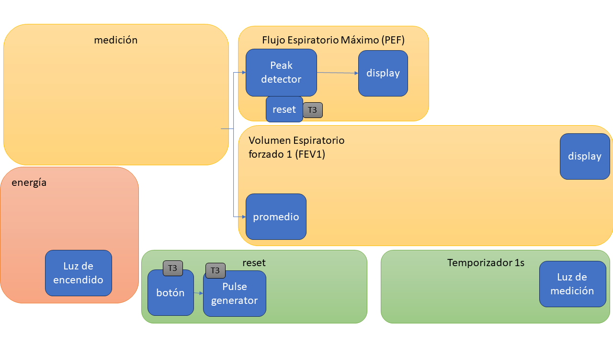
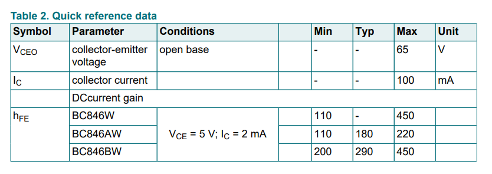
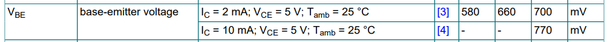

#  Trabajo 3 de Sistemas Electrónicos

#### Primer Semestre de 2024

## Introducción

Este semestre, su grupo es responsable de diseñar y fabricar un espirómetro electrónico para aplicar los conocimientos y tecnicas relacionados a la asignatura de Sistemas Electrónicos. 

En el Trabajo 3, la tarea es diseñar los circuitos responsables por el reset del peak detector. Es decir, los circuitos que descargan el capacitor $C_1$ del peak detector cuando el usuario presiona el botón. Se requiere que la descarga sea rapida, entre 10 ms y 100 ms.

Figura 1: División del sistema del espirómetro electrónico en bloques y componentes del trabajo 3

El trabajo será un ensayo que debe contener la siguiente información:

- Identificación del grupo (nombres, apellido y RUT)
- La información que se pide en cada una de las siguientes sesiones de este documento

## Peak detector reset

Cuando el usuario del espirometro desea realizar una medición, es necesario "limpiar" la medición anterior. Es decir, para el peak detector hay que "olvidar" el maximo anterior e iniciar una nueva medición del maximo. Para implementar dicha funcionalidad, utilizaremos un transistor que, cuando encendido, descarga el capacitor que está cargado con la medición del peak detector ($C_1$). La figura 2 muestra la conexión del transistor ($Q_1$) con $C_1$. El diodo del peak detector fue omitido para simplificar el diagrama.

Figura 2: Peak detector reset

Se utilizará el transistor BC846BW para $Q_1$. Las Tabla 1 y 2 muestran algunas características importantes del transistor obtenidas de su hoja de datos:

Tablas 1 y 2: Resúmen de características de $Q_1$

Determinen:

1. Suponiendo que el valor de $C_1$ es el que eligieron en el Trabajo 2, y que este tiene una carga inicial de 10 V, calculen el valor de la corriente de descarga $I_D$ mínimo para que el capacitor se descargue por completo en hasta 100 ms. (0.5pt)
2. Suponiendo que $Q_1$ está en modo activo, y utilizando su valor de $\beta$ típico, calculen el valor de $I_{B_{min}}$: la corriente de base correspondiente al $I_{D_{min}}$ calculado en el punto 1. (0.5pt)
2. Suponiendo que $Q_1$ está en modo activo, y utilizando su valor de $\beta$ típico, calculen el valor de $I_{B_{max}}$, la corriente de base correspondiente a la corriente de colector maxima del transistor. (0.5pt)
3. Suponiendo que el voltaje en RESET está entre 0 V y 5 V, que el $V_F$ de $D_4$ es 0.4 V, y el valor típico de $V_{BE}$, calculen los valores mínimo y máximo de $R_5$ para que $I_B$ esté entre $I_{B_{min}}$ y $I_{B_{max}}$. (1pt)

## Generador de pulso

Cuando el usuario presione el botón, se desconoce por cuanto tiempo lo mantendrá presionado, pero podemos suponer que es por un tiempo mayor a 100 ms. Para que el circuito de reset del peak generator no esté encendido por más tiempo del necesario, implementaremos un circuito que genera la señal de RESET de tal forma que se descarga a menos de 0 V entre 10 ms y 100 ms. Así, incluso si el usuario mantiene el botón presionado por más tiempo, la señal que enciende $Q_1$ sólo durará entre 10 ms y 100 ms

Para cumplir el objetivo, se utlizará un capacitor $C_3$ de la siguiente forma:

Figura 3: Generador de pulso

5. Suponiendo que inicialmente el botón no está apretado (los voltajes en $C_3$, $D_4$, $R_5$ y la base de $Q_1$ son -5 V), y que en t=0 el usuario apreta y mantiene apretado el botón (el voltaje a la izquierda de $C_3$ sube a +5 V), determinen la ecuación de como evoluciona el voltaje RESET en el tiempo. Asuman que $D_4$ y la unión base-emisor de $Q_1$ están siempre polarizados en directa (es decir, conducen), que el $V_F$ de $D_4$ es 0.4 V, y el valor de $V_{BE}$ es el típico de la hoja de datos. (1pt)
6. Utilizando la ecuación encontrada en el punto 5, determinen los valores máximo y mínimo para el producto $R_5 C_3$ para que el voltaje RESET baje a 0 V entre 10 ms y 100 ms. (1pt)
7. Elijan una combinación de valores de resistencias y capacitores para $R_5$ y $C_3$, que estén disponibles en el anexo y que cumplan tanto con las restricciones del punto 6 cuanto las del punto 4. (0.5pt)

Para finalizar el circuito, agregaremos las resistencias $R_4$ y $R_6$ para descargar el capacitor $C_3$ cuando el usuario desaprete el botón, y la resistencia $R_7$ para minimizar la corriente de fuga cuando $Q_1$ está apagado.

Figura 4: circuito completo

8. Suponiendo que el valor de $R_4$ y $R_6$ es igual al de $R_5$ elegido en el punto 7, calculen cuanto tiempo $C_3$ demora en descargar 95 % de su voltaje inicial cuando el botón no está apretado y $D_4$ está cortado. (0.5 pt)

## Correcciones Trabajo 1

9. Reseleccionen los valores de las resistencias del trabajo 1 ($R_1$ y $R_2$) considerando las correcciones entregadas. (0.5 pt)

## Plazo de entrega: 23:59, 10 de Abril de 2024

## Anexos

Valores de Resistencias disponibles:

|   |  |        |       |  |
|------|------|-----------|------------|-------|
| 10Ω  | 220Ω | 1kΩ       | 6.8kΩ      | 100kΩ |
| 22Ω  | 270Ω | 2kΩ       | 10kΩ       | 220kΩ |
| 47Ω  | 330Ω | 2.2kΩ     | 20kΩ       | 300kΩ |
| 100Ω | 470Ω | 3.3kΩ     | 47kΩ       | 470kΩ |
| 150Ω | 510Ω | 4.7kΩ     | 51kΩ       | 680kΩ |
| 200Ω | 680Ω | 5.1kΩ     | 68kΩ       | 1M    |

Valores de Capacitores Ceramicos disponibles:

|   |  |        |       |  |
|------|------|-----------|------------|-------|
| 100 pF  | 220 pF | 330 pF | 470 pF | 680 pF |
| 1 nF  | 2.2 nF | 3.3 nF | 4.7 nF | 6.8 nF |
| 10 nF  | 22 nF | 33 nF | 47 nF | 68 nF |
| $0.1\ \mu F$  | $0.22\ \mu F$ | $0.33\ \mu F$| $0.47\ \mu F$ | $0.68\ \mu F$ |