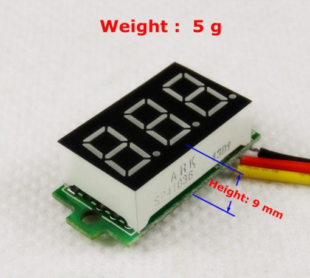
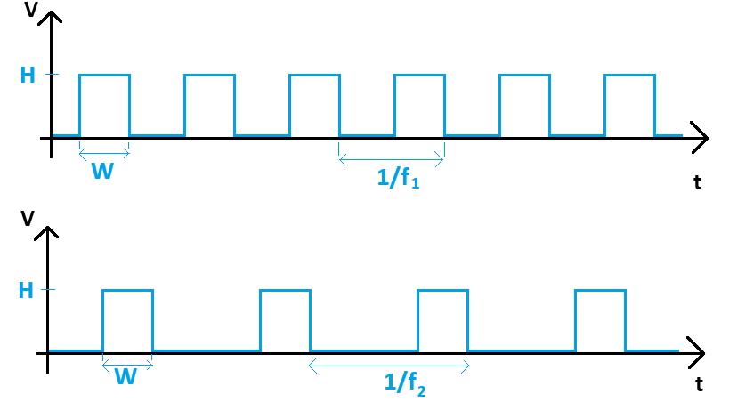

#  Trabajo 3 de Sistemas Electrónicos

#### Segundo Semestre de 2025

## Introducción

Este semestre, su grupo es responsable de diseñar y fabricar un prototipo de estetoscopio electrónico para aplicar los conocimientos y tecnicas relacionados a la asignatura de Sistemas Electrónicos.

El prototipo debe tener las siguientes funcionalidades:

1. Medir, amplificar, filtrar y reproducir los sonidos corporales
1. Permitir controlar el volúmen
1. Estimar y permitir la visualización de la frecuencia cardíaca (Heart Rate - HR)
1. Emitir una señal de luz cuando hay un pulso cardíaco

El sistema que deben diseñar puede ser dividido en los siguientes bloques:

Figura 1: División del sistema del estetoscopio electrónico en bloques

En el tercer trabajo, los objetivos son los siguientes:

1. Estudiar la respuesta transitoria del circuito completo (hasta Trabajo 2)
1. Diseñar el circuito generador de pulso
1. Diseñar el circuito del Filtro 2

El trabajo será un ensayo que debe contener la siguiente información:

- Identificación del grupo (color)
- Identificación de los integrantes del grupo (nombres, apellidos y RUT)
- La información que se pide en cada una de las siguientes sesiones de este documento

## 1. Respuesta transitoria del circuito completo (hasta Trabajo 2)

El objetivo de ésta sesión es identificar cuanto tiempo el prototipo en desarrollo demora en estabilizarse una vez que se enciende. Es decir, una vez que se energiza el sistema, ¿cuanto tiempo demora en llegar a estado estacionario y estar listo para amplificar las señales ?

Figura 2: Circuito completo del estetoscopio electrónico hasta el Trabajo 2

1. Suponiendo que la entrada del sistema es el voltaje $V_{CC}$ conectado a $R_1$, y que la salida es el voltaje $v_o$ en el altavoz, determinen la constante de tiempo del circuito. Asuman que el micrófono es una fuente de corriente DC ideal, y que el altavoz es una resistencia de $8\ \Omega$. (1.2pt)

2. Suponiendo que la entrada del sistema es el voltaje $V_{CC}$ conectado a $R_9$, y que la salida es el voltaje de salida de OA3, determinen la constante de tiempo del circuito de Tierra virtual. (0.5pt)

3. De acuerdo a los valores encontrados en las preguntas anteriores, contesten: ¿cuanto tiempo el circuito demora en llegar a estado estacionario y estar listo para amplificar las señales ? (0.3pt)

## 2. Generador de pulso

El prototipo está compuesto de dos placas de circuito impreso: una que se fabricará en el Laboratorio Presencial 3 y una que se fabricará en los laboratorios 6 y 10. La primera placa (placa 1) se enfoca en obtener la señal del micrófono, amplificarla y reproducirla en el altavoz. La segunda placa (placa 2) se enfoca en la detección de latidos cardíacos para permitir la visualización de la frecuencia cardíaca.

Uno de los componentes de la segunda placa es el circuito generador de pulso. Su objetivo es generar un pulso de voltaje de pequeña duración cada vez que la señal de entrada supera un cierto umbral.

Para cumplir con este objetivo, partiremos utilizando un comparador que genera una salida de $+V_{CC}$ cuando la señal de entrada supere un umbral programable:

Figura 3: Comparador para generador de pulso

4. Elijan un valor de $R_{pot2}$ que sea uno de los valores a continuación y de tal forma que su consumo de corriente sea menor a $0.5\ mA$: $1\ k\Omega$, $2\ k\Omega$, $5\ k\Omega$ o $10\ k\Omega$. (0.3pt)

Utilizaremos el amplificador operacional MCP6009T-E/SL como comparador.

5. Encuentren el datasheet del MCP6009T-E/SL e identifiquen su consumo de corriente cuando alimentado con 5 V. (0.3pt)

6. En el datasheet del MCP6009T-E/SL se dice que este tiene rail-to-rail Input/Output. ¿Qué significa rail-to-rail Input/Output ? (0.3pt)

   AYUDA: miren en DC ELECTRICAL SPECIFICATIONS -> Common-Mode -> Common-Mode Input Voltage Range y comparenlo con el "Common mode input voltage range" de otro amplificador operacional o comparador, como por ejemplo el LM2903D, cuyo input no es rail-to-rail .

A la salida del comparador conectaremos el siguiente circuito:

Figura 4: Filtro pasa-alta para el generador de pulso

7. Determinen la respuesta del circuito en el domínio del tiempo ($V_{out}(t)$) para una entrada escalón de amplitud 5 V ($V_{in}(t)$). (1pt)

8. Elijan un valor para $R_{13}$ de tal forma que la corriente que pasa por este está entre $50\ \mu A$ y $500\ \mu A$ cuando $V_{out}=1\ V$. El valor elegido debe ser uno de los valores disponibles en el anexo. (0.5pt)

9. Elijan un valor de $C_{12}$ de tal forma que la respuesta calculada en el ítem 7 ($V_{out}(t)$) se mantiene por sobre 2 V durante al menos 1 ms, y como máximo por 10 ms. El valor de $C_{12}$ debe ser uno de los valores de capacitores ceramicos disponibles en el anexo. (0.5pt)

Una vez que se tiene un voltaje $V_{out}$ que se mantiene por sobre 2 V durante algunos milisegundos, este se puede utilizar para encender la siguiente etapa.

## 3. Filtro 2

La estrategia que utilizaremos para visualizar la frecuencia cardíaca es producir un voltaje proporcional a ella y desplegarla en un display como el de la figura a continuación:

Figura 5: Display de voltaje

Para utilizar el display de voltaje, basta alimentarlo con los cables negro y rojo con un voltaje entre 3.5 y 30 V, y conectar la señal que se desea medir en el cable amarillo. Luego, el display mostrará el valor del voltaje medido. Para facilitar su lectura, apuntaremos a que 1 V del voltaje resultante sea equivalente a una frecuencia de 100 latidos por minuto (si el display muestra 1.00, equivale a 100 lpm, si muestra 0.89 significa 89 lpm etc). 

Para generar el voltaje proporcional a la frecuencia cardíaca, primero necesitamos generar una señal con las características que se muestran a continuación. 

Figura 6: Ejemplos de tren de pulsos generados para 2 frecuencias cardíacas distintas. 

Donde $f_1$ y $f_2$ son las frecuencias cardíacas ($1/f_1$ y $1/f_2$ son los períodos), W es la duración de cada pulso de voltaje y H es 5 V. Estas señales son el resultado de generar un pulso de voltaje con una duración fija cada vez que se detecta un latido cardíaco.

El valor promedio de las señales de la figura 6 es:

$$promedio = WHf_i$$

Como W y H son fijos, el valor promedio es una constante multiplicada por la frecuencia cardíaca. En un trabajo futuro implementaremos un circuito para fijar W de forma que 1 V del voltaje promedio sea equivalente a una frecuencia de 100 latidos por minuto. En este trabajo, el objetivo es simplemente extraer el valor promedio de la señal. 

Para cumplir con el objetivo se utilizará un filtro pasa baja, el que se muestra a continuación: 

Figura 7: Circuito del filtro paso baja.

La idea es que el filtro atenúa la parte de la señal que es variable en el tiempo, y por otro lado permite que el valor DC (promedio) se refleje en la salida sin alteración. 

10. Determinen el factor de amplificación del circuito de la figura 7 en DC ($A_V = |\frac{v_o}{v_i}|$) (0.3pt)

La frecuenta cardíaca típica de un adulto está entre 60 y 100 latidos por minuto, lo que equivale aproximadamente a 1 a 2 Hz. Diseñaremos el filtro para que atenue en al menos 100 veces la componente de la señal con dicha frecuencia. No eligiremos un valor mucho mayor que 100 pues implicaría que el circuito demora mucho en estabilizar su respuesta (pues la constante de tiempo sería muy alta).

6. Elijan los valores de $R_{19}$, $R_{20}$, $C_{14}$ y $C_{15}$ para que el circuito de la figura 7 implemente un filtro paso baja que atenúa señales con frecuencia 1 Hz en aproximadamente 100 veces ($A_v(\omega=2 \pi) \approx 0.01$). Consideren además que: (2pt)
  - Los valores de resistencias y capacitores tienen que estar disponibles en las tablas en anexo.
  - Ninguna resistencia es menor a $1\ k\Omega$
  - $R_{20} = R_{19}$
  - $C_{15} = C_{14}$ 

OBS: La figura muestra dos capacitores $C_{14}$. Esto no es un error, realmente deben considerar 2 capacitores con el mismo valor en paralelo. 

AYUDA: Para calcular $A_v(\omega=2 \pi)$ reemplacen los capacitores por sus respectivas impedancias en la frecuencia $\omega=2 \pi$ y luego calculen $A_V = |\frac{v_o}{v_i}|$

## Plazo de entrega: 23:59, 29 de Septiembre de 2025

## Anexo

I. Valores de Resistencias disponibles:

|   |  |        |       |  |
|------|------|-----------|------------|-------|
| 10Ω  | 220Ω | 1kΩ       | 6.8kΩ      | 100kΩ |
| 22Ω  | 270Ω | 2kΩ       | 10kΩ       | 220kΩ |
| 47Ω  | 330Ω | 2.2kΩ     | 20kΩ       | 300kΩ |
| 100Ω | 470Ω | 3.3kΩ     | 47kΩ       | 470kΩ |
| 150Ω | 510Ω | 4.7kΩ     | 51kΩ       | 680kΩ |
| 200Ω | 680Ω | 5.1kΩ     | 68kΩ       | 1MΩ   |

II. Valores de Capacitores Ceramicos disponibles:

|   |  |        |       |  |  |
| -------- | ------- | ------- | ----------- | --------- | --------- |
| 100 pF   | 1 nF    | 10 nF   | $0.1\ \mu F$ | $1\ \mu F$  | $10\ \mu F$ |
| 220 pF   | 2.2 nF  | 22 nF   | $0.22\ \mu F$ | -         | $22\ \mu F$ |
| 330 pF   | 3.3 nF  | 33 nF   | $0.33\ \mu F$ | -         | -         |
| 470 pF   | 4.7 nF  | 47 nF   | $0.47\ \mu F$ | $4.7\ \mu F$| -         |
| 680 pF   | 6.8 nF  | 68 nF   | $0.68\ \mu F$ | -         | -         |