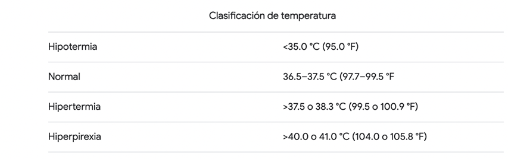

#  Trabajo 3 de Sistemas Electrónicos

#### Segundo Semestre de 2024

## Introducción

Este semestre, su grupo es responsable de diseñar y fabricar un prototipo de termometro médico electrónico para aplicar los conocimientos y tecnicas relacionados a la asignatura de Sistemas Electrónicos. 

A grandes rasgos, el prototipo debe tener las siguientes funcionalidades:

1. medir la temperatura en °C y mostrar su valor numérico con 1 casa decimal.
1. determinar cuando la medición de temperatura está estable e indicarlo con una señal sonora (bip).
1. encender una luz cuando la temperatura es muy alta o muy baja.
1. permitir el ajuste de los umbrales de temperatura alta y baja.
1. permitir el ajuste del criterio de estabilidad de la señal (más estricto o menos esctricto).
1. contener un sólo botón, que enciende el termometro cuando este está apagado, y lo apaga cuando este está encendido.
1. auto-apagado después de un tiempo ajustable de al menos aproximadamente 1 minuto.

Además, la fuente de energía debe ser una batería del tipo moneda/botón tamaño CR2032. Como esta fuente tiene pequeña capacidad energética, considerar bajo consumo de energía durante el desarrollo de todos los circuitos del termometro.

El sistema que deben diseñar puede ser dividido en los siguientes bloques:

Figura 1: División del sistema del termometro electrónico en bloques

En el tercer trabajo, los objetivos son los siguientes:

1. estudiar el sensor de temperatura
1. diseñar el gatillo que indica cuando la temperatura está estable
1. diseñar la versión final del circuito que enciende o apaga el termometro cuando se apreta el botón

El trabajo será un ensayo que debe contener la siguiente información:

- Identificación del grupo (color)
- Identificación de los integrantes del grupo (nombres, apellidos y RUT)
- La información que se pide en cada una de las siguientes sesiones de este documento

## 1. Sensor de Temperatura

Finalmente ha llegado el momento de estudiar el sensor de temperatura que se utilizará en el prototipo de termometro. Cada grupo utilizará un sensor distinto, los que se indican a continuación:

- Grupo Blanco: MCP9700-E/TO
- Grupo Azul: MCP9701-E/TO
- Grupo Verde: LMT87LPGM
- Grupo Rojo: LMT86LPGM
- Grupo Amarillo: LMT85LPGM

Todos los sensores seleccionados funcionan en base a la influencia de la temperatura en la tensión en directa de un diodo. Si se considera la ecuación de Shockley:

$$I_D=I_S(e^{\frac{V_D}{n V_T}}-1)$$

Resolviendo para $V_D$:

$$V_D = n V_T \ln(\frac{I_D+I_S}{I_S})$$

Considerando que tipicamente $I_D >> I_S$ y reemplazando $V_T=\frac{kT}{q}$, donde T es la temperatura en Kelvin :

$$V_D = T\frac{ n k }{q} \ln(\frac{I_D}{I_S})$$

Nótese que si $I_D$ es constante, $V_D$ será simplemente una constante multiplicada por T. Este es el principio de funcionamiento de los sensores seleccionados. En la practica se requieren circuitos extras para producir la corriente constante, mejorar la precisión de la medición (tipicamente se mide la diferencia de voltaje entre dos diodos iguales por los cuales pasan dos corrientes distintas pero conocidas. Esto permite eliminar $I_S$ de la ecuación), y producir un voltaje en la salida que no consume corriente del diodo, lo que afectaria la medición. El resultado final es que los sensores se alimentan con un voltaje DC y producen un voltaje de salida que tiene una dependencia lineal con respecto a la temperatura del sensor.

La siguiente tabla muestra los rangos típicos de clasificación de temperatura corporal

Basándose en esto, se requiere que el sensor tenga buena precisión especialmente en las mediciones entre 30°C y 45°C.

1. Busquen el datasheet del sensor que utilizará su grupo. Encuentren la aproximación lineal para la relación entre la temperatura en grados Celsius y el voltaje de salida del sensor. Es decir, encuentre el valor de los coeficientes a y b en la siguiente ecuación:

    $$V_{out}=aT_c + b$$

    Donde $T_c$ es la temperatura en grados celsius. Si necesario, linearicen la funcion de transferencia entre 30°C y 45°C . (1pt)

2. Para desplegar el valor de la temperatura en el display, se requiere de un voltaje que es 0 V cuando la temperatura es 0°C, y luego aumente 100 mV para cada °C. Es decir, se requiere un voltaje que implementa la siguiente relación:

    $$V_{temperatura} = 0.1 T_c$$

     Donde $T_c$ es la temperatura en grados celsius. Encuentren los valores de los coeficientes c y d en la siguiente ecuación, que permite transformar el $V_{out}$ del sensor de su grupo a $V_{temperatura}$: (0.5pt)

    $$V_{temperatura} = c V_{out} + d$$

    Obs: En el siguiente trabajo se implementará el circuito que convierte $V_{out}$ en $V_{temperatura}$.

3. Encuentren el consumo de corriente del sensor cuando está alimentado con 5V. (0.5pt)

## 2. Gatillo

Cuando la medición de temperatura se estabiliza, se generará un voltaje que cambia de 0 a 5 V, y se mantiene en 5 V mientras la temperatura está estable. Sin embargo, para gatillar el pulso de 1 segundo que encenderá el buzzer se requiere de un pulso de voltaje mucho más corto, de aproximadamente 50 ms. 

Para generar el pulso corto que gatilla el encendido del buzzer, se utilizará el siguiente circuito:

Figura 3: Filtro pasa-alta

1. Determinen la respuesta del circuito ($V_{out}$) para una entrada escalón de amplitud 5 V ($V_{in}$), en función a $R_15$ y $C_5$. 

1. Elijan un valor para $R_{15}$ de tal forma que la corriente que pasa por este está entre $5\ \mu A$ y $50\ \mu A$ cuando $V_{out}=1\ V$. El valor elegido debe ser uno de los valores disponibles en el anexo. (0.5pt)

1. Elijan un valor de $C_5$ de tal forma que la respuesta calculada en el ítem XXXX se mantiene por sobre 2 V durante al menos 10 ms, y como máximo por 100 ms. (0.5pt)

Una vez que se tiene un voltaje $V_{out}$ que se mantiene por sobre 2 V durante algunos milisegundos, se puede utilizar dicho voltaje para encender un transistor en modo saturado durante dicho período de tiempo. El circuito a continuación implementa esta idea:

Figura X: Generador de pulso.

1. Elijan el valor de $R_{16}$ de tal forma que el transistor está saturado cuando la corriente de base es igual a la corriente elegida en el ítem YYYY. (0.5pt)

Para finalizar el circuito, agregaremos la resistencia $R_{13}$  para descargar el capacitor $C_5$ cuando el voltaje de entrada es cero, y la resistencia $R_{16}$ para minimizar la corriente de fuga cuando el transistor está apagado.

Figura 4: circuito completo

## 3. Botón de encendido/apagado (parte 2)

En el trabajo anterior se diseñó el circuito a continuación, que permite mantener un voltaje en + 3V después que se apreta en pulsador ON, o en 0 V después que se apreta el pulsador OFF. El voltaje mencionado es el voltaje en el colector de $Q_5$.

En este trabajo el objetivo es reducir el número de pulsadores de 2 a 1. Para esto, primero se observa que cuando el colector de $Q_5$ está en ~3V, el colector de $Q_4$ está en aproximadamente 0 V (en realidad en $V_{CE_{SAT}}$). De la misma forma, cuando el colector de $Q_5$ está en ~0V, el colector de $Q_4$ está en ~3V. Por lo tanto, en vez de tener un pulsador que conecta a +3V y otro a 0V, se podría utilizar un único pulsador que conecta el colector de $Q_4$ al colector de $Q_5$, conforme el circuito a continuación:

Sin embargo, esta implementación tiene un problema: al mantener el pulsador presionado, ambos transistores se estabilizan en el mismo estado, por lo que es dificil predecir cuál se encenderá y cual se apagará al soltar el pulsador

1. resuelvan el circuito cuando el pulsador está presionado y muestren que los voltajes y corrientes en $Q_4$ y $Q_5$ son identicos. (0.5pt)

Para resolver el problema con el circuito anterior, se introducirán dos elementos: una resistencia entre el colector de $Q_4$ y el pulsador, la que permitirá que los voltajes de colectores se mantengan distintos cuando el pulsador está presionado; y un capacitor, que permitirá "inyectar" el voltaje del colector de $Q_4$ en el colector de $Q_5$ de forma casi instantánea cuando se aprete el botón. La figura abajo muestra el circuito final:

1. Suponiendo que $R_{28} = R_{25}$ (valor que eligieron en el trabajo 2), elijan un valor para el capacitor $C_8$ de tal forma que la constante de tiempo de carga del capacitor cuando el pulsador no está presionado esté entre 10 ms y 100 ms. El valor elegido debe estar contenido en los valores de capacitores ceramicos disponibles en el anexo. (0.5pt).

1. Completen la tabla a continuación, en la cual se describen una secuencia de acciones que se realizaron con el circuito, y se pide completar el valor de $V_{ON}$, $V_{OFF}$, $V_{C_8}$ y los modo de operación de $Q_4$ y $Q_5$ cuando se realiza cada acción. Asuman que las acciones son secuenciales: cada línea se realiza immediatamente después que la anterior. (1pt)

| acción | detalles/observaciones | $V_{ON}$ | $V_{OFF}$ | $V_{C_8}$ | modo de $Q_4$ | modo de $Q_5$
| - | - | - | - | - | - | - |
| estado inicial| $Q_5$ está saturado y el pulsador NO está presionado | | | | | saturado |
| se presiona el pulsador | immediatamente después de presionar el pulsador, el que se mantiene presionado | | | | |
| el pulsador se mantiene presionado | el circuito alcanza estado estacionario | | | | |
| se suelta el pulsador  | immediatamente después de soltar el pulsador | | | | |
| el pulsador se mantiene abierto | el circuito alcanza estado estacionario | | | | |
| se presionado el pulsador | immediatamente después de presionar el pulsador, el que se mantiene presionado | | | | |
| el pulsador se mantiene presionado | el circuito alcanza estado estacionario | | | | |
| se suelta el pulsador  | immediatamente después de soltar el pulsador | | | | |
| el pulsador se mantiene abierto | el circuito alcanza estado estacionario | | | | |

## Plazo de entrega: 23:59, 21 de Octubre de 2024

## Anexo

I. Valores de Resistencias disponibles:

|   |  |        |       |  |
|------|------|-----------|------------|-------|
| 10Ω  | 220Ω | 1kΩ       | 6.8kΩ      | 100kΩ |
| 22Ω  | 270Ω | 2kΩ       | 10kΩ       | 220kΩ |
| 47Ω  | 330Ω | 2.2kΩ     | 20kΩ       | 300kΩ |
| 100Ω | 470Ω | 3.3kΩ     | 47kΩ       | 470kΩ |
| 150Ω | 510Ω | 4.7kΩ     | 51kΩ       | 680kΩ |
| 200Ω | 680Ω | 5.1kΩ     | 68kΩ       | 1M    |

II. Valores de Capacitores Ceramicos disponibles:

|   |  |        |       |  |
|------|------|-----------|------------|-------|
| 100 pF  | 220 pF | 330 pF | 470 pF | 680 pF |
| 1 nF  | 2.2 nF | 3.3 nF | 4.7 nF | 6.8 nF |
| 10 nF  | 22 nF | 33 nF | 47 nF | 68 nF |
| $0.1\ \mu F$  | $0.22\ \mu F$ | $0.33\ \mu F$| $0.47\ \mu F$ | $0.68\ \mu F$ |
| $1\ \mu F$  | - | - | $4.7\ \mu F$ | - |
| $10\ \mu F$  | $22\ \mu F$ | - | - | - |