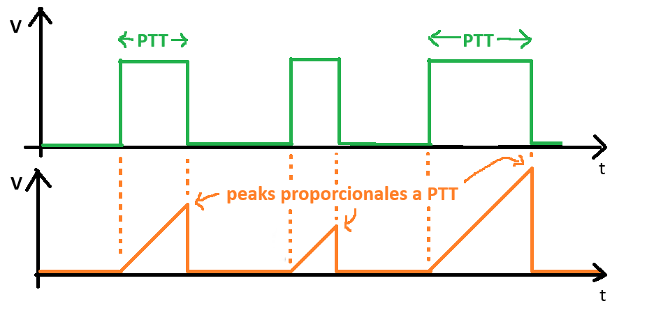

#  Trabajo 4 de Sistemas Electrónicos

#### Primer Semestre de 2025

## Introducción

Este semestre, su grupo es responsable de diseñar y fabricar un prototipo de fotopletismógrafo para aplicar los conocimientos y tecnicas relacionados a la asignatura de Sistemas Electrónicos.

A grandes rasgos, el prototipo debe tener las siguientes funcionalidades:

1. medir la frecuencia cardíaca (Heart Rate - HR)
1. emitir una señal de luz infrarroja cuando hay un pulso cardíaco
1. detectar la señal infraroja emitida por otro prototipo
1. medir el tiempo entre la detección de la señal infrarroja y el siguiente pulso cardíaco (Pulse Transit Time - PTT)
1. Permitir la visualización de los valores de HR y PTT medidos

El sistema que deben diseñar puede ser dividido en los siguientes bloques:

Figura 1: División del sistema del fotopletismógrafo en bloques

En el cuarto trabajo, los objetivos son los siguientes:

1. diseñar el integrador
1. elegir una imagen para identificar las placas del grupo

El trabajo será un ensayo que debe contener la siguiente información:

- Identificación del grupo (color)
- Identificación de los integrantes del grupo (nombres, apellidos y RUT)
- La información que se pide en cada una de las siguientes sesiones de este documento

## 1. Integrador

Conforme mencionado en el trabajo 3, para obtener el valor de PTT de la señal de pulsos de voltaje con la misma duración que el PTT, primero se va a generar una señal triangular que empieza en cero y luego sube a una velocidad constante mientras el pulso está en 5 V. Cuando el pulso baja a cero, la señal triangular también baja a cero

Figura 2: Medición de PTT

En el Trabajo 3 se diseñó el circuito que extrae el valor peak de la señal triangular. En este trabajo se va a diseñar el circuito que genera la señal triangular. Lo hemos nombrado circuito integrador porque la señal triangular (naranja) es la integral de la señal de PTT (verde). De forma equivalente, la señal de PTT es la derivada de la señal triangular.

1. Encuentren $v_o(t)$ en el siguiente circuito. Consideren condiciones iniciales nulas. (1pt)

Figura 3: Integrador

Observen que la salida del circuito de la figura 3 es un voltaje que aumenta a una velocidad constante. Es decir, se implementa la parte inclinada hacia arriba de la señal triangular.

Como tenemos un rango de voltaje limitado (hasta 5V), es necesario diseñar el circuito integrador de tal forma que el voltaje de salida no sobrepase 5V durante la operación normal. Además, como la intención es desplegar el voltaje peak de $v_o$ para inferir el valor de PTT, utlizaremos un factor de conversión amigable entre tiempo de PTT y valor de $v_o$. Considerando que el valor de PTT normalmente está en el rango de 100 a 200 ms, diseñaremos el circuito para que 1 V sea equivalente a 100 ms. Es decir, si el valor peak de $v_o$ desplegado en el display es 1.23 V, significa que el PTT medido fue de 123 ms. Esto también significa que el mayor valor de PTT que se puede medir es de 500 ms.

2. Considerando que $C_4 = 1\ \mu F$, elijan un valor para la corriente $I_9$ de tal forma que $v_o(t)$ suba 1 V a cada 100 ms. (0.5pt)

Para que el voltaje baje a cero cuando la señal de PTT cambia a 0 V, se agrega un transistor que descarga el capacitor, conforme la siguiente figura:

Figura 4: Integrador con RESET

El transistor $Q_{11}$ estará en modo activo mientras el voltaje $v_o$ sea mayor que su $V_{CE_{SAT}}$. Durante dicho período, la corriente de colector de $Q_{11}$ será constante e igual a $\beta I_B$. Por lo tanto, podemos reemplazar $Q_{11}$ por una fuente de corriente de la siguiente forma: 

Figura 5: Integrador con RESET (fuente de corriente en vez de $Q_{11}$)

3. Considerando que el voltaje inicial de $v_o$ es $v_o(0) = 5\ V$, elijan un valor de $I_{C}$ de tal forma que $v_o(t)$ baja a 0V en $100\ \mu s$. (0.5pt)

4. Observen la figura 4 y elijan un valor de $R_{19}$, disponible en el anexo, de tal forma que la corriente de base de $Q_{11}$ sea aproximadamente la necesaria para producir el $I_C$ elegido en la pregunta anterior. Consideren que $Q_{11}$ está en modo activo y que $\beta = 400$. (0.5pt)

El circuito diseñado es capaz de descargar el capacitor $C_4$ en un tiempo pequeño en comparación a PTT, pero lo hace cuando $R_{19}$ se conecta a 5V. Recordando que el objetivo es descargar el capacitor cuando la señal de PTT va a cero, introducimos un transistor extra para invertir la logica de encendido de $Q_{11}$:

Figura 6: Integrador con $RESET = \overline{PTT}$

Considerando que $R_{18} << R_{19}$, cuando $PTT = 0\ V$ el transistor $Q_{12}$ está cortado y la corriente de base de $Q_{11}$ es la que se proyectó en los ítems anteriores. Luego, cuando $PTT=5\ V$ debemos elegir $R_{20}$ de tal forma que $Q_{12}$ se sature, cortando $Q_{11}$ y permitiendo que $C_4$ empiece a cargarse nuevamente.

5. Elijan un valor de $R_{18}$ que esté disponible en el anexo y que sea aproximadamente 10 veces menor a $R_{19}$. Además, elijan un valor de $R_{20}$ de tal forma que $Q_{12}$ se sature con $\beta_{forzado} \approx 1$ cuando $PTT=5\ V$. (1pt)

Finalmente, debemos implementar la fuente de corriente que produce $I_9$. Empezamos observando que cuando un transistor está en modo activo, su corriente de colector es constante e igual a $\beta I_B$. Ya hemos utilizado este hecho para proyectar la parte del circuito con $Q_{11}$, ahora lo utilizaremos para generar $I_9$.

Figura 7: Integrador con $Q_9$

Como la unión base-emisor de $Q_9$ actúa como un diodo, esto significa que sigue la ecuación de Shockley y, por lo tanto, para cada $V_{BE} = V_B - 5$ produce un determinado $I_B$. Pero como podemos determinar con exactitud el valor de $V_{B}$ que produce el $I_B$ que genera el $I_9$ que queremos ? Una forma práctica de hacerlo es utilizando un segundo transistor, idéntico a $Q_9$ conectado de la siguiente forma:

Figura 8: $Q_8$ en conexión diodo

6. Elijan un valor de $R_{16}$, disponible en el anexo, de tal forma que la corriente de colector de $Q_8$ es aproximadamente igual a $I_9$. Consideren que $V_{CE_{SAT}} = 0.1\ V$, $V_{BE_{SAT}} = 0.7\ V$ y $\beta = 400$. (1pt)

De ésta forma, el voltaje en la base de $Q_8$ es exactamente el valor necesario para que $Q_9$ produzca una corriente de colector igual a $I_9$. Al conectarlos se logra el objetivo, y el circuito proyectado se conoce como espejo de corriente. Este tipo de circuito se utiliza de forma bastante común en circuitos integrados (chips).
 

Figura 9: Integrador con espejo de corriente

Para ahorrar energía podemos introducir el transistor $Q_{10}$ que apaga la fuente de corriente cuando $PTT=0\ V$:
 

Figura 10: Circuito integrador completo

7. Elijan un valor de $R_{17}$, disponible en el anexo, de tal forma que $Q_{10}$ se satura con $\beta_{forzado} \approx 1$ cuando $PTT = 5\ V$. (1pt)

## 2. Imagen

8. Elijan una imagen para personalizar la placa que será fabricada con el circuito diseñado por su grupo. La imagen debe estar en el formato bitmap (.bmp), tener un tamaño mínimo de 2000 x 2000 y tener apenas dos colores: blanco y negro. Envíenla al correo del profesor antes del plazo de entrega de este trabajo (0.5pt)

## Plazo de entrega: 23:59, 14 de Abril de 2025

## Anexo

Valores de Resistencias disponibles:

|   |  |        |       |  |
|------|------|-----------|------------|-------|
| 10Ω  | 220Ω | 1kΩ       | 6.8kΩ      | 100kΩ |
| 22Ω  | 270Ω | 2kΩ       | 10kΩ       | 220kΩ |
| 47Ω  | 330Ω | 2.2kΩ     | 20kΩ       | 300kΩ |
| 100Ω | 470Ω | 3.3kΩ     | 47kΩ       | 470kΩ |
| 150Ω | 510Ω | 4.7kΩ     | 51kΩ       | 680kΩ |
| 200Ω | 680Ω | 5.1kΩ     | 68kΩ       | 1M    |