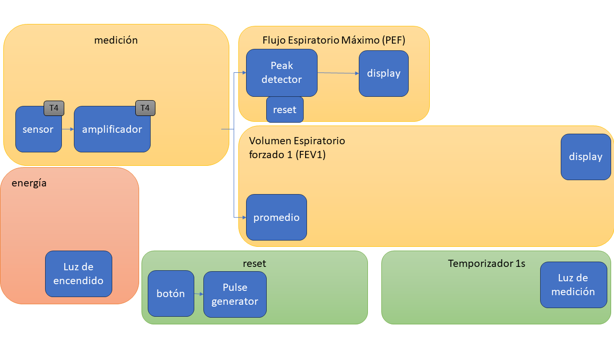
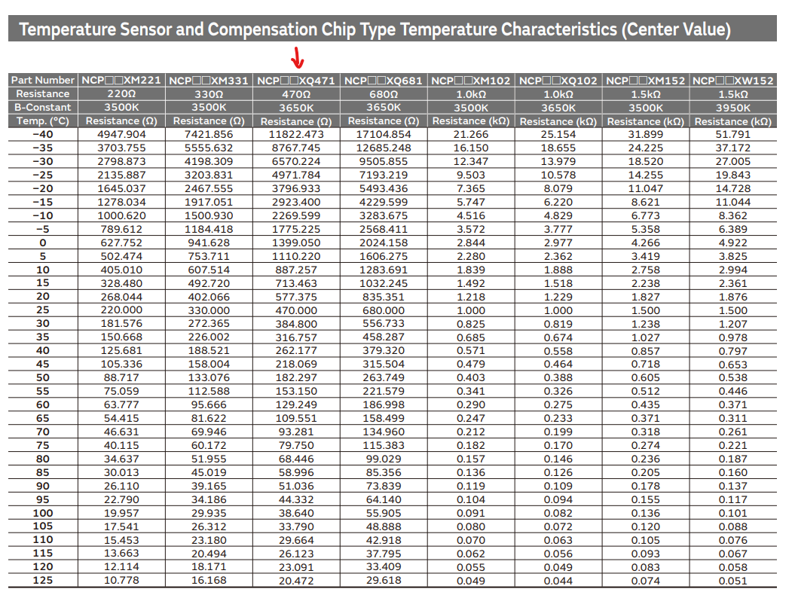

#  Trabajo 4 de Sistemas Electrónicos

#### Primer Semestre de 2024

## Introducción

Este semestre, su grupo es responsable de diseñar y fabricar un espirómetro electrónico para aplicar los conocimientos y tecnicas relacionados a la asignatura de Sistemas Electrónicos. 

En el Trabajo 4, la tarea es diseñar los circuitos responsables por realizar la medición del flujo espiratorio. Es decir, el circuito capaz de convertir el valor del flujo en un voltaje.

Figura 1: División del sistema del espirómetro electrónico en bloques y componentes del trabajo 4

El trabajo será un ensayo que debe contener la siguiente información:

- Identificación del grupo (nombres, apellido y RUT)
- La información que se pide en cada una de las siguientes sesiones de este documento

## Sensor

Para medir el flujo espiratorio se utilizará un sensor de temperatura: el termistor. Como se ha visto en clase, el termistor es una resistencia variable cuyo valor depende de la temperatura. En particular, se utilizará un termistor con coeficiente de temperatura negativo. Es decir, si la temperatura aumenta, la resistencia disminuye.

El termistor se ubicará al interior de un tubo en el cual el usuario soplará para realizar las mediciones. Para entender como el cambio de flujo de aire sobre el termistor puede influir sobre su temperatura (y, por lo tanto, su resistencia), primero es necesario entender qué determina la temperatura del termistor cuando fluye una corriente por él.

Como cualquier resistencia, el termistor consume energía cuando fluye una corriente por él. Además, la energía consumida se convierte en calor. Finalmente, el calor generado eleva la temperatura del termistor. Pero ¿cuanto es el cambio de temperatura que se produce para determinada cantidad de calor generado? Eso dependerá de cuanto calor se transmite al ambiente. De forma simplificada, la cantidad de calor transferido al ambiente es proporcional a la diferencia de temperatura entre el termistor y el ambiente. La constante de proporcionalidad se llama constante de disipación, y tiene unidad de calor/(diferencia de temperatura) (W/°C). Así, la temperatura del termistor se eleva hasta que el calor transmitido al ambiente sea igual al calor generado por el efecto resistivo, es decir: $(constante\ de\ disipación)*(temperatura_{termistor}-temperatura_{ambiente}) = RI^2$ .

Dada la ecuación anterior, ¿cómo influye el viento que pasa sobre el termistor en su temperatura? Intuitivamente se puede hacer la analogía de que cuando la comida está muy caliente, el consejo popular es soplarla para "enfriarla". Es decir, al soplar la comida se aumenta la cantidad de calor que se extrae hacia el ambiente. En otras palabras, cuanto mayor el flujo de aire, mayor el coeficiente de disipación. Y cuanto mayor el coeficiente de disipación, menor la temperatura del termistor necesaria para disipar una misma cantidad de energía.

En resúmen, cuando el usuario sople en el tubo del espirómetro, el flujo de aire aumentará el coeficiente de disipación térmico del termistor, lo que hará con que su temperatura disminuya y, en consecuencia, que su resistencia aumente.

Para convertir el cambio de resistencia del termistor en un voltaje, se utilizará un divisor de voltaje, como muestra la figura 2.

Figura 2: Sensor de flujo

Considerando que $R_{sens1} = 330\ \Omega$ y que $R_{th}$ es el termistor NCP15XQ471E03RC de murata cuya resistencia se caracteriza por la tabla 1 (columna indicada por la flecha), contesten las siguientes preguntas:

Tabla 1: Valor típico de resistencia x temperatura para el NCP15XQ471E03RC

1. Estimen a que temperatura el valor de la resistencia del termistor seria igual a $330\ \Omega$. (0.5pt)

1. Según la hoja de datos, el coeficiente de disipación térmico típico es de 1 mW/°C (en la ausencia de circulación de aire). Si la temperatura ambiente es 25°C y utilizando el valor típico de coeficiente de disipación térmico mencionado, ¿cuanto debe ser la corriente eléctrica a través del termistor para que su temperatura sea la encontrada en la pregunta 1 (y, por lo tanto, su resistencia sea $330\ \Omega$)? (0.5pt)

1. ¿Cuál debe ser el valor de $V_{bias}$ para producir la corriente encontrada en la pregunta 2 ? Asuman las mismas condiciones. (0.5pt)

1. Asumiendo que $V_{bias}$ tiene el valor calculado en la pregunta 3 y que la temperatura ambiente es 25°C, calcule el valor de $v_1$ cuando el usuario todavía no sopla (coeficiente de disipación térmico = 1 mW/°C). (0.5pt)

1. Asumiendo que $V_{bias}$ tiene el valor calculado en la pregunta 3 y que la temperatura ambiente es 25°C, calcule el valor de $v_1$ cuando el usuario sople. Considere que el flujo de aire cambia el coeficiente de disipación térmico a 2 mW/°C. (1pt)

AYUDA: tal vez sea necesario iterar

## Amplificador

Como la señal de salida del sensor es relativamente pequeña (considerando que los displays de voltaje muestran valores de 0.1V en 0.1V), es necesario amplificarla. 

La primera técnica que utilizaremos para amplificar la señal es duplicar el circuito del sensor, y utilizar uno de los circuitos resultantes de forma invertida. Así, si en el circuito original el flujo de aire produce un aumento del voltaje de $\Delta V$, en el circuito invertido el cambio de voltaje será $-\Delta V$. Luego, si medimos la diferencia entre el circuito normal e invertido, el cambio de voltaje será $\Delta V - (-\Delta V) = 2 \Delta V$. Es decir, el doble de variación en el voltaje.

Figura 3: Circuito del sensor de flujo mejorado. La salida es un voltaje diferencial ($v_1-v_2$) que tiene el doble de sensibilidad que el circuito original.

Finalmente, utilizaremos el amplificadorv diferencial para producir un único voltaje que es proporcional a la diferencia entre $v_1 - v_2$. La figura 4 muestra la topología elegida para el amplificador.

Figura 4: Amplificador diferencial

5. Considerando que $V_{CC}=+5\ V$, $V_{EE}=-5\ V$, $I_{EE}=2\ mA$, $\beta_{Q1} = \beta_{Q2} = 290$, $V_{BE_{Q1}} = V_{BE_{Q2}} = 660\ mV$ y que la temperatura es 25 °C, diseñen el amplificador diferencial (elijan $R_{C1}$, $R_{C2}$, $R_{E1}$ y $R_{E2}$), de tal forma que (3pt):
   - En DC, $v_{o,DC} \approx 0 \pm 1\ V$. Es decir, el voltaje de salida DC es aproximadamente igual al de la tierra (0V).
   - En AC, $A_{v_{AC}} \in [10,15]$, es decir, el factor de amplificación de voltaje diferencial en AC está entre 10 y 15
   - Todos los valores de resistencias elegidos son valores disponibles en el anexo

## Plazo de entrega: 23:59, 24 de Abril de 2024

## Anexos

Valores de Resistencias disponibles:

|   |  |        |       |  |
|------|------|-----------|------------|-------|
| 10Ω  | 220Ω | 1kΩ       | 6.8kΩ      | 100kΩ |
| 22Ω  | 270Ω | 2kΩ       | 10kΩ       | 220kΩ |
| 47Ω  | 330Ω | 2.2kΩ     | 20kΩ       | 300kΩ |
| 100Ω | 470Ω | 3.3kΩ     | 47kΩ       | 470kΩ |
| 150Ω | 510Ω | 4.7kΩ     | 51kΩ       | 680kΩ |
| 200Ω | 680Ω | 5.1kΩ     | 68kΩ       | 1M    |