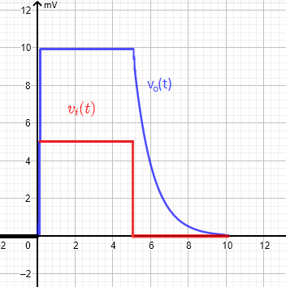

#  Trabajo 5 de Sistemas Electrónicos

#### Segundo Semestre de 2025

## Introducción

Este semestre, su grupo es responsable de diseñar y fabricar un prototipo de estetoscopio electrónico para aplicar los conocimientos y tecnicas relacionados a la asignatura de Sistemas Electrónicos.

El prototipo debe tener las siguientes funcionalidades:

1. Medir, amplificar, filtrar y reproducir los sonidos corporales
1. Permitir controlar el volúmen
1. Estimar y permitir la visualización de la frecuencia cardíaca (Heart Rate - HR)
1. Emitir una señal de luz cuando hay un pulso cardíaco

El sistema que deben diseñar puede ser dividido en los siguientes bloques:

Figura 1: División del sistema del estetoscopio electrónico en bloques

En el quinto trabajo, los objetivos son los siguientes:

1. Diseñar los circuitos de las luces de encendido y de la luz indicadora de pulso
1. Diseñar el detector de envolvente
1. Estudiar el display

El trabajo será un ensayo que debe contener la siguiente información:

- Identificación del grupo (color)
- Identificación de los integrantes del grupo (nombres, apellidos y RUT)
- La información que se pide en cada una de las siguientes sesiones de este documento

## 1. Luces de encendido e indicación de pulso

Se disponen de LEDs de 3 mm de diametro de 5 colores distintos (Rojo/Amarillo/Verde/Azul/Blanco) para cumplir la función de indicación luminosa. Estos se utilizarán tanto para mostrar que las placas están correctamente energizadas (luces de encendido), como para indicar la detección de cada pulso cardíaco. Cada grupo utilizará 3 LEDs del mismo color para su prototipo (con el color que equivale al nombre de su grupo). 

No se disponen de los números de parte ni de las características eléctricas de los LEDs, por lo que parte de su tarea es encontrar dicha información online.

Indiquen en el ensayo:

1. Identificación de 2 posibles hojas de datos (datasheets) para LEDs del color del grupo. Indicar link de origen donde se pueden descargar. (0.3pt)
1. Elección de una de las hojas de datos e identificación de los siguientes parametros (0.6pt):
    1. Voltaje de polarización directa máxima $V_{f,max}$
    1. Voltaje de polarización reversa máxima $V_{r,max}$
    1. Corriente directa máxima $I_{f,max}$*
    1. Potencia disipada máxima $P_{D,max}$
    1. Corriente de prueba $I_f$
    1. Voltaje de polarización directa para la corriente de prueba $V_f$

Para encender cada LED se utilizará el siguiente circuito:

Figura 2: Circuito de la indicación luminosa

El objetivo es obtener una corriente en el LED que sea cercana al valor de su corriente de prueba $I_f$. Se disponen de un conjunto de resistencias de 1/4 W, cuyos valores están indicados en la tabla anexa. Indiquen en el ensayo:

3. Cálculo del valor de la resistencia $R_{22}$ para que el LED se encienda con una corriente equivalente a la corriente de prueba $I_f$ de su datasheet. (0.6pt) AYUDA: pueden considerar que $V_D = V_f$. 
1. Elección de un valor de resistencia disponible en el anexo cercano al calculado, y en cuanto cambia $I_f$ con la nueva resistencia. Este será el valor que se utilizará en el prototipo. (0.3pt)
1. Cálculo de la potencia disipada en la resistencia $R_{22}$ cuando el LED está encendido. ¿Es menor que 1/4 W? (0.2pt)

## 2. Detector de envolvente

El prototipo de estetoscopio reproduce un sonido de corta duración cada vez que hay un pulso cardíaco. Así, de forma simplificada, para detectar un pulso se puede simplemente medir cuando el volumen supera un cierto umbral. Como el volumen es proporcional a la amplitud de la señal que alimenta el altavoz, se implementará un circuito que sigue la amplitud de dicho voltaje.

Para obtener la amplitud de una señal variable en el tiempo, se puede utilizar un circuito llamado detector de envolvente. La figura a continuación muestra la salida del detector de envolvente para la señal de entrada indicada:

Figura 3: Ejemplo de la envolvente de una señal

El circuito de detector de envolvente que se utilizará se muestra a continuación:

Figura 4: Circuito detector de envolvente

El circuito elegido no sólo detecta la envolvente de la señal de entrada, sino que además la amplifica por un factor A. El funcionamiento del circuito, de forma simplificada es el siguiente: cuando la entrada $v_i$ es superior a $\frac{v_o}{A}$, la salida del amplificador operacional se eleva de tal forma que el diodo conduzca y suba el valor de $v_o$ hasta que alcance $A v_i$. Este proceso se repite mientras $v_i$ está en ascenso, hasta que llegue a su valor maximo y $v_o$ sea igual a $A\ max(v_i)$. Luego, cuando la entrada se reduce, la salida del amplificador operacional se vuelve negativa, cortando el diodo. El valor de $v_o$ se mantiene en el voltaje $A\ max(v_i)$ gracias al condensador $C_{11}$, pero se descarga lentamente debido a las resistencias. La idea es que el tiempo de descarga sea más lento que el período de la señal de entrada, para que la salida no alcance a bajar mucho antes del siguiente peak de entrada, y se tenga la impresión que la salida está "siguiendo" el valor $A\ max(v_i)$. La siguiente figura ilustra un ciclo de dicho proceso:

 

Figura 5: Respuesta del detector de envolvente a un pulso de entrada

6. Determinen el valor de A (por cuanto el circuito amplifica $v_i$ cuando el diodo está conduciendo) (0.5pt)
1. Determinen en cuanto tiempo $v_o$ se descarga cuando el diodo deja de conducir (por ejemplo si la entrada baja a 0V). Pueden considerar que $v_o$ se descarga al reducirse a menos del 5% de su valor inicial. (0.5pt)
1. Considerando que los sonidos del corazón están tipicamente en el rango de 20 Hz a 650 Hz, Elijan valores de $R_{11}$, $R_{12}$ y $C_{11}$ de tal forma que: (0.5pt)
   1. La constante de tiempo de descarga de $C_{11}$ cuando el diodo no conduce es alrededor de 4 veces el mayor período de la señal de sonido
   1. El factor de amplificación A está entre 2 y 3 cuando el diodo conduce
   1. Los valores de las resistencias y capacitor son valores disponibles en el anexo
   1. Ninguna resistencia es menor a $1\ k\Omega$.

## 3. Display

## Plazo de entrega: 23:59, XX de XXXX de 2025

## Anexo

I. Valores de Resistencias disponibles:

|   |  |        |       |  |
|------|------|-----------|------------|-------|
| 10Ω  | 220Ω | 1kΩ       | 6.8kΩ      | 100kΩ |
| 22Ω  | 270Ω | 2kΩ       | 10kΩ       | 220kΩ |
| 47Ω  | 330Ω | 2.2kΩ     | 20kΩ       | 300kΩ |
| 100Ω | 470Ω | 3.3kΩ     | 47kΩ       | 470kΩ |
| 150Ω | 510Ω | 4.7kΩ     | 51kΩ       | 680kΩ |
| 200Ω | 680Ω | 5.1kΩ     | 68kΩ       | 1MΩ   |

II. Valores de Capacitores Ceramicos disponibles:

|   |  |        |       |  |  |
| -------- | ------- | ------- | ----------- | --------- | --------- |
| 100 pF   | 1 nF    | 10 nF   | $0.1\ \mu F$ | $1\ \mu F$  | $10\ \mu F$ |
| 220 pF   | 2.2 nF  | 22 nF   | $0.22\ \mu F$ | -         | $22\ \mu F$ |
| 330 pF   | 3.3 nF  | 33 nF   | $0.33\ \mu F$ | -         | -         |
| 470 pF   | 4.7 nF  | 47 nF   | $0.47\ \mu F$ | $4.7\ \mu F$| -         |
| 680 pF   | 6.8 nF  | 68 nF   | $0.68\ \mu F$ | -         | -         |