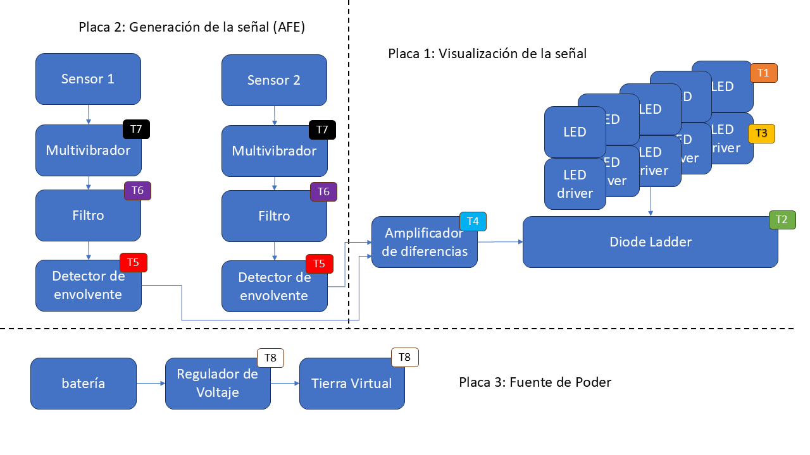
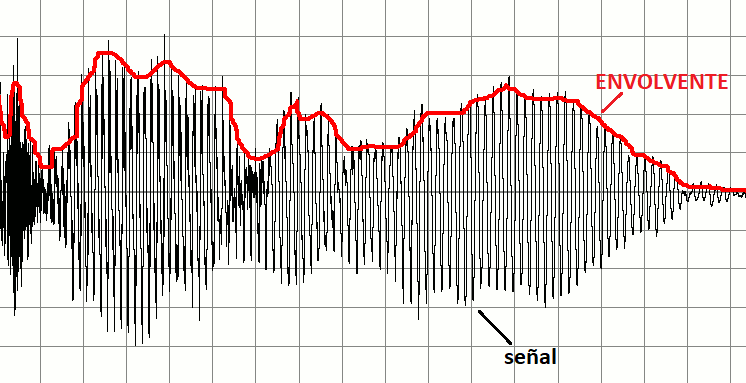
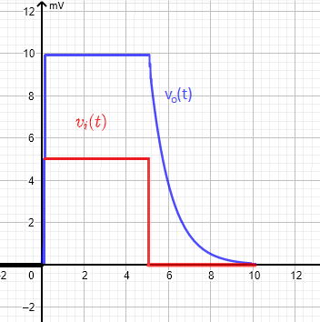

#  Trabajo 5 de Sistemas Electrónicos

#### Primer Semestre de 2026

## Introducción

Este semestre, su grupo es responsable de diseñar y fabricar un prototipo de sensor capacitivo de toque y proximidad para aplicar los conocimientos y tecnicas relacionados a la asignatura de Sistemas Electrónicos.

El dispositivo propuesto será capaz de producir un voltaje proporcional a la distancia entre el dedo del usuario y el sensor, y visualizar el voltaje a través de 5 luces. También podrá funcionar en modo diferencial, en el cual se conectan dos sensores y el voltaje resultante es la diferencia entre la señal de los dos sensores. 

El sistema que deben diseñar puede ser dividido en los siguientes bloques:

Figura 1: División del sistema del sensor capacitivo en bloques

El objetivo del Trabajo 5 es diseñar el detector de envolvente.

El trabajo será un ensayo que debe contener la siguiente información:

- Identificación del grupo (color)
- Identificación de los integrantes del grupo (nombres, apellidos y RUT)
- La información que se pide en cada una de las siguientes secciones de este documento

## Detector de envolvente

El prototipo de estetoscopio reproduce un sonido de corta duración cada vez que hay un pulso cardíaco. Así, de forma simplificada, para detectar un pulso se puede simplemente medir cuando el volumen del altavoz supera un cierto umbral. Como el volumen es proporcional a la amplitud de la señal que alimenta el altavoz, se implementará un circuito que sigue la amplitud de dicho voltaje.

Para obtener la amplitud de una señal variable en el tiempo, se puede utilizar un circuito llamado detector de envolvente. La figura a continuación muestra la salida del detector de envolvente para la señal de entrada indicada:

Figura 3: Ejemplo de la envolvente de una señal

El circuito de detector de envolvente que se utilizará se muestra a continuación:

Figura 4: Circuito detector de envolvente

El circuito elegido no sólo detecta la envolvente de la señal de entrada, sino que además la amplifica por un factor A. El funcionamiento del circuito, de forma simplificada, es el siguiente: cuando la entrada $v_i$ es superior a $\frac{v_o}{A}$, la salida del amplificador operacional se eleva de tal forma que el diodo conduzca y suba el valor de $v_o$ hasta que alcance $A v_i$. Este proceso se repite mientras $v_i$ está en ascenso, hasta que llegue a su valor maximo y $v_o$ sea igual a $A\ max(v_i)$. Luego, cuando la entrada se reduce, la salida del amplificador operacional se vuelve negativa, cortando el diodo. El valor de $v_o$ se mantiene en el voltaje $A\ max(v_i)$ gracias al condensador $C_{11}$, pero se descarga lentamente debido a las resistencias. La idea es que el tiempo de descarga sea más lento que el período de la señal de entrada, para que la salida no alcance a bajar mucho antes del siguiente peak de entrada, y se tenga la impresión que la salida está "siguiendo" el valor $A\ max(v_i)$. La siguiente figura ilustra un ciclo de dicho proceso:

 

Figura 5: Respuesta del detector de envolvente a un pulso de entrada

6. Determinen el valor de A (por cuanto el circuito amplifica $v_i$ cuando el diodo está conduciendo) en función de los valores de los componentes del circuito ($R_{11}$, $R_{12}$, $C_{11}$, $V_f$ del diodo) (0.5pt)
1. Determinen en cuanto tiempo $v_o$ se descarga cuando el diodo deja de conducir (por ejemplo si la entrada baja a 0V). Pueden considerar que $v_o$ se descarga al reducirse a menos del 5% de su valor inicial. Indiquen la respuesta como una función de los valores de los componentes del circuito ($R_{11}$, $R_{12}$, $C_{11}$, $V_f$ del diodo) (0.7pt)
1. Considerando que los sonidos del corazón están tipicamente en el rango de 20 Hz a 650 Hz, elijan valores de $R_{11}$, $R_{12}$ y $C_{11}$ de tal forma que: (1pt)
   1. El tiempo de descarga de $v_o$ cuando el diodo no conduce es alrededor de 4 veces el mayor período de la señal de sonido
   1. El factor de amplificación A está entre 2 y 3 cuando el diodo conduce
   1. Los valores de las resistencias y capacitor son valores disponibles en el anexo
   1. Ninguna resistencia es menor a $1\ k\Omega$.

## Plazo de entrega: 23:59, 11 de Mayo de 2026

## Anexo

I. Valores de Resistencias disponibles:

|   |  |        |       |  |
|------|------|-----------|------------|-------|
| 10Ω  | 220Ω | 1kΩ       | 6.8kΩ      | 100kΩ |
| 22Ω  | 270Ω | 2kΩ       | 10kΩ       | 220kΩ |
| 47Ω  | 330Ω | 2.2kΩ     | 20kΩ       | 300kΩ |
| 100Ω | 470Ω | 3.3kΩ     | 47kΩ       | 470kΩ |
| 150Ω | 510Ω | 4.7kΩ     | 51kΩ       | 680kΩ |
| 200Ω | 680Ω | 5.1kΩ     | 68kΩ       | 1MΩ   |

II. Valores de Capacitores Ceramicos disponibles:

|   |  |        |       |  |  |
| -------- | ------- | ------- | ----------- | --------- | --------- |
| 100 pF   | 1 nF    | 10 nF   | $0.1\ \mu F$ | $1\ \mu F$  | $10\ \mu F$ |
| 220 pF   | 2.2 nF  | 22 nF   | $0.22\ \mu F$ | -         | $22\ \mu F$ |
| 330 pF   | 3.3 nF  | 33 nF   | $0.33\ \mu F$ | -         | -         |
| 470 pF   | 4.7 nF  | 47 nF   | $0.47\ \mu F$ | $4.7\ \mu F$| -         |
| 680 pF   | 6.8 nF  | 68 nF   | $0.68\ \mu F$ | -         | -         |