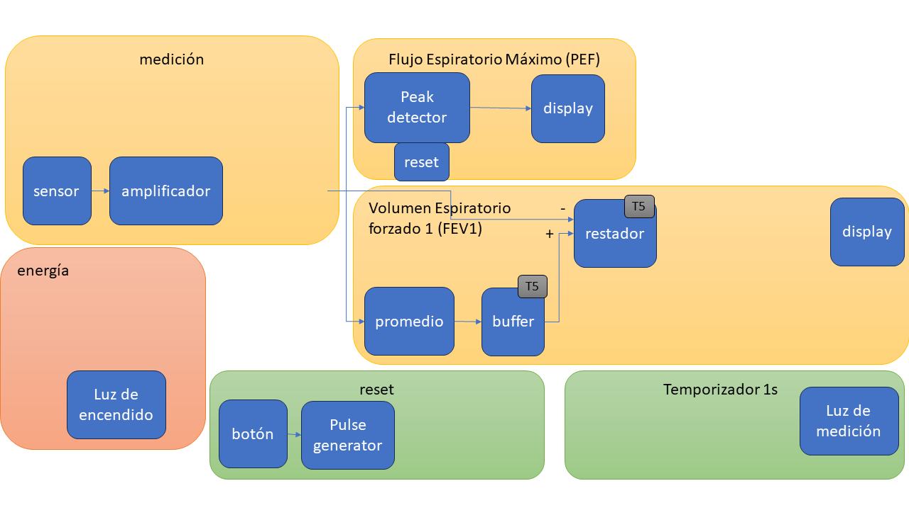

#  Trabajo 6 de Sistemas Electrónicos

#### Primer Semestre de 2024

## Introducción

Este semestre, su grupo es responsable de diseñar y fabricar un espirómetro electrónico para aplicar los conocimientos y tecnicas relacionados a la asignatura de Sistemas Electrónicos. 

En el Trabajo 5, la tarea es diseñar un circuito que produce la resta entre la señal que representa el flujo espiratorio y su promedio. El promedio proviene del circuito diseñado en el T2.

Figura 1: División del sistema del espirómetro electrónico en bloques y componentes del trabajo 5

El trabajo será un ensayo que debe contener la siguiente información:

- Identificación del grupo (nombres, apellido y RUT)
- La información que se pide en cada una de las siguientes sesiones de este documento

## Buffer y Restador

Para preparar la señal de salida del sensor para el circuito que calcula su integral, es necesario primero restar el promedio ($T_2$) y hacer el resultado negativo. Esto para que el voltaje sea cero cuando no hay flujo, y tenga señal negativa (veremos más adelante el porqué tiene que ser negativo). Es decir, se necesita un circuito que calcula $v_o = - (v_i - promedio)$, donde $v_i$ es la señal que mide el flujo de aire. Simplificando la expresión, se tiene: $v_o = promedio - v_i$.

1. Utilizando apenas los elementos en la figura 2, armen un circuito que implementa la expresión $v_o = promedio - v_i$. Elijan los valores de $R_1$, $R_2$, $R_3$ y $R_4$ de tal forma que estén disponibles en el anexo y la corriente maxima en cualquier uno de ellos sea menor que $10\ mA$. (3pt)

Figura 2: Elementos disponibles para diseñar restador.

Para evitar que el circuito que calcula el promedio se afecte por la corriente que consume el circuito proyectado en el punto 1, utlizaremos un buffer, como muestra la figura 3.

Figura 3: Circuito del promedio con buffer.

2. Asumiendo que la ganancia del amplificador operacional es 100.000, calcule cual sería la mayor diferencia entre el voltaje de salida del buffer ($promedio$) y el de entrada ($v_1$) (1 pt)

## Corrección Trabajos anteriores

Hagan las siguientes correcciones de los trabajos anteriores (2pt):

## Plazo de entrega: 23:59, 02 de Mayo de 2024

## Anexos

Valores de Resistencias disponibles:

|   |  |        |       |  |
|------|------|-----------|------------|-------|
| 10Ω  | 220Ω | 1kΩ       | 6.8kΩ      | 100kΩ |
| 22Ω  | 270Ω | 2kΩ       | 10kΩ       | 220kΩ |
| 47Ω  | 330Ω | 2.2kΩ     | 20kΩ       | 300kΩ |
| 100Ω | 470Ω | 3.3kΩ     | 47kΩ       | 470kΩ |
| 150Ω | 510Ω | 4.7kΩ     | 51kΩ       | 680kΩ |
| 200Ω | 680Ω | 5.1kΩ     | 68kΩ       | 1M    |