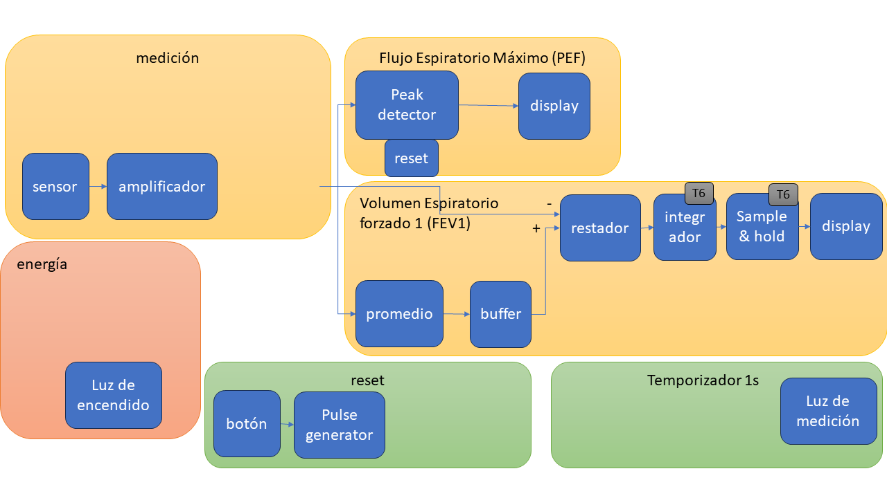
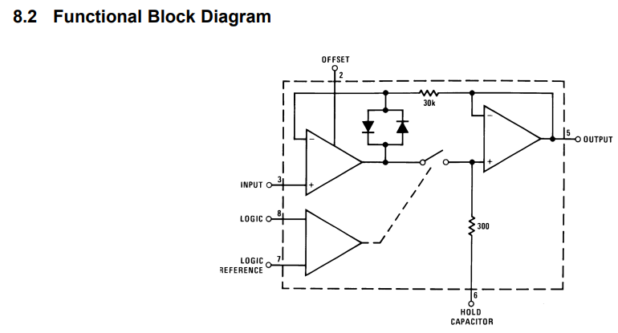

#  Trabajo 6 de Sistemas Electrónicos

#### Primer Semestre de 2024

## Introducción

Este semestre, su grupo es responsable de diseñar y fabricar un espirómetro electrónico para aplicar los conocimientos y tecnicas relacionados a la asignatura de Sistemas Electrónicos. 

En el Trabajo 6, la tarea es diseñar el circuito que integra la señal que representa el flujo espiratorio para producir el valor del volúmen espiratorio, bien como el circuito que "guarda" el valor del volúmen cuando se le indique. Posteriormente generaremos la señal para guardar el valor 1 segundo de presionar el botón reset.

Figura 1: División del sistema del espirómetro electrónico en bloques y componentes del trabajo 6

El trabajo será un ensayo que debe contener la siguiente información:

- Identificación del grupo (nombres, apellido y RUT)
- La información que se pide en cada una de las siguientes sesiones de este documento

## Integrador

Para obtener un voltaje proporcional al volúmen espiratorio forzado 1 (FEV1), es necesario integrar el valor del voltaje que representa el flujo espiratorio. En trabajos anteriores, se ha preparado la señal de entrada del integrador, que consiste del promedio menos la señal del flujo. Con esto se asegura que si no hay flujo, la entrada del integrador será aproximadamente cero. Además, cuando hay flujo, la entrada del integrador será un voltaje negativo proporcional a dicho flujo espiratorio. El circuito que implementa el integrador se muestra en la figura 2.

Figura 2: Circuito Integrador.

1. Considerando que el voltaje $v_i$ es constante, determinen una expresión para el valor de $v_o$ después de 1 segundo en función de $v_i$, $R$ y $C$. Asuman que $v_o$ = 0 en $t=0$ (2pt).
1. Suponiendo que el mayor flujo espiratorio que podemos medir corresponde a $v_i=3.3\ V$, y que el usuario espira con un flujo constante, queremos que el voltaje de salida del integrador, en este caso, sea el mayor voltaje disponible. Elijan los valores de $R$ y $C$ de tal forma que $v_o \approx 5\ V$ después de 1 segundo y $v_i$ constante e igual a 3.3 V. Los valores de $R$ y $C$ elegidos tienen que que estar disponibles en el anexo (1pt)

## Sample & Hold

Una vez que transcurre 1 segundo después de presionar el botón reset, debemos "congelar" el valor de salida del integrador y desplegarlo en el display. Existe un circuito electrónico llamado Sample and Hold (en español, muestreo y retención) que es capaz de cumplir con este objetivo. Utilizaremos el circuito integrado LF398MX que implementa un Sample and Hold. La figura 3 muestra un diagrama simplificado del LF398MX.

Figura 3: Diagrama simplificado del circuito del LF398MX

El LF398MX tiene 2 modos de funcionamiento, "muestreo" y "retención". 

3. Encuentren el datasheet del LF398MX y describan con sus palabras:
   1. Como los voltajes en LOGIC y LOGIC REFERENCE controlan el modo de funcionamiento del dispositivo. (0.5pt)
   1. La relación entre los voltajes en OUTPUT, INPUT y HOLD CAPACITOR en cada uno de los modos de funcionamiento. (0.5pt)

AYUDA: Pueden ignorar los diodos en el diagrama para entender el funcionamiento del circuito.

4. Suponiendo que se utiliza un capacitor con las mismas características que el elegido para el circuito de peak detector (ver T2), determinen:
    1. La constante de tiempo de carga del capacitor cuando el LF398MX está en modo de muestreo (1pt)
    1. La velocidad de descarga del capacitor debido a su corriente de fuga cuando el LF398MX está en modo de retención (1pt)

## Plazo de entrega: 23:59, 08 de Mayo de 2024

## Anexos

Valores de Resistencias disponibles:

|   |  |        |       |  |
|------|------|-----------|------------|-------|
| 10Ω  | 220Ω | 1kΩ       | 6.8kΩ      | 100kΩ |
| 22Ω  | 270Ω | 2kΩ       | 10kΩ       | 220kΩ |
| 47Ω  | 330Ω | 2.2kΩ     | 20kΩ       | 300kΩ |
| 100Ω | 470Ω | 3.3kΩ     | 47kΩ       | 470kΩ |
| 150Ω | 510Ω | 4.7kΩ     | 51kΩ       | 680kΩ |
| 200Ω | 680Ω | 5.1kΩ     | 68kΩ       | 1M    |

Valores de Capacitores Ceramicos disponibles:

|   |  |        |       |  |
|------|------|-----------|------------|-------|
| 100 pF  | 220 pF | 330 pF | 470 pF | 680 pF |
| 1 nF  | 2.2 nF | 3.3 nF | 4.7 nF | 6.8 nF |
| 10 nF  | 22 nF | 33 nF | 47 nF | 68 nF |
| $0.1\ \mu F$  | $0.22\ \mu F$ | $0.33\ \mu F$| $0.47\ \mu F$ | $0.68\ \mu F$ |