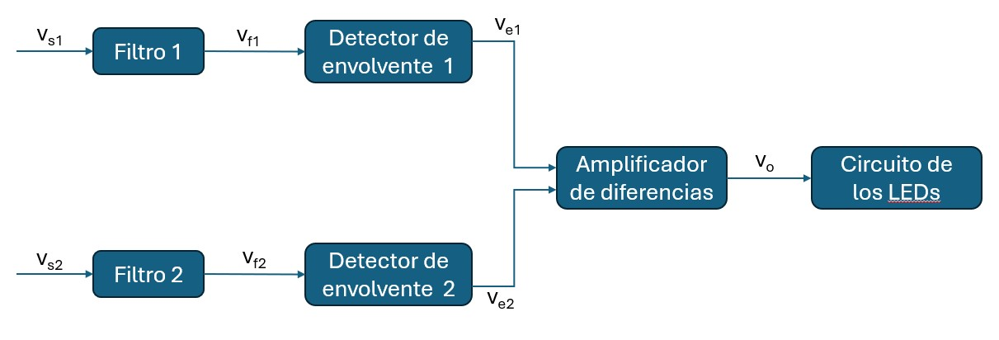

#  Trabajo 6 de Sistemas Electrónicos

#### Primer Semestre de 2026

## Introducción

Este semestre, su grupo es responsable de diseñar y fabricar un prototipo de sensor capacitivo de toque y proximidad para aplicar los conocimientos y tecnicas relacionados a la asignatura de Sistemas Electrónicos.

El dispositivo propuesto será capaz de producir un voltaje proporcional a la distancia entre el dedo del usuario y el sensor, y visualizar el voltaje a través de 5 luces. También podrá funcionar en modo diferencial, en el cual se conectan dos sensores y el voltaje resultante es la diferencia entre la señal de los dos sensores. 

El sistema que deben diseñar puede ser dividido en los siguientes bloques:

Figura 1: División del sistema del sensor capacitivo en bloques

El objetivo del Trabajo 6 es diseñar el filtros.

El trabajo será un ensayo que debe contener la siguiente información:

- Identificación del grupo (color)
- Identificación de los integrantes del grupo (nombres, apellidos y RUT)
- La información que se pide las siguientes secciones de este documento

## Introducción

El Trabajo 5 describió la señal producida por el sensor que diseñaremos para detectar toque y proximidad como una señal sinusoidal con amplitud variable, cuyo valor de amplitud varia de acuerdo a la distancia del dedo con el sensor. En realidad, el circuito del sensor no genera una variación de amplitud por si solo, sino que solamente modifica la frecuencia de su señal de salida de acuerdo a la distancia del dedo. No obstante, es posible variar la amplitud de una señal de acuerdo a su frecuencia simplemente aplicando un filtro. En este trabajo, diseñaremos dicho filtro.

## Señal del circuito del sensor

La señal del circuito del sensor es una señal cuadrada, cuyo voltaje cambia de -2.5 V a +2.5 V con una frecuencia dependiente de la distancia entre el dedo y el sensor. Cuando el dedo está infinitamente lejos del sensor, la frecuencia de la señal es de aproximadamente 450 kHz. Cuando el dedo está presionado contra el sensor de la forma más perfecta posible, la frecuencia de la señal baja a aproximadamente 20 kHz. Para distancias intermedias, se generan valores de frecuencias entre los dos extremos mencionados. Se espera que la mayor variación de frecuencia ocurra cuando el dedo está muy proximo al sensor. Una estimación inicial muestra que a una distancia de 1 mm la frecuencia seria del orden de 410 kHz, por ejemplo.

Para diseñar el filtro consideraremos apenas la principal componente de frecuencia de la señal cuadrada.

1. Considerando que la señal cuadrada generada por el sensor tiene una amplitud de 2.5 V (es decir, oscila entre -2.5 V y +2.5 V) con una frecuencia angular $\omega$, determine la amplitud de su armonico fundamental. Es decir, al descomponer la señal cuadrada en su serie de Fourier, ¿cual es la amplitud del componente con frecuencia $\omega$ ? (0.5 pt) 

Denominaremos $K$ el valor de amplitud encontrado en la pregunta 1

## Filtro

La figura a continuación muestra como las señales de los sensores ($v_{s1}$ y $v_{s2}$) son filtradas, generando $v_{f1}$ y $v_{f2}$, luego pasan por los detectores de envolvente, produciendo las señales $v_{e1}$ y $v_{e2}$ y, finalmente, se combinan en el amplificador de diferencias produciendo el voltaje final $v_o$.

 

Figura 2: generación del voltaje $v_o$ a partir de $v_{s1}$ y $v_{s2}$

El circuito del Filtro 1 es identico al circuito del filtro 2, así como también el circuito del detector de envolvente 1 es identico al circuito del detector de envolvente 2.

Por la simetria del sistema, es facil ver que cuando la frecuencia de $v_{s1}$ es igual a la frecuencia de $v_{s2}$, la amplitud de $v_{f1}$ será igual a la de $v_{f2}$. Además, los voltajes en las salidas de los detectores de envolvente serán iguales, lo que significa que $v_o$ será cero (recuerdense que el amplificador de diferencias amplifica la diferencia entre sus voltajes de entrada, y, por lo tanto, si los voltajes de entrada son iguales, la salida es cero).

Diseñaremos el circuito del filtro de tal forma que nuestro sistema sea lo suficientemente sensible para detectar el cambio de frecuencia del sensor de 450 kHz a 410 kHz. Es decir, cuando la señal de un sensor tenga 450 kHz y la del otro 410 kHz, $v_o \approx 1 \ V$ (considerando que el circuitos de los LEDs enciende un LED distinto cada vez que el voltaje cambia en aproximadamente 1 V).

2. Considerando los factores de amplificación elegidos para el detector de envolvente y para el amplificador de diferencias en los trabajos anteriores, determinen cuanto debe ser la diferencia entre las amplitudes de $v_{f1}$ y $v_{f2}$ para que $|v_o| \approx 1\ V$ (0.5 pt)

Denominaremos $\Delta V$ el valor encontrado en la pregunta 2

Consideraremos que $v_{s1}$ y $v_{s2}$ son señales sinusoidales con amplitud $K$ (ver pregunta 1) y frecuencias angulares $\omega_1$ y $\omega_2$, respectivamente.

La figura a continuación muestra el circuito de filtro elegido para implementar tanto el filtro 1 cuanto el filtro 2:

Figura 3: Circuito del filtro

La señal de entrada es $v_s$ y la señal de salida es $v_f$.

3. Elijan los valores de $R_{22}$ y $C_3$ de tal forma que (5pt):
   - La diferencia entre la amplitud de la salida con una entrada de 450 kHz y de 410 kHz es el valor determinado en la pregunta 2. Es decir, $K(A_v(\omega_1) - A_v(\omega_2)) \approx \Delta V$, donde $A_v(\omega)$ es la ganancia de amplitud del filtro en la frecuancia $\omega$ y $\omega_1 = 2\pi\times 450\times 10^3 \approx 2.83\times 10^6\ rad/s$ y $\omega_2 = 2\pi\times 410\times 10^3 \approx 2.58\times 10^6$ .
   - $C_3$ es menor o igual a $1\ \mu F$
   - $R_{22} > 500\ \Omega$
   - los valores de $R_{22}$ y $C_{3}$ son valores disponibles en el anexo

**Observación**: se utilizarán 2 circuitos filtros (uno para cada sensor capacitivo). El circuito de la figura 3 es el circuito para el sensor 1, y para el sensor 2 se utilizarán los mismos valores elegidos. El nombre de los componentes del segundo filtro equivalentes a los valores proyectados se muestra a continuación:

| filtro 1 | filtro 2 |
| -- | -- |
| $R_{22}$ | $R_{23}$ |
| $C_{3}$ | $C_{4}$ |

## Plazo de entrega: 23:59, 28 de Mayo de 2026

## Anexo

I. Valores de Resistencias disponibles:

|   |  |        |       |  |
|------|------|-----------|------------|-------|
| 10Ω  | 220Ω | 1kΩ       | 6.8kΩ      | 100kΩ |
| 22Ω  | 270Ω | 2kΩ       | 10kΩ       | 220kΩ |
| 47Ω  | 330Ω | 2.2kΩ     | 20kΩ       | 300kΩ |
| 100Ω | 470Ω | 3.3kΩ     | 47kΩ       | 470kΩ |
| 150Ω | 510Ω | 4.7kΩ     | 51kΩ       | 680kΩ |
| 200Ω | 680Ω | 5.1kΩ     | 68kΩ       | 1MΩ   |

II. Valores de Capacitores Ceramicos disponibles:

|   |  |        |       |  |  |
| -------- | ------- | ------- | ----------- | --------- | --------- |
| 100 pF   | 1 nF    | 10 nF   | $0.1\ \mu F$ | $1\ \mu F$  | $10\ \mu F$ |
| 220 pF   | 2.2 nF  | 22 nF   | $0.22\ \mu F$ | -         | $22\ \mu F$ |
| 330 pF   | 3.3 nF  | 33 nF   | $0.33\ \mu F$ | -         | -         |
| 470 pF   | 4.7 nF  | 47 nF   | $0.47\ \mu F$ | $4.7\ \mu F$| -         |
| 680 pF   | 6.8 nF  | 68 nF   | $0.68\ \mu F$ | -         | -         |