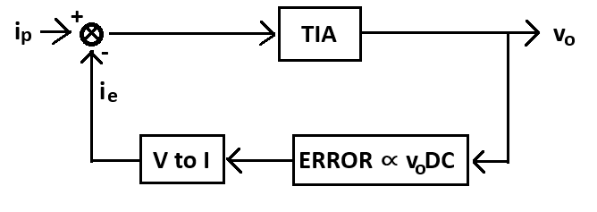

#  Trabajo 6 de Sistemas Electrónicos

#### Primer Semestre de 2025

## Introducción

Este semestre, su grupo es responsable de diseñar y fabricar un prototipo de fotopletismógrafo para aplicar los conocimientos y tecnicas relacionados a la asignatura de Sistemas Electrónicos.

A grandes rasgos, el prototipo debe tener las siguientes funcionalidades:

1. medir la frecuencia cardíaca (Heart Rate - HR)
1. emitir una señal de luz infrarroja cuando hay un pulso cardíaco
1. detectar la señal infraroja emitida por otro prototipo
1. medir el tiempo entre la detección de la señal infrarroja y el siguiente pulso cardíaco (Pulse Transit Time - PTT)
1. Permitir la visualización de los valores de HR y PTT medidos

El sistema que deben diseñar puede ser dividido en los siguientes bloques:

Figura 1: División del sistema del fotopletismógrafo en bloques

En el sexto trabajo, los objetivos son los siguientes:

1. implementar el detector óptico y amplificador, los cuales producen la señal de fotopletismografía
1. implementar el filtro 1, el cual elimina la parte DC de la señal de fotopletismografía
1. mejorar el detector de peak utilizando un circuito de rectificador de precisión (superdiodo)

El trabajo será un ensayo que debe contener la siguiente información:

- Identificación del grupo (color)
- Identificación de los integrantes del grupo (nombres, apellidos y RUT)
- La información que se pide en cada una de las siguientes sesiones de este documento

## 1. Detector Óptico y amplificador

Como visto anteriormente, fotodiodos convierten intensidad luminosa en una corriente eléctrica. El objetivo de esta sesión es diseñar el circuito que convierte la corriente eléctrica resultante en un voltaje. También es necesario amplificar el voltaje obtenido porque la señal de fotopletismografía suele ser pequeña.

Una forma simple de convertir corriente en voltaje es utilizando una resistencia, de la siguiente forma:

Figura 2: Convertidor de corriente del fotodiodo en un voltaje

Donde $D_P$ es el fotodiodo del SFH 7070.

1. Considerando que $R=1\ k\Omega$, calculen (0.5pt) :
   1. La relación entre el voltaje de salida $v_o$ y la corriente del fotodiodo, $i_p$
   1. La impedancia de salida del circuito 
   1. Cuanto vale $V_D$ cuando $i_p = 0$, $i_p = 0.01\ mA$ y $i_p = 0.1\ mA$. 

El circuito de la figura 2 tiene dos grandes desventajas:
  - La impedancia de salida es muy alta
  - El voltaje del diodo cambia junto con $v_o$

El segundo punto distorciona la señal de salida, porque la corriente del diodo será proporcional no sólo a la intensidad luminosa, sino que también a los cambios en $V_D$.

Para mitigar los problemas con el circuito de la figura 2, utilizaremos un circuito conocido como amplificador de transimpedancia (del inglés, transimpedance amplifier, algunas veces abreviado como TIA). El nombre puede parecer rebuscado, pero recordando que impedancia es similar a la resistencia en el sentido que se definen como la razón entre el voltaje y la corriente ($R=\frac{V}{I}$, $Z=\frac{\mathbb{V}}{\mathbb{I}}$, donde $\mathbb{V}$ y $\mathbb{I}$ son los fasores de voltaje y corriente, respectivamente), se puede entender que transimpedancia es simplemente la razón entre un voltaje de salida y una corriente de entrada. Es decir, amplificador de transimpedancia literalmente significa un amplificador que convierte corrientes en voltajes. La siguiente figura muestra el circuito del TIA que utilizaremos. Al igual que en trabajos anteriores, el amplificador operacional elegido es el MCP6009T-E/SL.

Figura 3: Amplificador de Transimpedancia 

2. Elijan un valor de $R_{23}$, que esté disponible en el anexo, de tal forma que $v_o \approx 1000 i_p$ y calculen (0.4pt) :
   1. La impedancia de salida del circuito 
   1. Cuanto vale $V_D$ cuando $i_p = 0$, $i_p = 0.01\ mA$ y $i_p = 0.1\ mA$.

Debido a la capacitancia del fotodiodo y el ancho de banda finito del amplificador operacional, el amplificador de transimpedancia de la figura 3 puede ser inestable. Una forma de estabilizarlo es introducir un capacitor adicional y hacer con que el polo resultante sea relativamente lento en comparación con el ancho de banda del amplificador operacional. El siguiente circuito implementa dicha solución:

Figura 4: Amplificador de Transimpedancia Compensado

3. Determinen la función de transferencia $H(s) = \frac{v_o(s)}{i_p(s)} $. (0.5pt)

4. Elijan un valor para $C_5$, que esté disponible en el anexo, de tal forma que el polo de la función de transferencia determinada en el item anterior sea aproximadamente -100 rad/s. (0.3pt)

## 2. Filtro 1

El SFH 7070 puede ser ubicado como en la Figura 5 (a), de forma a obtener una señal de corriente que es similar a lo que se muestra en la Figura 5 (c). En la Figura 6 se destaca que la señal tiene una componente DC y otra AC. Tipicamente la amplitud AC es al menos 100 veces menor que la línea de base DC. Por ejemplo, podría detectarse una corriente de 1 mA, sobre la cual hay una señal de PPG con amplitud 0.01 mA.

Figura 5: Principio de fotopletismografía. Tomada de Dzedzickis, Andrius & Kaklauskas, Arturas & Bučinskas, Vytautas. (2020). Human Emotion Recognition: Review of Sensors and Methods. Sensors. 20. 592. 10.3390/s20030592. 

Figura 6: Señal PPG. Tomada de Yung-Hui Li, Latifa Nabila Harfiya, Ching-Chun Chang, "Featureless Blood Pressure Estimation Based on Photoplethysmography Signal Using CNN and BiLSTM for IoT Devices", Wireless Communications and Mobile Computing, vol. 2021, Article ID 9085100, 10 pages, 2021. https://doi.org/10.1155/2021/9085100

Utilizando el amplificador de transimpedancia diseñado en la sesión anterior, la señal resultante sería un voltaje de 1 V DC sumada a una señal de PPG con amplitud 10 mV.

En esta sesión, el objetivo es diseñar un circuito que remueve la componente DC del voltaje resultante, obteniendo así la señal de PPG más pura. Nótese que la componente DC que se debe remover no siempre tiene el mismo valor: en realidad varía dependiendo del tono de piel, ubicación del sensor y con cuanta presión se presiona el sensor contra la piel del paciente. Por lo tanto, el circuito a proyectar debe ser capaz de adaptarse al valor DC de la señal en tiempo real.

La estrategia que utilizaremos para cumplir con el objetivo es aplicar un sistema de control en malla cerrada. Es decir, vamos a crear un circuito que mide la señal de salida y produce una señal de error relacionada al voltaje DC, para luego generar una corriente proporcional al error y restarla de la corriente del fotodiodo $i_p$. La siguiente figura muestra un diagrama de la estrategia elegida:

Figura 7: Sistema en malla cerrada para remover la componente DC de $v_o$.

Para producir una señal de error relacionada a la componente DC de $v_o$ utilizaremos un integrador. La motivación es que al integrar una señal, se atenuan las partes AC, mientras que se amplifica la parte DC. Por ejemplo, para una señal de entrada $v_i = 1 + 0.01 cos(10t)$, su integral sería $\int v_i = 1t + 0.001sen(10t)$ . Es decir, la parte AC tiene una amplitud 10 veces menor, mientras que la parte DC se convirtió en un voltaje que crece tendiendo al infinito.

Recordando que:

$$ \mathcal{L} \left\\{ \int f(t) \right\\} = \frac{1} {s} F(s) $$

Podemos concluir que para integrar una señal, basta con multiplicarla por $1/s$ en el dominio de Laplace. Es decir, la función de transferencia $1/s$ representa un integrador.

5. Encuentren la función de transferencia $H(s) = \frac{v_{integrated}}{v_o}$ del siguiente circuito: (1pt)

Figura 8: Circuito Integrador Deboo

6. Determinen cual debe ser la relación entre $R_{24}$, $R_{25}$, $R_{26}$ y $R_{27}$ para que la función de transferencia tome la forma $\frac{K}{s}$, donde K es una constante. (0.5pt)

La salida del integrador diseñado es un voltaje proporcional a la integral de $v_o$. Para finalizar el circuito solo necesitamos convertir la salida del integrador en una corriente $i_e$ y restarla de $i_p$. Eso se puede lograr utilizando apenas una resistencia adicional, $R_{28}$ de la siguiente forma:

Figura 9: Detector óptico + filtro 1

7. Elijan los valores de $R_{24}$, $R_{25}$, $R_{26}$, $R_{27}$, $R_{28}$ y $C_6$ de forma que se cumplan los siguientes requerimientos (1pt):
   1. Los valores de los componentes elegidos están disponibles en el anexo
   1. Los valores de $R_{24}$, $R_{25}$, $R_{26}$ y $R_{27}$ cumplen con la relación determinada en el punto 6
   1. $(1+\frac{R_{26}}{R_{27}})\frac{1}{R_{28}R_{24}C_6} \approx \frac{1}{R_{23}}$
   1. Ninguna resistencia es menor a $1\ k\Omega$.

## 3. Detector de Peak parte 2

En el trabajo 3 estudiamos como se generará el valor de PTT: primero se produce una señal de pulsos de voltaje con la misma duración que el PTT, luego la utilizamos como entrada del integrador para producir una señal triangular que empieza en cero y sube a una velocidad constante mientras el pulso está en 5 V. Cuando el pulso baja a cero, la señal triangular también baja a cero

Figura 10: Medición de PTT

De ésta forma, el valor maximo de la señal triangular será proporcional al valor de PTT (1 V = 100 ms). Finalmente, proyectamos el circuito detector de peak cuya salida es efectivamente dicho valor maximo.

Figura 11: Peak detector

Sin embargo, el peak detector proyectado tiene una desventaja: el valor de $v_o$ no es exactamente $max\{v_i\}$, sino que $max\{v_i\} - V_F$, donde el $V_F$ del diodo utilizado es aproximadamente 0.7 V.

En este trabajo reemplazaremos $D_4$ por un circuito conocido como rectificador de precisión (superdiodo), que actúa como un diodo ideal con $V_F=0$. Comprobemos el funcionamiento del rectificador de precisión con un ejemplo:

Figura 12: Rectificador de media onda con diodo ideal

Figura 13: Rectificador de media onda con rectificador de precisión

8. Calculen $v_o$ en ambos circuitos cuando $v_i > 0$ y cuando $v_i < 0$ y comparenlos. Asuman que $D_{ideal}$ es un diodo ideal ($V_F = 0$) y que $D_4$ es un diodo real con $V_F=0.7\ V$. (1pt)

AYUDA: Analicen el caso $v_i >0$ y el caso $v_i <0$ por separado.

AYUDA2: Al igual que en el primer módulo de la asignatura, remuevan el diodo del circuito, analicen los voltajes resultantes y, de acuerdo a esto, determinen si el diodo conduce o no.

AYUDA3: Tanto cuando remueven el diodo cuanto después de determinar si está conduciendo o no, evaluen si hay realimentación negativa para el amplificador operacional. Si no hay, este actua como un comparador. Si hay, pueden aplicar cortocircuito virtual.

9. Calculen $v_x$ en el circuito rectificador de precisión (figura 13) cuando $v_i > 0$ y considerando que el $V_F$ de $D_4$ es 0.7 V. Basandose en la respuesta, determinen cual es el mayor valor de $v_i$ con el cual el circuito actúa como un diodo ideal. (0.5pt)

Finalmente, el circuito final del peak detector se muestra a continuación:

Figura 14: Peak detector con rectificador de precisión

Se agregaron $R_{43}$, $R_{44}$ y $Q_{14}$ para  descargar $C_{13}$ cuando se inicia la medición de PTT.

10. Elijan un valor de $R_{44}$ que esté disponible en el anexo y descargue entre 90 % y 95 % del voltaje de $C_{13}$ en 100 ms cuando $Q_{14}$ se satura. Asuman $V_{BE_{SAT}} = 0.7\ V$, $V_{CE_{SAT}} = 0.3\ V$ y $\beta=100$. Utilizaremos el mismo valor elegido para $R_{43}$. (0.3pt) 

## Plazo de entrega: 23:59, 14 de Mayo de 2025

## Anexos

I. Valores de Resistencias disponibles:

|   |  |        |       |  |
|------|------|-----------|------------|-------|
| 10Ω  | 220Ω | 1kΩ       | 6.8kΩ      | 100kΩ |
| 22Ω  | 270Ω | 2kΩ       | 10kΩ       | 220kΩ |
| 47Ω  | 330Ω | 2.2kΩ     | 20kΩ       | 300kΩ |
| 100Ω | 470Ω | 3.3kΩ     | 47kΩ       | 470kΩ |
| 150Ω | 510Ω | 4.7kΩ     | 51kΩ       | 680kΩ |
| 200Ω | 680Ω | 5.1kΩ     | 68kΩ       | 1MΩ   |

II. Valores de Capacitores Ceramicos disponibles:

|   |  |        |       |  |
|------|------|-----------|------------|-------|
| 100 pF  | 220 pF | 330 pF | 470 pF | 680 pF |
| 1 nF  | 2.2 nF | 3.3 nF | 4.7 nF | 6.8 nF |
| 10 nF  | 22 nF | 33 nF | 47 nF | 68 nF |
| $0.1\ \mu F$  | $0.22\ \mu F$ | $0.33\ \mu F$| $0.47\ \mu F$ | $0.68\ \mu F$ |
| $1\ \mu F$  | - | - | $4.7\ \mu F$ | - |
| $10\ \mu F$  | $22\ \mu F$ | - | - | - |
