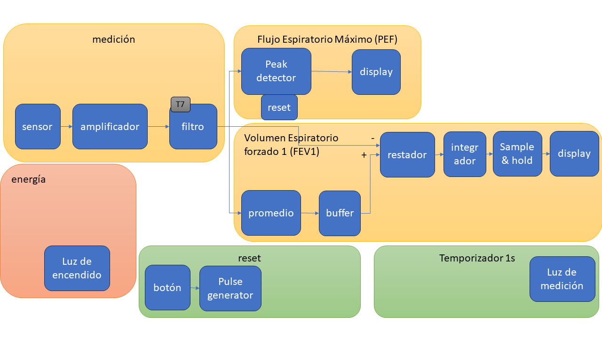
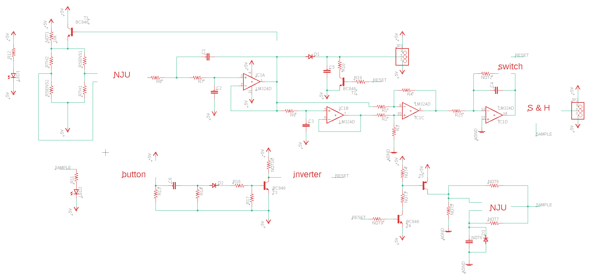

#  Trabajo 7 de Sistemas Electrónicos

#### Primer Semestre de 2024

## Introducción

Este semestre, su grupo es responsable de diseñar y fabricar un espirómetro electrónico para aplicar los conocimientos y tecnicas relacionados a la asignatura de Sistemas Electrónicos. 

En el Trabajo 7, la tarea es diseñar el filtro que ayudará a reducir el ruido de la señal de flujo. Además, se harán las preparaciones para la fabricación del circuito del espirometro.

Figura 1: División del sistema del espirómetro electrónico en bloques y componentes del trabajo 7

El trabajo será un ensayo que debe contener la siguiente información:

- Identificación del grupo (nombres, apellido y RUT)
- La información que se pide en cada una de las siguientes sesiones de este documento

## Filtro

Aproximemos la señal de flujo como una onda cuadrada con periodo 2 segundos (el usuario empieza a soplar con un flujo constante en t=0 y deja de soplar en t=1 s).

Figura 2: aproximación de la señal de flujo como una onda cuadrada y sus aproximaciones considerando las primeras componentes de la serie de fourier. La ampliud está normalizada a 1. $L = 1\ s$.

Podemos encontrar el espectro de frecuencia de esta señal calculando su serie de Fourier:

$$ f(x)=\frac{4}{\pi} \sum_{n=1,3,5,...}^\infty \frac{1}{n} sen(\frac{n\pi x}{L}). $$

Es decir, la señal está compuesta de señales sinusoidales, cada una con frecuencia $n\pi$ y amplitud $\frac{4}{n \pi}$, donde $n=1,3,5,...$.
Se puede observar que la mayor componente es la de la frecuencia fundamental ($\pi$ rad/s, o 0.5 Hz), y que la amplitud de las componentes disminuyen conforme la frecuencia aumenta. Es decir, si consideramos que la energía de la señal es proporcional a su amplitud al cuadrado, la mayor parte de la energía está concentrada en las componentes de menores frecuencias. Por lo tanto, si en la señal real encontramos componentes con grandes amplitudes a frecuencias altas, lo más probable es que sean ruido. Implementaremos un filtro paso-baja para eliminar dicho ruido. En especial, es deseable atenuar la componente de frecuencia 50 Hz.

1. Para elegir la frecuencia de corte, determinen a que frecuencia las componentes de la onda cuadrada contribuyen con menos del 0.1 % de la energía de la componente fundamental. Es decir, a que frecuencia la amplitud de la componente al cuadrado es menor a 0.1 % de la amplitud de la fundamental al cuadrado ($Amplitud^2 < 0.001 (\frac{4}{\pi})^2$). La frecuencia elegida no puede ser mayor a 50 Hz. (1 pt)

2. Elijan los valores de $R$ y $C$ para que el siguiente circuito implemente un filtro paso-baja con una frecuencia de corte cercana ($\pm 2\ Hz$) a la frecuencia de corte elegida en el item 1. Los valores de $R$ y $C$ tienen que estar disponibles en las tablas en anexo. (3 pt)

Figura 3: Circuito del filtro.

## Preparación para la fabricación

3. Utilizando el programa Autodesk EAGLE que puede ser descargado gratuitamente en la pagina https://www.autodesk.com/products/eagle/free-download, abran el proyecto contenido en el archivo espirometro.zip de uvirtual. La manera más facil de hacerlo es descompactando el contenido del archivo y moviendolo a una nueva carpeta en el directorio de proyectos de EAGLE (normalmente ...\Documentos\EAGLE\projects). Una vez que tengan el proyecto abierto, abran el archivo v1.sch, el cual contiene el diagrama preliminar del circuito del espirometro. Identifiquen cada uno de los bloques que se han diseñado en los trabajos anteriores y, utilizando la herramienta "value", agreguen el valor de todos las resistencias y capacitancias cuyo nombre no empieza con "NOT". Utilicen los valores corregidos de todos los trabajos hasta el momento (incluyendo el trabajo 7). Guarden el archivo y envíen solamente v1.sch al correo del profesor antes del plazo de entrega de este trabajo. (1pt)

Figura 3: diagrama preliminar del circuito completo del espirometro

4. Elijan una imagen para personalizar la placa que será fabricada con el circuito diseñado por su grupo. La imagen debe estar en el formato bitmap (.bmp), tener un tamaño mínimo de 2000 x 2000 y estar en blanco y negro. Envíenla al correo del profesor antes del plazo de entrega de este trabajo. (1pt)

## Plazo de entrega: 23:59, 24 de Mayo de 2024

## Anexos

Valores de Resistencias disponibles:

|   |  |        |       |  |
|------|------|-----------|------------|-------|
| 10Ω  | 220Ω | 1kΩ       | 6.8kΩ      | 100kΩ |
| 22Ω  | 270Ω | 2kΩ       | 10kΩ       | 220kΩ |
| 47Ω  | 330Ω | 2.2kΩ     | 20kΩ       | 300kΩ |
| 100Ω | 470Ω | 3.3kΩ     | 47kΩ       | 470kΩ |
| 150Ω | 510Ω | 4.7kΩ     | 51kΩ       | 680kΩ |
| 200Ω | 680Ω | 5.1kΩ     | 68kΩ       | 1M    |

Valores de Capacitores Ceramicos disponibles:

|   |  |        |       |  |
|------|------|-----------|------------|-------|
| 100 pF  | 220 pF | 330 pF | 470 pF | 680 pF |
| 1 nF  | 2.2 nF | 3.3 nF | 4.7 nF | 6.8 nF |
| 10 nF  | 22 nF | 33 nF | 47 nF | 68 nF |
| $0.1\ \mu F$  | $0.22\ \mu F$ | $0.33\ \mu F$| $0.47\ \mu F$ | $0.68\ \mu F$ |