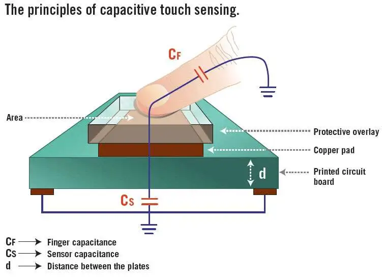

#  Trabajo 7 de Sistemas Electrónicos

#### Primer Semestre de 2026

## Introducción

Este semestre, su grupo es responsable de diseñar y fabricar un prototipo de sensor capacitivo de toque y proximidad para aplicar los conocimientos y tecnicas relacionados a la asignatura de Sistemas Electrónicos.

El dispositivo propuesto será capaz de producir un voltaje proporcional a la distancia entre el dedo del usuario y el sensor, y visualizar el voltaje a través de 5 luces. También podrá funcionar en modo diferencial, en el cual se conectan dos sensores y el voltaje resultante es la diferencia entre la señal de los dos sensores. 

El sistema que deben diseñar puede ser dividido en los siguientes bloques:

Figura 1: División del sistema del sensor capacitivo en bloques

El objetivo del Trabajo 7 es diseñar el multivibrador.

El trabajo será un ensayo que debe contener la siguiente información:

- Identificación del grupo (color)
- Identificación de los integrantes del grupo (nombres, apellidos y RUT)
- La información que se pide las siguientes secciones de este documento

## Multivibrador Astable

En el trabajo 6 se describió la señal del sensor como una señal cuadrada con amplitud fija y frecuencia variable. Se dijo que la frecuencia cambia de acuerdo a la distancia del dedo al sensor. En este trabajo, entenderemos como funciona el sensor y lo diseñaremos para que produzca la señal con las características esperadas.

El sensor capacitivo de toque y proximidad, como el nombre indica, funciona basado en las propiedades capacitivas del cuerpo humano. En el primer laboratorio presencial Ustedes midieron la resistencia eléctrica entre sus manos, y encontraron valores relativamente altos (cientos de $k \Omega$, o incluso del órden de $M\Omega$). Esto significa que, por lo menos a nivel de la capa externa de la piel (epidermis), el cuerpo humano presenta baja conductividad eléctrica o, de forma equivalente, alta resistencia eléctrica. Sin embargo, a nivel interno (dermis, sangre y músculos), hay fluidos ricos en iones que facilitan la conducción eléctrica. Es decir, la capa externa de la piel es aislante mientras que el interior es conductor.

Con esta información podemos construir un capacitor que utiliza el cuerpo humano. Basta establecer una area de material conductivo (por ejemplo cobre) y tocarla con el dedo. El cobre es una placa del capacitor, la epidermis del dedo es el material aislante, y el interior del cuerpo es la otra placa del capacitor. La siguiente imagen ilustra este concepto:

Figura 2: Un capacitor formado por una area de cobre y un dedo.

El valor de la capacitancia que se forma utilizando esta técnica es relativamente pequeño: podría estar del orden de 1 a 10 pF. Sin la capa protectore por sobre el cobre podría ser un poco mayor, del órden de 100 a 200 pF. Sin embargo, es grande lo suficiente para que se pueda medir utilizando la técnica apropriada.

Una de las técnicas para producir una señal que depende del valor de la capacitancia en el sensor capacitivo es la utilización de un multivibrador astable, como el que se muestra en la figura 3.

Figura 3: Circuito del Multivibrador Astable

La idea es conectar el "botón", que es simplemente una pequeña área de cobre, a $V_-$. Cuando el dedo del usuario forma un capacitor con el botón, la capacitancia resultante está en paralelo con $C_5$. Como capacitancias en paralelo se suman, la capacitancia observada por el nodo $V_-$ se incrementa, lo que modifica la frecuencia de la señal producida por el astable.

1. Elijan valores para $C_5$, $R_{24}$, $R_{25}$ y $R_{26}$ de tal forma que (6pt):
    - La frecuencia de la señal generada por el astable cuando $C_5$ es igual a su valor nominal es aproximadamente 450 kHz. Si no es posible un valor cercano, asegurénse de que sea del órden de cientos de kHz.
    - La frecuencia de la señal generada por el astable cuando $C_5$ se incrementa en 200 pF (cuando el dedo entra en contacto con el nodo $V_-$ ) es aproximadamente 20 kHz. Si no es posible un valor cercano, asegurénse de que sea del órden de decenas de kHz.
    - Ninguna resistencia es menor a $1\ k\Omega$
    - Los valores de resistencias y capacitor elegidos están disponibles en el anexo

## Plazo de entrega: 15:20, 23 de Julio de 2026

## Anexos

I. Valores de Resistencias disponibles:

|   |  |        |       |  |
|------|------|-----------|------------|-------|
| 10Ω  | 220Ω | 1kΩ       | 6.8kΩ      | 100kΩ |
| 22Ω  | 270Ω | 2kΩ       | 10kΩ       | 220kΩ |
| 47Ω  | 330Ω | 2.2kΩ     | 20kΩ       | 300kΩ |
| 100Ω | 470Ω | 3.3kΩ     | 47kΩ       | 470kΩ |
| 150Ω | 510Ω | 4.7kΩ     | 51kΩ       | 680kΩ |
| 200Ω | 680Ω | 5.1kΩ     | 68kΩ       | 1MΩ   |

II. Valores de Capacitores Ceramicos disponibles:

|   |  |        |       |  |  |
| -------- | ------- | ------- | ----------- | --------- | --------- |
| 100 pF   | 1 nF    | 10 nF   | $0.1\ \mu F$ | $1\ \mu F$  | $10\ \mu F$ |
| 220 pF   | 2.2 nF  | 22 nF   | $0.22\ \mu F$ | -         | $22\ \mu F$ |
| 330 pF   | 3.3 nF  | 33 nF   | $0.33\ \mu F$ | -         | -         |
| 470 pF   | 4.7 nF  | 47 nF   | $0.47\ \mu F$ | $4.7\ \mu F$| -         |
| 680 pF   | 6.8 nF  | 68 nF   | $0.68\ \mu F$ | -         | -         |

III. Valores de Capacitores Electrolíticos disponibles:

|   |  |        |       |
|------|------|-----------|------------|
| $1\ \mu F$  | $10\ \mu F$ | $100\ \mu F$       | $1000\ \mu F$      |
| $2.2\ \mu F$  | $22\ \mu F$ | $220\ \mu F$       | -       |
| $3.3\ \mu F$  | $33\ \mu F$ | $330\ \mu F$     | -       |
| $4.7\ \mu F$ | $47\ \mu F$ | $470\ \mu F$     | -       |
