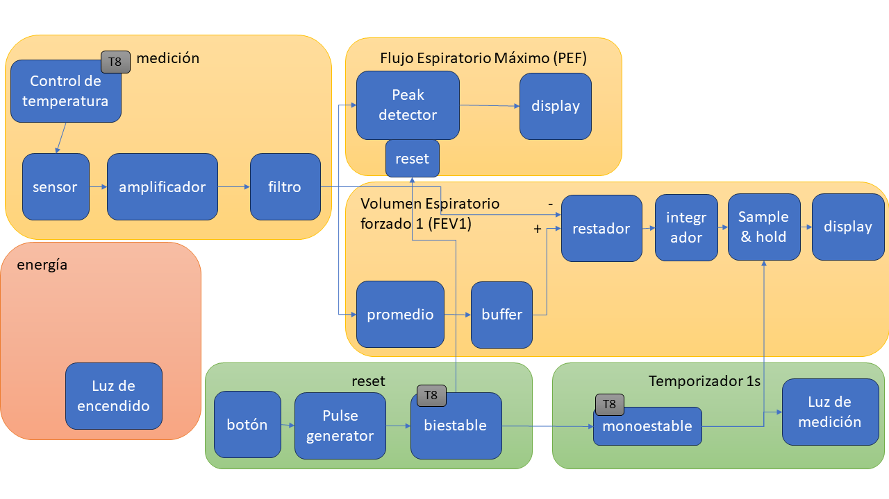
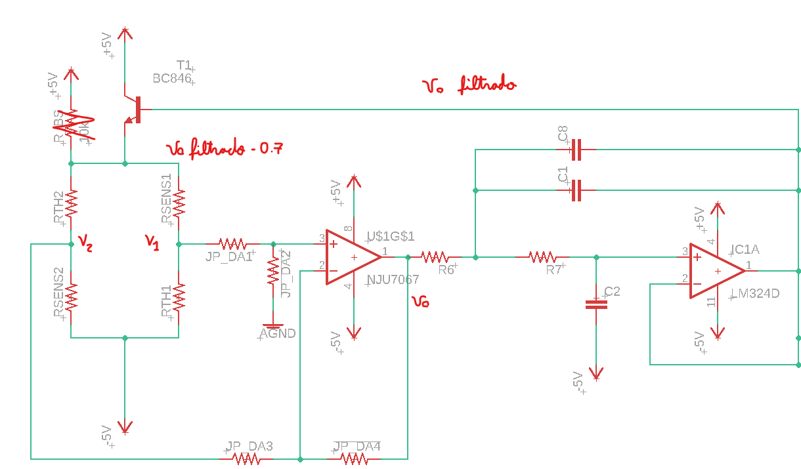

#  Trabajo 8 de Sistemas Electrónicos

#### Primer Semestre de 2024

## Introducción

Este semestre, su grupo es responsable de diseñar y fabricar un espirómetro electrónico para aplicar los conocimientos y tecnicas relacionados a la asignatura de Sistemas Electrónicos. 

El trabajo 8 tiene 3 objetivos:

1. Diseñar el circuito que cuenta 1 segundo después de presionado el botón de RESET, y genera la señal para que el Sample and Hold retenga el valor de salida del integrador.
1. Robustecer la señal de reset utilizando un inversor Schmitt
1. Reemplazar el amplificador diferencial del sensor por un amplificador operacional, y aplicar un sistema de control de temperatura

Figura 1: División del sistema del espirómetro electrónico en bloques y componentes del trabajo 8

El trabajo será un ensayo que debe contener la  identificación del grupo (nombres, apellido y RUT) y la información que se pide en cada una de las siguientes sesiones de este documento.

## Multivibrador Monoestable

Para marcar el paso de 1 segundo desde que se apreta el botón de reset, se utilizará un multivibrador monoestable que se muestra en la figura a continuación.

Figura 2: Circuito del Multivibrador Monoestable

1. Considerando que $+V_{CC} = +5\ V$, $-V_{CC} = -5\ V$, Elijan los valores de $R_{m1}$, $R_{m2}$, $R_{m3}$ y $C_{m1}$, de tal forma que el circuito cumpla con todos los siguientes requerimientos (1.5pt):
   - $T_t = 1\pm0.2\ s$. Es decir, suponiendo que el voltaje de salida ($SAMPLE$) está en su estado estable y que el circuito de disparo ($TRIGGER$) hace con que la salida cambie a su estado semi-estable, el tiempo en que el circuito demora en volver al estado estable está entre 0.8 s y 1.2 s.
   - La corriente en $R_{m1}$ y $R_{m2}$ está entre $0.05\ mA$ y $0.5\ mA$ en cada uno de los estados del multivibrador
   - El modulo del voltaje en $V_+$ no supera 4.5 V ($|V_+| <= 4.5$) 
   - Los valores de Resistencias y de Capacitores son valores disponibles en el anexo

## Circuito de disparo (TRIGGER)

El objetivo del circuito de disparo es elevar el voltaje en $V_+$ durante un breve período de tiempo de acuerdo a la señal RESET. Cuando no está activo, el circuito de disparo debe estar desconectado de $V_+$ de forma a no influenciar el funcionamiento del multivibrador monoestable. Para cumplir con el objetivo, se utilizará un transistor PNP.

Para activar el transistor PNP es necesario bajar su voltaje de base. Sin embargo, la señal RESET funciona al revés: al momento de apretar el botón, RESET sube de -5 V a +5 V. Por lo tanto, se utilizará un segundo transistor, del tipo NPN, que se activará con la señal RESET, bajando el voltaje en la base del transistor PNP y, por lo tanto, disparando el monoestable. El circuito completo se muestra en la siguiente figura:

Figura 3: Circuito del TRIGGER

Para $Q_1$ se utilizará el transistor BC846BW, mientras que para $Q_2$ se utilizará el transistor MMBT3906.

Las resistencias $R_{B1}$ y $R_{B2}$ tendrán los mismos valores que las resistencias $R_5$ y $R_7$ del circuito de reset del peak detector (Trabajo 3).

2. Elijan un valor de $R_C$ para que su corriente esté entre 0.1 mA y 1 mA cuando $Q_1$ está saturado. El valor elegido tiene que ser uno de los valores disponibles en el anexo. (0.5pt)

3. Considerando el circuito de multivibrador monoestable que Ustedes diseñaron en el ítem 1, calculen cual será la corriente de colector de $Q_2$ si este está saturado ($I_{C_{SAT\ (Q_2)}}$). Elijan alguno de los valores de $V_{CE_{SAT}}$ de la hoja de datos de $Q_2$ para realizar el cálculo. (0.5pt)

4. Elijan un valor para $R_{B3}$, que esté disponible en el anexo, de tal forma que la corriente de base en $Q_2$ cuando $Q_1$ está saturado sea aproximadamente una décima de $I_{C_{SAT\ (Q_2)}}$ (es decir, $\beta_{forzado}\approx 10$). Elijan alguno de los valores de $V_{BE_{SAT}}$ de la hoja de datos de $Q_2$ para realizar el cálculo. (0.5pt)
   
## Multivibrador biestable

En el trabajo 3 se diseñó un circuito que genera un pulso que será la señal de RESET, bien como el circuito que descarga el capacitor del peak detector de acuerdo a dicha señal. El resultdao final se muestra a continuación.

Figura 4: Circuito del generador de pulso (señal RESET) y de descarga del capacitor del peak detector.

Conforme avanza el diseño del espirómetro, más circuitos necesitan consumir la señal de RESET:
   1. El circuito del reset del peak detector
   1. El circuito del reset del integrador (pendiente)
   1. El TRIGGER del multivibrador monoestable

Al conectar más circuitos en el punto RESET de la figura 4, se aumenta la cantidad de corriente que el generador de pulso debe entregar, lo que puede afectar su funcionamiento. Para evitar cargar el generador de pulso, este se modificará para que tenga un amplificador en su salida, lo que le brindará mayor capacidad de entrega de corriente. La figura 5 muestra las modificaciones en el generador de la señal RESET bien como los tres circuitos que se conectan a él.

Figura 5: Generador de pulso modificado y circuitos que consumen la señal RESET

5. Suponiendo que los valores de las resistencias $R_{13}$, $R_{14}$, $R_{16}$ y $R_{17}$ son los mismos que Ustedes eligieron para sus equivalentes en el circuito original ($R_4$, $R_6$, $R_5$ y $R_7$, respectivamente), determinen el valor de $R_{18}$ para que la corriente sobre él esté entre 0.5 y 1.5 mA cuando el transistor $Q_1$ está saturado. Recuerden que el valor de resistencia debe estar disponible en el anexo. (0.5pt)

6. El componente U1 representa un inversor con histeresis, que es equivalente al comparador inversor con histeresis, estudiado en clase (se omite el voltaje umbral). U1 será implementado utilizando el circuito integrado TC4S584F. Estudien la hoja de datos del TC4S584F y, asumiendo que está alimentado con -5V y +5V, determinen el voltaje umbral positivo y negativo. Asuman que la temperatura de operación es 25°C. (1pt)

## Amplificador de Diferencias

El sensor de flujo diseñado en el Trabajo 4 contenía 2 termistores y 2 resistencias conectados de la siguiente forma:

Figura 6: Circuito del sensor de flujo mejorado. La salida es un voltaje diferencial ($v_1-v_2$)

Dicha configuración también se conoce como puente de wheatstone. También en el trabajo 4 se diseñó un amplificador diferencial para amplificar la diferencia de voltaje $v_1-v_2$ y producir un voltaje único de salida.

Para tener más flexibilidad con el sensor de flujo, se va a reemplazar el amplificador diferencial por un amplificador de diferencias implementado con un amplificador operacional. La figura 7 muestra el amplificador de diferencias.

Figura 7: Amplificador de diferencias

7. Elijan los valores de $R_{DA1}$, $R_{DA2}$, $R_{DA3}$ y $R_{DA4}$ de tal forma que el circuito cumpla con todos los siguientes requerimientos: (1pt)
   - el circuito implementa la fórmula $v_o = A_v (v_1 - v_2)$ con $A_v \in [10,15]$
   - La corriente máxima en cada una de las resistencias está entre 0.1 mA y 1 mA
   - los valores de las resistencias elegidas son valores disponibles en el anexo

## Generación de $V_{bias}$ / Control de Temperatura

Finalmente, existen dos estrategias que vamos a probar para  generar el voltaje $V_{bias}$ del sensor de flujo.

8. La primera estrategia es simplemente utilizar una resistencia con valor fijo entre $V_{bias}$ y +5V para mantener el voltaje aproximadamente en el valor deseado. Así, asumiendo que se conecta una resistencia entre $V_{bias}$ y +5V en el circuito de la figura 6, y que $R_{sens1} = R_{sens2} = R_{th1} = R_{th2} = 330\ \Omega$, determinen el valor de la resistencia para que $V_{bias}$ sea aproximadamente el valor elegido en la pregunta 3 del Trabajo 4. Elijan un valor de resistencia que esté disponible en el anexo. (0.5pt)

La segunda estrategia es controlar el valor de $V_{bias}$ de tal forma que la temperatura de los termistores se mantenga constante. Esto se puede lograr porque al aumentar $V_{bias}$, aumenta la corriente en cada termistor, lo que hace con que su temperatura aumente y, como consecuencia, que su resistencia disminuya. Al disminuir $V_{bias}$ se genera el efecto inverso, y la temperatura de los termistores disminuyen mientras sus resistencias aumentan. Así, podemos crear un circuito que intente mantener la diferencia de voltaje $v_d = v_1 - v_2$ siempre igual a cero. Es decir, si $v_d$ es positiva, aumentar $V_{bias}$, y si $v_d$ es negativa, disminuir $V_{bias}$. Al hacerlo, el cambio de resistencias traerá $v_d$ de vuelta a cero.

La salida del amplificador de diferencias ya tiene las características que se buscan: cuando $v_d$ aumenta, $v_o$ aumenta y vice-versa. Por lo tanto, se puede utilizar $v_o$ como $V_{bias}$. Alternativamente, si la corriente que consumen los termistores es relativamente alta, se puede utilizar un transistor para amplificar la corriente y no cargar el amplificador operacional. El circuito de la figura a continuación implementa dicha estrategia:

Figura 8: Circuito de control de $V_{bias}$ que mantiene la temperatura de los termistores constante.

La segunda estrategia cambia un poco el significado del voltaje de salida del sensor: en vez de ser un voltaje proporcional a la diferencia de resistencia que se produce cuando los termistores se enfrían debido al flujo de aire, ahora el voltaje de salida es el voltaje necesario para mantener los termistores a una misma temperatura, incluso cuando el flujo de aire les quita más calor. A priori, no está claro cual de las dos estrategias es mejor, por lo que realizaremos pruebas más adelante para determinarlo.

Las placas de circuito impreso que se van a fabricar tendrán espacio para implementar ambas estrategias. Para elegir o una o la otra se pueden dejar algunos de dichos espacios vacios, o ocupar resistencias de 0 ohms para hacer cortocircuitos en partes del circuito que no se ocupen en la estrategia elegida. 

## Plazo de entrega: 23:59, 05 de Junio de 2024

## Anexos

Valores de Resistencias disponibles:

|   |  |        |       |  |
|------|------|-----------|------------|-------|
| 10Ω  | 220Ω | 1kΩ       | 6.8kΩ      | 100kΩ |
| 22Ω  | 270Ω | 2kΩ       | 10kΩ       | 220kΩ |
| 47Ω  | 330Ω | 2.2kΩ     | 20kΩ       | 300kΩ |
| 100Ω | 470Ω | 3.3kΩ     | 47kΩ       | 470kΩ |
| 150Ω | 510Ω | 4.7kΩ     | 51kΩ       | 680kΩ |
| 200Ω | 680Ω | 5.1kΩ     | 68kΩ       | 1M    |

Valores de Capacitores Ceramicos disponibles:

|   |  |        |       |  |
|------|------|-----------|------------|-------|
| 100 pF  | 220 pF | 330 pF | 470 pF | 680 pF |
| 1 nF  | 2.2 nF | 3.3 nF | 4.7 nF | 6.8 nF |
| 10 nF  | 22 nF | 33 nF | 47 nF | 68 nF |
| $0.1\ \mu F$  | $0.22\ \mu F$ | $0.33\ \mu F$| $0.47\ \mu F$ | $0.68\ \mu F$ |