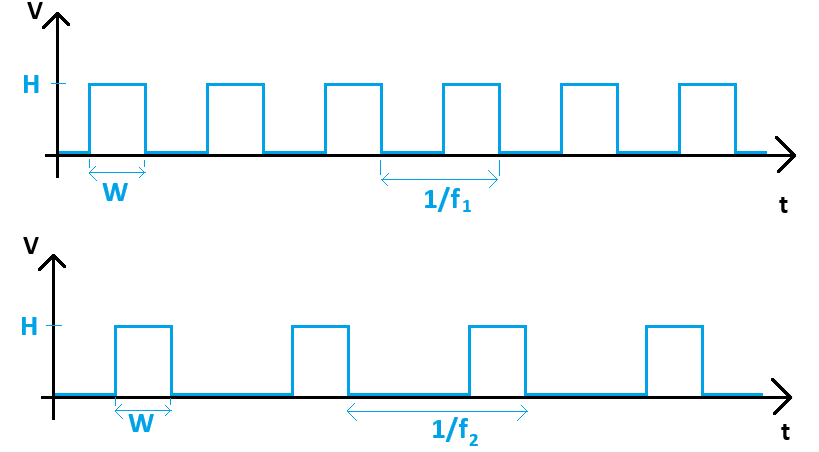

#  Trabajo 7 de Sistemas Electrónicos

#### Segundo Semestre de 2025

## Introducción

Este semestre, su grupo es responsable de diseñar y fabricar un prototipo de estetoscopio electrónico para aplicar los conocimientos y tecnicas relacionados a la asignatura de Sistemas Electrónicos.

El prototipo debe tener las siguientes funcionalidades:

1. Medir, amplificar, filtrar y reproducir los sonidos corporales
1. Permitir controlar el volúmen
1. Estimar y permitir la visualización de la frecuencia cardíaca (Heart Rate - HR)
1. Emitir una señal de luz cuando hay un pulso cardíaco

El sistema que deben diseñar puede ser dividido en los siguientes bloques:

Figura 1: División del sistema del estetoscopio electrónico en bloques

En el octavo trabajo, los objetivos son los siguientes:

1. hacer correcciones de los trabajos anteriores
1. implementar el multivibrador monoestable

El trabajo será un ensayo que debe contener la siguiente información:

- Identificación del grupo (color)
- Identificación de los integrantes del grupo (nombres, apellidos y RUT)
- La información que se pide en cada una de las siguientes sesiones de este documento

## 1. Correcciones de trabajos anteriores

1. Revisen los trabajos entregados hasta el momento (hasta el Trabajo 7) y realicen todas las correcciones correspondientes. En especial, asegúrense de indicar si hay algún valor de componente que cambia. Generen la BOM final con el valor de todos los componentes utilizados en la Placa 1 y en la Placa 2. (1pt)

## 2. Multivibrador Monoestable

En el trabajo 3 se diseñó el circuito que extrae el valor promedio del tren de pulsos cardíacos.

Figura 2: Ejemplos de tren de pulsos generados para 2 frecuencias cardíacas distintas. 

Conforme se vió en dicho trabajo, el valor promedio de las señales de la figura 2 es:

$$promedio = WHf_i$$

Con $H=5\ V$ y $f_i$ la frecuencia cardíaca en Hz.

2. Determinen el valor de $W$ de tal forma que 1 V del voltaje promedio sea equivalente a una frecuencia de 100 latidos por minuto. (1pt)

   AYUDA: Acuérdense que 60 latidos por minuto equivale a 1 Hz

Para producir el tren de pulsos, se utilizará un multivibrador monoestable con $T_t=W$. El gatillo del monoestable serán los pulsos que se producen cada vez que hay un latido cardíaco.

Figura 3: Circuito del Multivibrador Monoestable

2. Elijan los valores de $R_{17}$, $R_{16}$, $R_{18}$ y $C_{13}$ de tal forma que (2.5pt):
   - $T_t \approx W$ 
   - La corriente maxima en $R_{18}$ es menor a 1 mA
   - La corriente maxima en $R_{17}$ es menor a $500\ \mu A$
   - $R_{17} = R_{16}$
   - los valores de $R_{17}$, $R_{16}$, $R_{18}$ y $C_{13}$ son valores disponibles en el anexo

AYUDA: Atención a la alimentación del amplificador operacional: +2.5 V y -2.5 V.

AYUDA2: pueden ignorar el TRIGGER para analizar el circuito

El circuito TRIGGER es el circuito que gatilla el cambio de estado del monoestable. La idea es que TRIGGER suba el voltaje $V_+$ por un breve período de tiempo, que es suficiente para que $v_o$ cambie a +2.5 V e inicie el tiempo en el estado semi-estable del monoestable.

3. Estimen la corriente que tiene que entregar TRIGGER al circuito para que $V_+$ suba a +2.5 V. Asuman que $v_o = -2.5\ V$ (0.5pt).

En realidad, el circuito TRIGGER ya ha sido proyectado en trabajos anteriores, y se muestra a continuación:

Figura 4: Circuito gatillo diseñado en el trabajo 6

Donde $R_{futuro}$ en realidad era la resistencia $R_{16}$ del multivibrador monoestable. El circuito que se proyectó hasta el momento enciende el PMOS por un breve período (entre 1 ms y 10 ms) cada vez que la señal sonora supera el umbral definido por el potenciometro. 

Figura 5: Circuito del Multivibrador Monoestable + gatillo

4. Considerando que el PMOSFET es el AO3401A y que está en modo triodo, estimen el valor del voltaje $V_+$ y cuanta corriente fluye a través del MOSFET si $v_o = -2.5\ V$. Cuando esto sucede, es suficiente para cambiar $v_o$ a $+2.5\ V$ ? (1pt)

## Plazo de entrega: 23:59, 14 de Enero de 2026

## Anexos

I. Valores de Resistencias disponibles:

|   |  |        |       |  |
|------|------|-----------|------------|-------|
| 10Ω  | 220Ω | 1kΩ       | 6.8kΩ      | 100kΩ |
| 22Ω  | 270Ω | 2kΩ       | 10kΩ       | 220kΩ |
| 47Ω  | 330Ω | 2.2kΩ     | 20kΩ       | 300kΩ |
| 100Ω | 470Ω | 3.3kΩ     | 47kΩ       | 470kΩ |
| 150Ω | 510Ω | 4.7kΩ     | 51kΩ       | 680kΩ |
| 200Ω | 680Ω | 5.1kΩ     | 68kΩ       | 1MΩ   |

II. Valores de Capacitores Ceramicos disponibles:

|   |  |        |       |  |  |
| -------- | ------- | ------- | ----------- | --------- | --------- |
| 100 pF   | 1 nF    | 10 nF   | $0.1\ \mu F$ | $1\ \mu F$  | $10\ \mu F$ |
| 220 pF   | 2.2 nF  | 22 nF   | $0.22\ \mu F$ | -         | $22\ \mu F$ |
| 330 pF   | 3.3 nF  | 33 nF   | $0.33\ \mu F$ | -         | -         |
| 470 pF   | 4.7 nF  | 47 nF   | $0.47\ \mu F$ | $4.7\ \mu F$| -         |
| 680 pF   | 6.8 nF  | 68 nF   | $0.68\ \mu F$ | -         | -         |