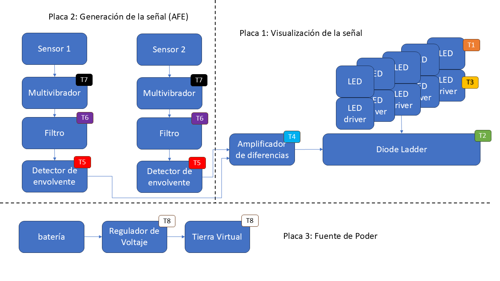
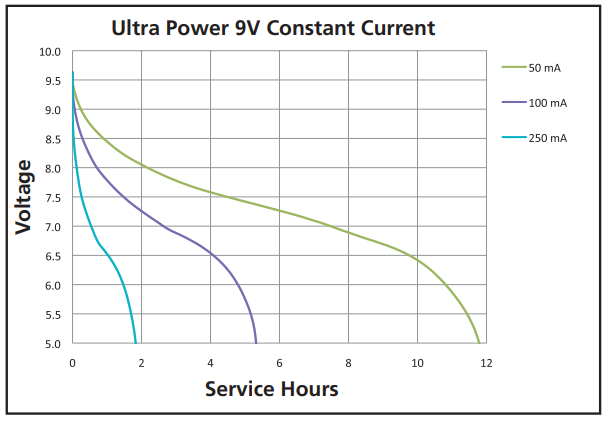

#  Trabajo 8 de Sistemas Electrónicos

#### Primer Semestre de 2026

## Introducción

Este semestre, su grupo es responsable de diseñar y fabricar un prototipo de sensor capacitivo de toque y proximidad para aplicar los conocimientos y tecnicas relacionados a la asignatura de Sistemas Electrónicos.

El dispositivo propuesto será capaz de producir un voltaje proporcional a la distancia entre el dedo del usuario y el sensor, y visualizar el voltaje a través de 5 luces. También podrá funcionar en modo diferencial, en el cual se conectan dos sensores y el voltaje resultante es la diferencia entre la señal de los dos sensores. 

El sistema que deben diseñar puede ser dividido en los siguientes bloques:

Figura 1: División del sistema del sensor capacitivo en bloques

En el octavo trabajo, los objetivos son:

1. diseñar la fuente de poder del sistema
1. generar la tierra virtual

El trabajo será un ensayo que debe contener la siguiente información:

- Identificación del grupo (color)
- Identificación de los integrantes del grupo (nombres, apellidos y RUT)
- La información que se pide las siguientes secciones de este documento

## Fuente de Energía

Se ha decidido utilizar una bateria de 9V como fuente de energía para el sensor capacitivo. Las pilas y baterías son componentes con elementos químicos que reaccionan entre sí para generar energía eléctrica. Mientras entregan energía a los circuitos, las baterías proveen un voltaje aproximadamente constante. Conforme se extrae energía, se agotan los reactantes y la batería se descarga. La descarga de las baterías se refleja en una gradual disminuición de su voltaje hasta un punto mínimo determinado por los fabricantes. Una típica curva de descarga de una batería se muestra en la Figura 2

Figura 2: Curva de descarga de una batería de 9 V

Nótese que hay más de una curva, cada una representando la descarga de la batería con un consumo de corriente distinto, y que la escala horizontal está en horas. Es muy común reportar la capacidad de energía de las baterías como el producto de la corriente de descarga por el tiempo que se demora en descargar, lo que genera una cantidad con unidad mAh (miliamperios hora). Para la batería de la figura 2, por ejemplo, su capacidad está entre 500 y 600 mAh. Con este valor, es facil estimar la duración de la batería en diversas condiciones: por ejemplo, con un consumo de 10 mA se puede esperar que la batería tarde entre 50 y 60 horas para descargar (500 a 600 mAh / 10 mA = 50 a 60 h).

1. Encuentren la capacidad típica de energía de una bateria de 9V y determinen cuanta energía estará disponible para el sensor capacitivo, en mAh. (0.3pt)

2. Estimen el consumo total de corriente del sensor y calculen cuanto tiempo duraría la batería en dicha condición. Acuerdense de considerar la corriente quiescente de los distintos circuitos integrados (en la placa 2 se utiliza 1 MCP6489-E/SL que contiene los 4 op amps necesarios, en la palca 1 se utiliza 1 LMV321B-TR con 1 op amp, y en la palca 3 también se utilizará 1 LMV321B-TR) (1.2pt)

## Regulador de Voltaje de 5V

Otra observación importante de la Figura 2 es que el voltaje de la batería baja mientras se descarga. Normalmente los circuitos eléctricos requieren un voltaje de alimentación estable y constante, por lo que es necesario regular el voltaje de la batería y obtener un valor fijo. 

En el caso del sensor capacitivo proyectado, se necesitan 3 voltajes distintos: -2.5V, 0V y +2.5V. Primero, generaremos los voltajes de -2.5V y +2.5V, y en la siguiente sección generaremos la tierra (virtual). Para generar -2.5V y +2.5V, basta producir una diferencia de voltaje de 5V, y utilizar el voltaje más bajo como -2.5V, y el más alto como +2.5V.

Encuentren la hoja de datos del circuito integrado RAA2118054GP3#JA0.

3. Describan las entradas y salidas del RAA2118054GP3#JA0. (0.5pt)

1. ¿Qué tipo de regulador de voltaje utiliza el RAA2118054GP3#JA0 para generar +5 V ? (0.5pt)

1. Dibujen el circuito de aplicación típica recomendado para el RAA2118054GP3#JA0. Muestren en el circuito donde se conectarían los dos terminales de la batería y donde se conectaría el nodo -2.5V y el +2.5V, los cuales se unirán a cada uno de los otros subsistemas del sensor capacitivo. Asegurense de listar qué componentes externos al RAA2118054GP3#JA0 se necesitan para construir dicho circuito, incluyendo sus cantidades y valores (capacitores ? resistencias ? inductores ?). Asegúrense de elegir valores disponibles en el anexo. Si el circuito incluye algun inductor, utilicen $L_1 = 22\ \mu H$. (1.5pt)

AYUDA: En este proyecto el RAA2118054GP3#JA0 estará siempre encendido.

AYUDA2: Asegúrense de que en el circuito que Ustedes dibujen, todos los terminales del regulador se conectan a algo (incluso EN)

6. Estimen la eficiencia del regulador cuando el sensor capacitivo consume la corriente estimada en el ítem 2. ¿En cuánto cambia la estimación de duración de la batería considerando la eficiencia del regulador ? (0.5pt)

## Tierra Virtual

El regulador elegido genera dos nodos con voltajes casi constantes y cuya diferencia de voltaje entre sí es de 5V. Si asumimos que el nodo con menor voltaje es -2.5V, el de mayor voltaje seria +2.5V. El único voltaje de alimentación que falta para alimentar todos los circuitos proyectados hasta el momento es la tierra ( 0V ). 

Estrictamente hablando, el voltaje de 0 V que generaremos no está conectado a una tierra real, por lo que lo clasificamos como "tierra virtual". Para generar el voltaje de 0 V que actuará como tierra virtual, se utilizará el siguiente circuito:

Figura 3: Divisor de voltaje

Donde $V_{bias\ weak}$ es el voltaje de la tierra virtual. 

7. Elijan los valores de $R_{30}$ y $R_{31}$, que estén disponible en el anexo, de tal forma que $V_{bias\ weak} = 0\ V$ y la corriente a través de las resistencias es menor a $100\ \mu A$. (0.3pt)

Es común agregar un capacitor conectado a tierra para atenuar cualquier ruido en voltajes que deben ser constantes. Por esta razón se incluye el capacitor $C_{7}$ para estabilizar $V_{bias\ weak}$. Cuando mayor el valor de la capacitancia, más se atenua el ruído. Sin embargo, también aumenta la constante de tiempo, lo que significa que el circuito demora más en "inicializarse" cuando se enciende.

8. Elijan el mayor valor de capacitancia disponible en el anexo para $C_{7}$ de tal forma que $\tau \leq 5$ segundos, donde $\tau$ es la constante de tiempo del circuito considerando que la entrada es el voltaje de +2.5V y la salida es $V_{bias\ weak}$. (0.3pt)

3. Determinen la resistencia de salida del circuito de la figura 2. Pueden considerar solamente el análisis en DC para este ejercicio. Es decir, pueden ignorar $C_7$. (0.3pt)

Como la resistencia de salida del circuito es muy alta, no se pueden conectar circuitos que consumen mucha corriente a $V_{bias\ weak}$ , una vez que afectarían su voltaje. Una forma de entenderlo es considerar que al conectar una resistencia de carga $R_L$ entre $V_{bias\ weak}$ y tierra, ésta apareceria en paralelo a $R_{31}$, disminuyendo su valor efectivo y, por lo tanto disminuyendo el valor de $V_{bias\ weak}$ . Para mejorar la capacidad de la tierra virtual de entregar o consumir corrientes se utilizará un buffer, el que se muestra en la figura a continuación.

Figura 4: Buffer

$V_{bias}$ es la tierra virtual que efectivamente se conectará a los circuitos que la requieran.

10. Determinen la resistencia de entrada del buffer y calculen en cuanto cambia el valor de $V_{bias\ weak}$ en DC cuando se conecta al buffer. Consideren que el amplificador operacional utilizado es el LMV321. (0.3pt)

5. Determinen la resistencia de salida del buffer. Consideren que el amplificador operacional utilizado es el LMV321. (0.3pt)

   AYUDA: una forma de estimar la resistencia de salida del amplificador operacional es dividiendo el voltaje de alimentación por la corriente de corto circuito (maxima) de salida.

Con respecto a $C_8$, se utilizará cualquier capacitor electrolítico con capacitancia mayor a $10\ \mu F$.

## Plazo de entrega: 23:59, 04 de Agosto de 2026

## Anexos

I. Valores de Resistencias disponibles:

|   |  |        |       |  |
|------|------|-----------|------------|-------|
| 10Ω  | 220Ω | 1kΩ       | 6.8kΩ      | 100kΩ |
| 22Ω  | 270Ω | 2kΩ       | 10kΩ       | 220kΩ |
| 47Ω  | 330Ω | 2.2kΩ     | 20kΩ       | 300kΩ |
| 100Ω | 470Ω | 3.3kΩ     | 47kΩ       | 470kΩ |
| 150Ω | 510Ω | 4.7kΩ     | 51kΩ       | 680kΩ |
| 200Ω | 680Ω | 5.1kΩ     | 68kΩ       | 1MΩ   |

II. Valores de Capacitores Ceramicos disponibles:

|   |  |        |       | 
| -------- | ------- | ------- | ----------- | 
| 100 pF   | 1 nF    | 10 nF   | $0.1\ \mu F$ | 
| 220 pF   | 2.2 nF  | 22 nF   | $0.22\ \mu F$ |
| 330 pF   | 3.3 nF  | 33 nF   | $0.33\ \mu F$ | 
| 470 pF   | 4.7 nF  | 47 nF   | $0.47\ \mu F$ | 
| 680 pF   | 6.8 nF  | 68 nF   | $0.68\ \mu F$ | 

III. Valores de Capacitores Electrolíticos disponibles:

|   |  |        |       |
|------|------|-----------|------------|
| $1\ \mu F$  | $10\ \mu F$ | $100\ \mu F$       | $1000\ \mu F$      |
| $2.2\ \mu F$  | $22\ \mu F$ | $220\ \mu F$       | -       |
| $3.3\ \mu F$  | $33\ \mu F$ | $330\ \mu F$     | -       |
| $4.7\ \mu F$ | $47\ \mu F$ | $470\ \mu F$     | -       |
