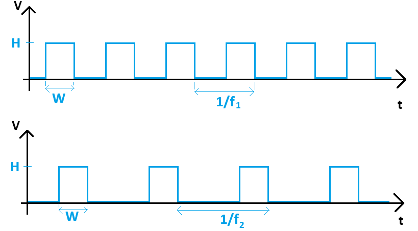

#  Trabajo 8 de Sistemas Electrónicos

#### Primer Semestre de 2025

## Introducción

Este semestre, su grupo es responsable de diseñar y fabricar un prototipo de fotopletismógrafo para aplicar los conocimientos y tecnicas relacionados a la asignatura de Sistemas Electrónicos.

A grandes rasgos, el prototipo debe tener las siguientes funcionalidades:

1. medir la frecuencia cardíaca (Heart Rate - HR)
1. emitir una señal de luz infrarroja cuando hay un pulso cardíaco
1. detectar la señal infraroja emitida por otro prototipo
1. medir el tiempo entre la detección de la señal infrarroja y el siguiente pulso cardíaco (Pulse Transit Time - PTT)
1. Permitir la visualización de los valores de HR y PTT medidos

El sistema que deben diseñar puede ser dividido en los siguientes bloques:

Figura 1: División del sistema del fotopletismógrafo en bloques

En el octavo trabajo, los objetivos son los siguientes:

1. implementar el multivibrador monoestable
1. hacer correcciones de los trabajos anteriores
1. producir una BOM en preparación para la fabricación

El trabajo será un ensayo que debe contener la siguiente información:

- Identificación del grupo (color)
- Identificación de los integrantes del grupo (nombres, apellidos y RUT)
- La información que se pide en cada una de las siguientes sesiones de este documento

## 1. Multivibrador Monoestable

En el trabajo anterior se diseñó el circuito que extrae el valor promedio del tren de pulsos cardíacos.

Figura 2: Ejemplos de tren de pulsos generados para 2 frecuencias cardíacas distintas. 

Conforme se vió en dicho trabajo, el valor promedio de las señales de la figura 2 es:

$$promedio = WHf_i$$

Con $H=5\ V$ y $f_i$ la frecuencia cardíaca en Hz.

1. Determinen el valor de $W$ de forma que 1 V del voltaje promedio sea equivalente a una frecuencia de 100 latidos por minuto. (0.5pt)

Para producir el tren de pulsos, se utilizará un multivibrador monoestable con $T_t=W$. El gatillo del monoestable serán los pulsos que se producen cada vez que hay un latido cardíaco.

Figura 3: Circuito del Multivibrador Monoestable

2. Elijan los valores de $R_{19}$, $R_{20}$, $R_{21}$ y $C_6$ de tal forma que (1.5pt):
   - $T_t \approx W$ 
   - La corriente maxima en $R_{20}$ es menor a 1 mA
   - La corriente maxima en $R_{18}$ es menor a $500\ \mu A$
   - $R_{18} = R_{19}$
   - los valores de $R_{19}$, $R_{20}$, $R_{21}$ y $C_6$ son valores disponibles en el anexo

AYUDA: Atención a la alimentación del amplificador operacional: +2.5 V y -2.5 V.

AYUDA2: pueden ignorar el TRIGGER para analizar el circuito

El circuito TRIGGER es el circuito que gatilla el cambio de estado del monoestable. La idea es que TRIGGER suba el voltaje $V_+$ por un breve período de tiempo, que es suficiente para que $v_o$ cambie a +2.5 V e inicie el tiempo en el estado semi-estable del monoestable.

3. Estimen la corriente que tiene que entregar TRIGGER al circuito para que $V_+$ suba a +2.5 V. Asuman que $v_o = -2.5\ V$ (0.5pt).

En realidad, gran parte del circuito TRIGGER ya ha sido proyectada en trabajos anteriores, y se muestra a continuación:

Figura 5: Circuito generador de pulso diseñado en el trabajo 3

El circuito que se proyectó hasta el momento produce una salida que cambia de + 2.5V a ~ -2.5V por algunos milisegundos cuando se detecta un pulso cardíaco, para luego volver a + 2.5V. Los elementos que faltan para que se pueda gatillar el monoestable son un transistor PNP ($Q_{13}$) y una resistencia $R_{39}$, conectados como se indica a continuación:

Figura 4: Gatillo con $Q_{13}$ y $R_{39}$

4. Considerando que la corriente de colector de saturación de $Q_{13}$ es igual al valor encontrado en la pregunta 3, elijan $R_{39}$ de tal forma que (0.5pt):
   - $ \beta_{forzado} \approx 10$ cuando $\overline{V_{TRIGGER}} \approx -2.5\ V$
   - el valor de $R_{39}$ es uno de los valores disponibles en el anexo. 

OBS: Para $Q_{13}$ consideren que $V_{CE_{SAT}} = -0.1\ V$, $V_{BE_{SAT}} = -0.7\ V$ y $\beta = 400$.

## 2 Correcciones de trabajos anteriores

5. Revisen los trabajos entregados hasta el momento y realicen todas las correcciones correspondientes. En especial, asegúrense de indicar si hay algún valor de componente que cambia. (2pt)

Abajo se indican posibles valores de componentes que necesitan corrección (obtenido de las anotaciones del profesor, puede ser que la lista no esté completa):

- Trabajo 1: $R_2$
- Trabajo 2: $R_5$
- Trabajo 3: $C_1$, $C_2$ y $R_{15}$
- Trabajo 5: $R_{29}$
- Trabajo 6: $R_{24}$, $R_{25}$, $R_{26}$, $R_{27}$, $R_{28}$, $R_{43}$, $R_{44}$, $C_5$ y $C_6$
- Trabajo 7: 

## 3. Preparación para la fabricación - BOM

Durante el semestre los profesores digitalizaron el circuito completo del fotopletismógrafo que Ustedes están proyectando, diseñaron una PCB basado en ello y la mandaron a fabricar. Para último trabajo (Trabajo 10) y actividad de laboratorio (Laboratorio 8) se pedirá que solden los componentes en las placas de circuito impreso para terminar su fabricación.

En preparación para la etapa de soldar componentes, es útil producir un documento conocido como lista de materiales o BOM (del inglés, bill of materials). 

6. Completen la BOM a continuación con el valor de los componentes elegidos hasta el momento. Consulten los diagramas en anexo (en uvirtual) si tienen dudas con respecto a qué parte del circuito corresponde cada componente. (1pt)

Tabla I: BOM

| Part      | Value / MPN          | Detailed   Description                        |   | Part     | Value / MPN  | Detailed   Description      |   | Part | Value / MPN | Detailed   Description          |
|-----------|----------------------|-----------------------------------------------|---|----------|--------------|-----------------------------|---|------|-------------|---------------------------------|
| C1        |                      | CAPACITOR,   European symbol                  |   | PHOTO_T3 | PT12-21C/TR8 |                             |   | R20  |             | RESISTOR, American symbol       |
| C2        |                      | CAPACITOR, European symbol                    |   | Q1       | BC846A       | NPN -   Popular parts       |   | R21  |             | RESISTOR, American symbol       |
| C3        |                      | CAPACITOR,   European symbol                  |   | Q2       | BC846A       | NPN - Popular parts         |   | R22  |             | RESISTOR,   American symbol     |
| C4        |                      | CAPACITOR, European symbol                    |   | Q3       | BC846A       | NPN -   Popular parts       |   | R23  |             | RESISTOR, American symbol       |
| C5        |                      | CAPACITOR,   European symbol                  |   | Q4       | BC846A       | NPN - Popular parts         |   | R24  |             | RESISTOR,   American symbol     |
| C6        |                      | CAPACITOR, European symbol                    |   | Q5       | BC846A       | NPN -   Popular parts       |   | R25  |             | RESISTOR, American symbol       |
| C7        |                      | CAPACITOR,   European symbol                  |   | Q6       | BC846A       | NPN - Popular parts         |   | R26  |             | RESISTOR,   American symbol     |
| C8        |                      | CAPACITOR, European symbol                    |   | Q7       | BC846A       | NPN -   Popular parts       |   | R27  |             | RESISTOR, American symbol       |
| C9        |                      | CAPACITOR,   European symbol                  |   | Q10      | BC846A       | NPN - Popular parts         |   | R28  |             | RESISTOR,   American symbol     |
| C10       |                      | CAPACITOR, European symbol                    |   | Q11      | BC846A       | NPN -   Popular parts       |   | R29  |             | RESISTOR, American symbol       |
| C11A      |                      | CAPACITOR,   European symbol                  |   | Q12      | BC846A       | NPN - Popular parts         |   | R30  |             | RESISTOR,   American symbol     |
| C11B      |                      | CAPACITOR, European symbol                    |   | Q13      | BC857C       | PNP -   Popular parts       |   | R31  |             | RESISTOR, American symbol       |
| C12       |                      | CAPACITOR,   European symbol                  |   | Q14      | BC846A       | NPN - Popular parts         |   | R33  |             | RESISTOR,   American symbol     |
| C13       |                      | CAPACITOR, European symbol                    |   | R1A      |              | RESISTOR,   American symbol |   | R34  |             | RESISTOR, American symbol       |
| CR1       |                      | Capacitor   - Generic                         |   | R1B      |              | RESISTOR, American symbol   |   | R35  |             | RESISTOR,   American symbol     |
| CR2       |                      | Capacitor - Generic                           |   | R2       |              | RESISTOR,   American symbol |   | R36  |             | RESISTOR, American symbol       |
| CR3       |                      | Capacitor   - Generic                         |   | R3       |              | RESISTOR, American symbol   |   | R37  |             | RESISTOR,   American symbol     |
| D1        | DIODEDIODE-AXIAL     | Diode Rectifier - Generic                     |   | R4       |              | RESISTOR,   American symbol |   | R38  |             | RESISTOR, American symbol       |
| D2        | DIODEDIODE-AXIAL     | Diode   Rectifier - Generic                   |   | R5       |              | RESISTOR, American symbol   |   | R39  |             | RESISTOR,   American symbol     |
| D3        | DIODEDIODE-AXIAL     | Diode Rectifier - Generic                     |   | R6       |              | RESISTOR,   American symbol |   | R40  |             | RESISTOR, American symbol       |
| D4        | DIODEDIODE-AXIAL     | Diode   Rectifier - Generic                   |   | R7       |              | RESISTOR, American symbol   |   | R41  |             | RESISTOR,   American symbol     |
| D5        | DIODEDIODE-AXIAL     | Diode Rectifier - Generic                     |   | R8       |              | RESISTOR,   American symbol |   | R42  |             | RESISTOR, American symbol       |
| IC1       | MCP6009T-E/S         | Quad Op   Amp 2.7V to 6.0V Single Supply CMOS |   | R9       |              | RESISTOR, American symbol   |   | R43  |             | RESISTOR,   American symbol     |
| IC2       | LM393                | Dual Comparators                              |   | R10      |              | RESISTOR,   American symbol |   | R44  |             | RESISTOR, American symbol       |
| IC3       | MCP6009T-E/S         | Quad Op   Amp 2.7V to 6.0V Single Supply CMOS |   | R11      |              | RESISTOR, American symbol   |   | R45  |             | RESISTOR,   American symbol     |
| L1        |                      | Inductor Fixed - Generic                      |   | R12      |              | RESISTOR,   American symbol |   | R46  |             | RESISTOR, American symbol       |
| LED1      | SFH_7070SFH_7070_OSR |                                               |   | R13      |              | RESISTOR, American symbol   |   | R47  |             | RESISTOR,   American symbol     |
| LED_COLOR | LED3MM               | LED (Generic)                                 |   | R14      |              | RESISTOR,   American symbol |   | R48  |             | RESISTOR, American symbol       |
| LED_IR1   | VSMB10940            |                                               |   | R15      |              | RESISTOR, American symbol   |   | R49  |             | RESISTOR,   American symbol     |
| LED_IR2   | VSMB10940            |                                               |   | R16      |              | RESISTOR,   American symbol |   | R50  |             | RESISTOR, American symbol       |
| LED_IR3   | VSMB10940            |                                               |   | R17      |              | RESISTOR, American symbol   |   | U$1  | BCM62B      |                                 |
| PHOTO_T1  | PT12-21C/TR8         |                                               |   | R18      |              | RESISTOR,   American symbol |   | VR1  | TPS61322A   | 1-A Step-Down Voltage Regulator |
| PHOTO_T2  | PT12-21C/TR8         |                                               |   | R19      |              | RESISTOR, American symbol   |   |      |             |                                 |
|           |                      |                                               |   |          |              |                             |   |      |             |                                 |

## Plazo de entrega: 23:59, 16 de Junio de 2025

## Anexo

I. Valores de Resistencias disponibles:

|   |  |        |       |  |
|------|------|-----------|------------|-------|
| 10Ω  | 220Ω | 1kΩ       | 6.8kΩ      | 100kΩ |
| 22Ω  | 270Ω | 2kΩ       | 10kΩ       | 220kΩ |
| 47Ω  | 330Ω | 2.2kΩ     | 20kΩ       | 300kΩ |
| 100Ω | 470Ω | 3.3kΩ     | 47kΩ       | 470kΩ |
| 150Ω | 510Ω | 4.7kΩ     | 51kΩ       | 680kΩ |
| 200Ω | 680Ω | 5.1kΩ     | 68kΩ       | 1M    |

II. Valores de Capacitores Ceramicos disponibles:

|   |  |        |       |  |
|------|------|-----------|------------|-------|
| 100 pF  | 220 pF | 330 pF | 470 pF | 680 pF |
| 1 nF  | 2.2 nF | 3.3 nF | 4.7 nF | 6.8 nF |
| 10 nF  | 22 nF | 33 nF | 47 nF | 68 nF |
| $0.1\ \mu F$  | $0.22\ \mu F$ | $0.33\ \mu F$| $0.47\ \mu F$ | $0.68\ \mu F$ |
| $1\ \mu F$  | - | - | $4.7\ \mu F$ | - |
| $10\ \mu F$  | $22\ \mu F$ | - | - | - |
