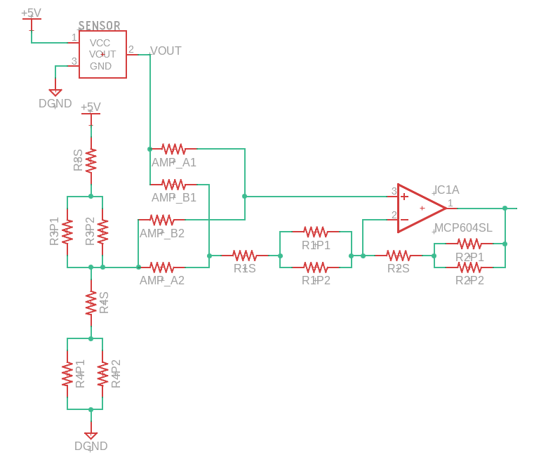

#  Trabajo 9 de Sistemas Electrónicos

#### Segundo Semestre de 2024

## Introducción

Este semestre, su grupo es responsable de diseñar y fabricar un prototipo de termometro médico electrónico para aplicar los conocimientos y tecnicas relacionados a la asignatura de Sistemas Electrónicos. 

El sistema que deben diseñar puede ser dividido en los siguientes bloques:

Figura 1: División del sistema del termometro electrónico en bloques

En el noveno trabajo, los objetivos son los siguientes:

1. diseñar la fuente de poder del sistema
1. preparar para la fabricación de la placa

El trabajo será un ensayo que debe contener la siguiente información:

- Identificación del grupo (color)
- Identificación de los integrantes del grupo (nombres, apellidos y RUT)
- La información que se pide en cada una de las siguientes sesiones de este documento

## Fuente de Energía

Se ha decidido utilizar una batería de 3V del tipo moneda/botón tamaño CR2032 como fuente de energía para el termometro. Las pilas y baterías son componentes que contienen elementos químicos que reaccionan entre sí para generar energía eléctrica. Mientras entregan energía a los circuitos, las baterías proveen un voltaje aproximadamente constante. Conforme se extrae energía, se agotan los reactantes y la batería se descarga. La descarga de las baterías se refleja en una gradual disminuición de su voltaje hasta un punto mínimo determinado por los fabricantes. Una típica curva de descarga de una batería se muestra en la Figura 2

Figura 2: Curva de descarga de una batería de 9 V

Nótese que hay más de una curva, cada una representando la descarga de la batería con un consumo de corriente distinto, y que la escala horizontal está en horas. Es muy común reportar la capacidad de energía de las baterías como el producto de la corriente de descarga por el tiempo que se demora en descargar, lo que genera una cantidad con unidad mAh. Para la batería de la figura 2, por ejemplo, su capacidad está entre 500 y 600 mAh. Con este valor, es facil estimar la duración de la batería en otras condiciones: por ejemplo, con un consumo de 10 mA se puede esperar que la batería tarde entre 50 y 60 horas para descargar (500 a 600 mAh / 10 mA = 50 a 60 h).

Otra observación importante de la Figura 2 es que el voltaje de la batería baja mientras se descarga. Normalmente los circuitos eléctricos requieren un voltaje de alimentación estable y constante, por lo que es necesario regular el voltaje de la batería y obtener un valor fijo.

## Regulador de Voltaje de 5V

Encuentren la hoja de datos del circuito integrado TPS613222A.

1. Describan las entradas y salidas del TPS613222A. (0.4pt)

1. ¿Qué tipo de regulador de voltaje utiliza el TPS613222A para generar +5 V ? (0.4pt)

1. Dibujen el circuito de aplicación típica recomendado para el TPS613222A. Muestren en el circuito donde se conectarían los dos terminales de la batería y donde se conectaría la tierra y el +5 V, el cuales se unirá a cada uno de los otros subsistemas del termometro. Asegurense de listar qué componentes externos al TPS613222A se necesitan para construir dicho circuito, incluyendo sus cantidades y valores (capacitores ? resistencias ? inductores ?). (0.8pt)

Estudien la sesión 8.3 de la hoja de datos del TPS613222A, donde se muestra como agregar componentes para apagar el regulador cuando no se está utilizando. Q1 es un transistor pMOSFET, que es equivalente a un transistor bipolar del tipo PNP, con respecto a su funcionamiento, y Q2 es un transsitor nMOSFET, equivalente a un NPN. Adaptaremos parte del circuito que ya diseñemos para encender y apagar un transistor PNP que cumplirá la función de Q1. En particular, utilizaremos la señal $V_{OFF}$, que ya implementa la logica para tener un voltaje "alto" cuando se debe apagar el termometro y "bajo" cuando se debe encenderlo:

Figura 3: Circuito de encendido/apagado con conexión de auto-apagado.

Figura 4: Circuito de encendido/apagado del regulador TPS613222A

4. Elijan el mayor valor, disponible en el anexo, para $R_{33}$ de tal forma que la corriente de colector maxima de $Q_8$ sea al menos 40 mA ($| \beta I_{B} | > 40\ mA$). Considere que, para $Q_8$, $V_{BE_{SAT}} \approx -0.8\ V$, $V_{CE_{SAT}} \approx -0.2\ V$, $\beta \approx 200$ y para $Q_4$, $V_{BE_{SAT}} \approx 0.7\ V$, $V_{CE_{SAT}} \approx 0.2\ V$, $\beta \approx 200$. (0.4pt)

5. Estimen la eficiencia del regulador cuando el termometro consume aproximadamente 1 mA de la fuente de 5V. (0.4pt)

3. Estimen el consumo total de corriente del termometro y calculen cuanto tiempo duraría una batería de 3 V y 225 mAh en dicha condición. Acuerdense de considerar la corriente quiescente de los distintos circuitos integrados. (0.8pt)

## Preparación para la fabricación

7. Corrijan los valores de componentes que requieran corrección. En particular, asegurense de que los valores de $R_{17}$, $R_{20}$ y $C_6$ (Trabajo 8), $R_{31}$ y $C_7$ (Trabajo 6) y de $R_1$, $R_2$, $R_3$ y $R_4$ (ver observaciones Trabajo 8) están correctos. (0.8pt)

Durante el semestre, en paralelo con el desarrollo de los trabajos, también se diseñó la placa de circuito impresa que implementa todos los circuitos del termometro. En los diagramas en adjunto se muestra el circuito diseñado.

En algunas partes del circuito se podían utilizar resistencias en serie/paralelo para obtener un valor equivalente más cercano al diseñado. Para permitir esta flexibilidad, se implementaron más de una resistencia en algunas partes del circuito, las cuales pueden ser utilizadas o ignoradas para implementar el diseño correcto.

Por ejemplo, en la imagen a continuación la resistencia R1 se dividió en 3: R1S, R1P1 y R1P2. Si el diseño requiere apenas una resistencia para R1, se puede conectar la resistencia con el valor correcto a R1S y resistencias de  $0\ \Omega$ a  R1P1 y R1P2. El valor equivalente de este bloque seria solamente el valor de R1S. Si, por otro lado, se requiere de 2 resistencias en paralelo para obtener el valor de R1 deseado, se pueden conectar dichas resistencias a R1P1 y R1P2, mientras que en R1S se utiliza una resistencia de $0\ \Omega$. De esta forma, el valor equivalente seria R1P1 // R1P2.

Figura 5: Implementación de R1

En otras partes del circuito no es solo el valor de una resistencia que se puede implementar de distintas formas, sino que también las conexiones entre componentes tienen distintas opciones. En estas partes también se agregaron resistencias que se pueden dejar abiertas o como corto-circuitos para seleccionar las conexiones adecuadas.

Por ejemplo, en el diagrama a continuación, se puede conectar una resistencia de $0\ \Omega$ a AMP_A1 y otra a AMP_A2, mientras se deja AMP_B1 y AMP_B2 sin ninguna resistencia (circuitos abiertos). Esto conectaría la salida del sensor (VOUT) a la entrada no inversora del amplificador operacional (V+) y el voltaje del divisor de voltaje de R3 y R4 a R1, la cual se conecta a V- . Por otro lado, también se puede implementar el circuito al revés: es decir, AMP_A1 y AMP_A2 se dejan abiertos, mientras se conecta una resistencia de $0\ \Omega$ a AMP_B1 y otra a AMP_B2, lo que conectaría VOUT a R1 que va a V- y el divisor de voltaje de R3 y R4 a V+ . Nótese que esta última forma de conectar AMP_A y AMP_B corresponde al circuito denominado Amplificador de diferencias versión B, mientras que la otra forma corresponde al Amplificador de diferencias versión A, ambos detallados en el trabajo 8.

Figura 5: Implementación de los amplificadores de diferencias versiones A o B

8. Preparen una lista de todas las resistencias y capacitores que se muestran en las 3 paginas de diagramas en anexo e indiquen cual debe ser el valor de cada uno de ellos. En particular, asegurense de indicar las resistencias donde no se debe conectar nada (dejar el circuito abierto), y en las que se debe conectar una resistencia de $0 \ \Omega$ (hacer un corto-circuito). (2pt)

NOTA: la resistencia $R_31$ del trabajo 6 aparece como $R_{32}$ en el diagrama, pues $R_{31}$ ya se habia utilizado para otra resistencia.

## Plazo de entrega: 23:59, 23 de Diciembre de 2024

## Anexo

I. Valores de Resistencias disponibles:

|   |  |        |       |  |
|------|------|-----------|------------|-------|
| 10Ω  | 220Ω | 1kΩ       | 6.8kΩ      | 100kΩ |
| 22Ω  | 270Ω | 2kΩ       | 10kΩ       | 220kΩ |
| 47Ω  | 330Ω | 2.2kΩ     | 20kΩ       | 300kΩ |
| 100Ω | 470Ω | 3.3kΩ     | 47kΩ       | 470kΩ |
| 150Ω | 510Ω | 4.7kΩ     | 51kΩ       | 680kΩ |
| 200Ω | 680Ω | 5.1kΩ     | 68kΩ       | 1M    |

II. Valores de Capacitores Ceramicos disponibles:

|   |  |        |       |  |
|------|------|-----------|------------|-------|
| 100 pF  | 220 pF | 330 pF | 470 pF | 680 pF |
| 1 nF  | 2.2 nF | 3.3 nF | 4.7 nF | 6.8 nF |
| 10 nF  | 22 nF | 33 nF | 47 nF | 68 nF |
| $0.1\ \mu F$  | $0.22\ \mu F$ | $0.33\ \mu F$| $0.47\ \mu F$ | $0.68\ \mu F$ |
| $1\ \mu F$  | - | - | $4.7\ \mu F$ | - |
| $10\ \mu F$  | $22\ \mu F$ | - | - | - |
